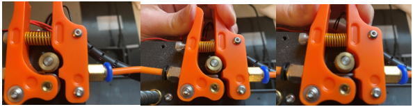

Preparing Printer
=================

Once you have saved your G-code to the micro-SD card and inserted it into the printer, it is time to prepare your printer.

Bed adhesion is the ability of the first layer of a 3D print to stick to the heatbed. The first step to ensuring bed adhesion is to print on a clean heatbed. Click :ref:`Bed Adhesion` to learn more about bed adhesion and factors that can influence it.

Preparing the printer means, cleaning the bed and applying adhesion. If this is your first print of the day or you do not know
when the last time the printer was used, it is a good idea to clean your print bed. The bed can become dirty by collecting things
like dust, oils, plastic, and having old adhesion still on it. A dirty print bed leads to all kinds of problems when
printing; your first layer might not go down correctly causing the part to break away mid-print, or your part might not be flat
on the bottom which would not be good for assemblies.

Before you do anything, you want to make sure that the heated bed is turned off, you can leave the printer on but just make sure
that the bed is not heated or being heating. This bottom number shows you what the temperature is right now and the top shows
what it is being heated to. The top should say 0 and the bottom should say less than 30° before you touch it.

.. figure:: ../_static/images/PreP1.PNG
    :figwidth: 400px
    :target: ../_static/images/PreP1.PNG

If you are using the Eryone ER-20, the first step is to unscrew the clamps from the bed. Be careful not to lose these as they are very small but very important. Once the clamps are off, carefully take the glass bed off and lay it on the desk.

.. figure:: ../_static/images/PreP2.PNG
    :figwidth: 400px
    :target: ../_static/images/PreP2.PNG

If your are using the Prusa, simply take of the magnetic bed and lay it on the desk.

Next, grab your cleaning supplies; you will need Windex, Isopropyl Alcohol, Two
Microfiber Cloths, and your printer’s scraper.

.. figure:: ../_static/images/cleaning.jpg
    :figwidth: 600px
    :target: ../_static/images/cleaning.jpg

Take the scraper and scrape the bed, try to get off any large pieces of plastic that are stuck on and any visible dirt. Next, grab
the Windex and spray the bed. It is important that the bed is off and away from the printer as Windex and Isopropyl Alcohol
are dangerous to the printer's electronics.  Leave the Windex for about a minute and then grab one of the microfiber cloths and
clean the bed. Here you are trying to get off any glue, hairspray, or other bed adhesion. If you are having trouble with getting
adhesive off you can unfold the cloth and use the scraper to clean. This will use the pressure of the scraper as well as the cleaning
power of the Windex

.. figure:: ../_static/images/Prep4.PNG
    :figwidth: 400px
    :target: ../_static/images/Prep4.PNG

*Make sure glass bed is removed from printer when cleaning*

The bed should now be clean from any visible dirt, plastic, or adhesion. Now grab the Isopropyl Alcohol and spray it onto the
bed, again wait a minute and then grab the other cloth and begin to wipe. The Isopropyl alcohol should clean any nonvisible dirt
that is left on the bed. Once the bed is dry, place it back onto the printer and reattach the clamps. Dispose of the microfiber
cloths and bring the cleaning products back to their original place. Your print bed should now be all clean and ready for perfect
prints.

Once your bed is cleaned and your adhesion is applied it is time to start your print. Make sure the printer is turned on, there is a
power switch on the back. Next, insert your filament.

Changing and Inserting Material
-------------------------------

Changing the material with the Eryone printer is a very simple process. The first thing you want to do is find your selected
material and bring it to the printer.

Now, you want to grab the wire cutters and the end of the filament, being very careful not to let go of the filament so it does
not flick back to the spool and get tangled up. Cut the end of the filament at a 45° angle and keep hold of the end or place
it back in the side spool hole.

.. figure:: ../_static/images/Eryone37.PNG
    :figwidth: 500px
    :target: ../_static/images/Eryone37.PNG

*Please read all instructions as you will need to do this even when replacing or changing filament that is already in the printer.*

If there is no filament in the printer already, place the spool onto the spool holder. Grab the end of the filament that you
have cut and insert it into the orange tube. Keep pushing the filament in until it reaches the golden wheel. Now you want to pinch
the back of the orange clamp that encases the golden wheel and push the filament through, so that it goes past the wheel and into
the next hole. If the filament goes into the next hole, continue to pinch the clamps, and push the filament all the way until it
stops (hitting the start of the extruder).

If the filament is not going into the next hole and is instead going upwards toward the top of the clamp, there is a simple
fix. Pull the filament back so that it is before the hole. Grab a friend or some assistance and a thin tool, such as a
knife (BE CAREFUL). You will want to pinch the orange clamp and push the filament down with the knife. At this time have your
friend push the filament while you push the filament down so that it goes through the hole.

.. figure:: ../_static/images/Filamentchange3.PNG
    :figwidth: 500px
    :target: ../_static/images/Filamentchange3.PNG

*If you are changing the filament you can skip this next step because the printer should do this by itself when changing filament.*

Once you have the filament pushed all the way until it hits the start of the hot end, you are going to want to heat up the hot end.
Make sure the printer is turned on (via power switch on back), then click the scroll wheel. Navigate to Temperature-> Nozzle -> and
then scroll up to 215 for PLA (245 for PETG and 215 for TPU) and click the wheel. Go back to the Info Screen and wait for the nozzle
to reach the desired temperature. Once the nozzle is heated, click the scroll wheel again and navigate to Motion->
Move Axis-> Extruder-> Move 10 mm. Then scroll the wheel to 10 mm and watch filament exit through the hot end. If no filament
comes out, then scroll another 10 mm until it does.

Next grab the wire cutters and clean up the extruded filament by pulling the filament away. Be careful the nozzle is over
200° right now. Once you have cleaned the nozzle, go back to the temperature setting and turn the nozzle back to 0.

Congratulations! Your filament is all set up.

If you have a dual extruder head attachment on the Eryone ER-20s the technique is a little different. First push your filament into the hole as seen below untiol it hits some resistance.

Then, on the LED screen go to filament change, wait for the nozzle to heat up completely and start extruding so that the gear moves. The gears should push the filament through to the boden tube by itself but you can always check by taking off the tube where it meets the gear box. Once the filament has been pushed through the gear box to can pull out the tab
on the left of the gear box to loosen up the filament and push it all the way to the hot end.

Once you hit resistance again, purge more filament and you are ready to go. 

If the printer already has filament in it, changing/ replacing is even easier. The Eryone ER-20 has built in instructions, so all
you need to do is get your new filament, cut the end at 45° and hold onto it. Then go to the printer, click the scroll wheel,
and navigate to Change Filament. If you are changing PLA, click preheat PLA, if you are changing PETG or TPU, click preheat
custom and set the temperature to 245 and 215, respectively.  Then follow the instructions on the Eryone’s screen. If you have
trouble inserting the new filament go back and check the figures above.

Printing
--------

When a 3D printer is on you should be on the home page as called on the Eryone ER-20 or info page as called on the Prusa. Click the wheel and scroll to the where it
says, “Print from media” or "Print from SD Card". Select the file you saved to the SD card and select print.

.. figure:: ../_static/images/Eryone27.GIF
    :figwidth: 300px
    :target: ../_static/images/Eryone27.GIF

If everything is okay, your model should print. It is a good idea to check on your print periodically to make sure nothing is
going wrong. If you need to stop the print for whatever reason, click the button and scroll to “Stop Print”. A Successful print
looks like this.

.. figure:: ../_static/images/Eryone21.GIF
    :figwidth: 300px
    :target: ../_static/images/Eryone21.GIF

Once the print is complete, let the bed cool down a little bit then peel your part off the bed.

Congratulations! Your model should now be printed.

.. figure:: ../_static/images/Eryone26.PNG
    :figwidth: 150px
    :target: ../_static/images/Eryone26.PNG
