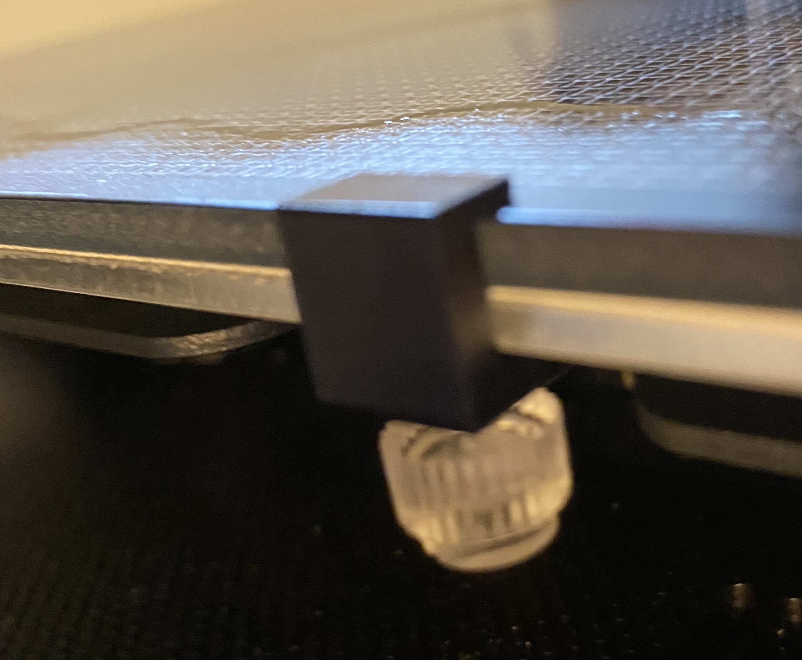
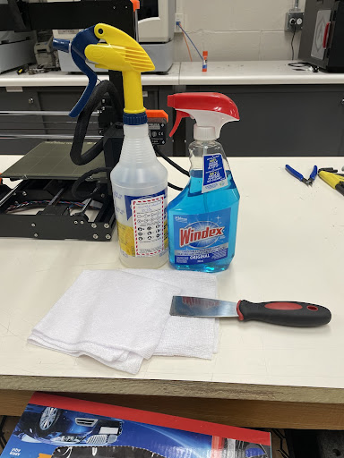

Preparing Printer
=================

Once you have saved your G-code to the micro-SD card and inserted it into the printer, it is time to prepare your printer.

Bed adhesion is the ability of the first layer of a 3D print to stick to the heatbed. The first step to ensuring bed adhesion is to print on a clean heatbed. Click :ref:`Bed Adhesion` to learn more about bed adhesion and factors that can influence it.

Preparing the printer means, cleaning the bed and applying adhesion. If this is your first print of the day or you do not know
when the last time the printer was used, it is a good idea to clean your print bed. The bed can become dirty by collecting things
like dust, oils, plastic, and having old adhesion still on it. A dirty print bed leads to all kinds of problems when
printing; your first layer might not go down correctly causing the part to break away mid-print, or your part might not be flat
on the bottom which would not be good for assemblies.

Before you do anything, you want to make sure that the heated bed is turned off, you can leave the printer on but just make sure
that the bed is not heated or being heating. This bottom number shows you what the temperature is right now and the top shows
what it is being heated to. The top should say 0 and the bottom should say less than 30° before you touch it.

.. figure:: ../_static/images/PreP1.PNG
    :figwidth: 400px
    :target: ../_static/images/PreP1.PNG

If you are using the Eryone ER-20, the first step is to unscrew the clamps from the bed. Be careful not to lose these as they are very small but very important. Once the clamps are off, carefully take the glass bed off and lay it on the desk.

If your are using the Prusa, simply take of the magnetic bed and lay it on the desk.

Next, grab your cleaning supplies; you will need Windex, Isopropyl Alcohol, Two
Microfiber Cloths, and your printer’s scraper.

Take the scraper and scrape the bed, try to get off any large pieces of plastic that are stuck on and any visible dirt. Next, grab
the Windex and spray the bed. It is important that the bed is off and away from the printer as Windex and Isopropyl Alcohol
are dangerous to the printer's electronics.  Leave the Windex for about a minute and then grab one of the microfiber cloths and
clean the bed. Here you are trying to get off any glue, hairspray, or other bed adhesion. If you are having trouble with getting
adhesive off you can unfold the cloth and use the scraper to clean. This will use the pressure of the scraper as well as the cleaning
power of the Windex

.. figure:: ../_static/images/Prep4.PNG
    :figwidth: 400px
    :target: ../_static/images/Prep4.PNG

*Make sure glass bed is removed from printer when cleaning*

The bed should now be clean from any visible dirt, plastic, or adhesion. Now grab the Isopropyl Alcohol and spray it onto the
bed, again wait a minute and then grab the other cloth and begin to wipe. The Isopropyl alcohol should clean any nonvisible dirt
that is left on the bed. Once the bed is dry, place it back onto the printer and reattach the clamps. Dispose of the microfiber
cloths and bring the cleaning products back to their original place. Your print bed should now be all clean and ready for perfect
prints.

Once your bed is cleaned and your adhesion is applied it is time to start your print. Make sure the printer is turned on, there is a
power switch on the back. As well, make sure sufficient filament is inserted into the hot end. To learn how to insert
filament click visit :ref:`Changing and Inserting Material`.

When a 3D printer is on you should be on the home page as called on the Eryone ER-20 or info page as called on the Prusa. Click the wheel and scroll to the where it
says, “Print from media” or "Print from SD Card". Select the file you saved to the SD card and select print.

.. figure:: ../_static/images/Eryone27.GIF
    :figwidth: 300px
    :target: ../_static/images/Eryone27.GIF

If everything is okay, your model should print. It is a good idea to check on your print periodically to make sure nothing is
going wrong. If you need to stop the print for whatever reason, click the button and scroll to “Stop Print”. A Successful print
looks like this.

.. figure:: ../_static/images/Eryone21.GIF
    :figwidth: 300px
    :target: ../_static/images/Eryone21.GIF

Once the print is complete, let the bed cool down a little bit then peel your part off the bed.

Congratulations! Your model should now be printed.

.. figure:: ../_static/images/Eryone26.PNG
    :figwidth: 150px
    :target: ../_static/images/Eryone26.PNG
