Printer Settings
======================

In order to move your file to the laser cutter from inkscape go to file > print > and hit “TrotecEngraver v9.4.2”

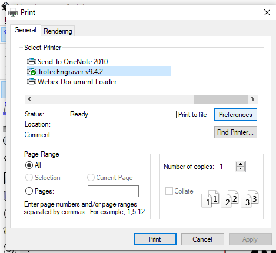

Next, hit preferences. ​​Now, you’ll be in the laser settings menu. The first section will relate to the size of your piece. You can leave it as User-defined Size (i.e., this will take the canvas size you set up already), or you can check the Minimize to Jobsize box. This option reduces the cut area to a small perimeter around your image.

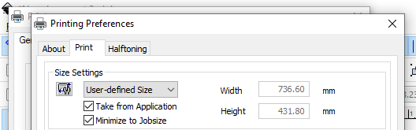

Next, under Material Settings, you’ll have a variety of material options with preset settings for the Trotec laser cutter. The idea here is that you can select the material you are using and sometimes the thickness. If the material you are using is not listed, skip to the :ref:`New Material` section.

Before moving on to the next step, you must double check that the presets have not been tinkered with. In order to do this refer to the :ref:`Material Cut Parameters` section in this tutorial. Then, in InkScape hit the flash button to the left of where the material is listed. 

.. figure:: ../_static/images/lasercut/flash.jpg
  :align: center

This menu is where you can manually override the presets and set them to different values. Compare the presets in the table in this tutorial and the presets in this menu and make sure they match. If true, select ok. If false, or you want to manually override these setting skip to :ref:`New Material`

Finally, unless specified otherwise, the bottom section of the preferences menu should look like this:

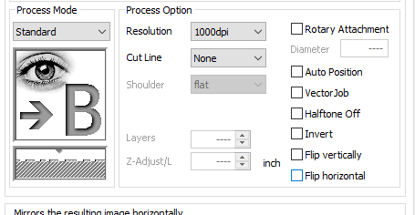

To continue the printing process hit okay > apply > print

New Material
------------

If the material you choose to cut with isn't listed in the presets then that's totally fine but you just might need to have extra stock and do some trial and error.  

The first thing you can do is click on the material you think has the closest composition to the stock you are using. Then, click on the flash button as seen below.

.. figure:: ../_static/images/lasercut/flash.jpg
  :align: center

In this menu you are able to see the predefined parameters for the material you selected and override them. Before changing the settings, jot down all the settings and values seen on the table at the bottom of the window. If you had selected Balsa, 3/16” it would look like this:

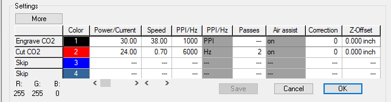

Once those settings are jotted down, select the Category box as if you were to type something in and hit new.

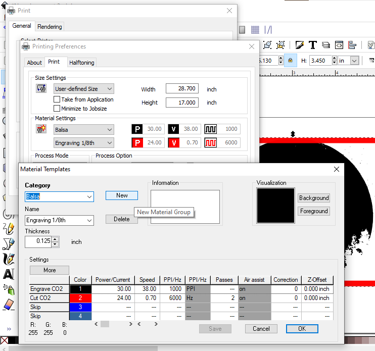

Fill in the category and name of your material and begin filling in the same parameters you jotted down a second ago. Then, begin experimenting by changing some of the parameters that you think will work best for the material you have chosen and run some tests (ie: If your material is harder than the sample material then increasing the power and decreasing the speed value will be necessary).

Tip: The trotec has a dual laser. All hard materials like aluminum need to use the fiber (FLP) laser and all other materials like foam, wood, or plastic need the CO2 laser. Please refer to :ref:`Approved Materials for Laser Cutter`. 

Once satisfied with the settings, select “save” then “ok”. 

Finally, unless specified otherwise, the bottom section of the preferences menu should look like this:

To continue the printing process hit okay > apply > print

Important Note: If the material parameters used were successful, please notify the Engineer In Residence or Student Design Hub Assistant so they can add your material to the table in this tutorial!

Trotec Launch
-------------

After hitting print from InkScape, the Trotec JobControl software will automatically start up. This part is super simple.

The first thing you need to do is calibrate the laser cutter. Use the tool hung on a hook on the left of the laser cutter and attach it to the laser nozzle as seen in the photos below.

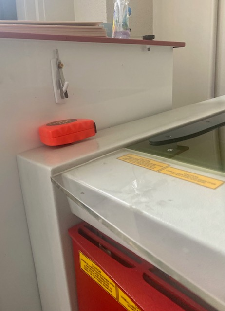

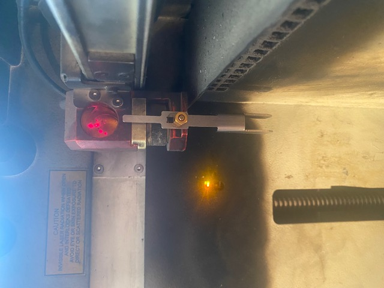

Use the up and down buttons on the control panel on the right of the laser cutter to move the bed upwards until the calibration tool is touching the stock or falls off.

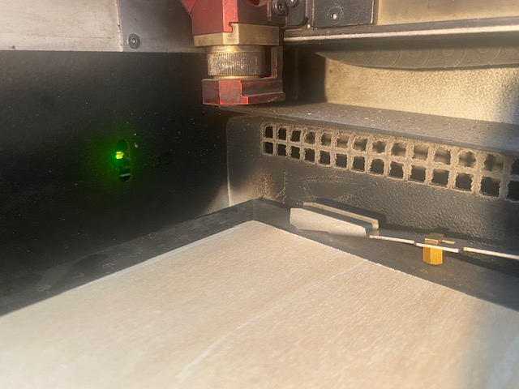

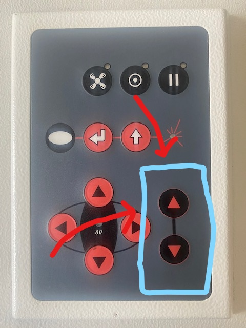

Next, insert your stock in the laser cutter onto the hexagonal bed so that the material sits in the upper left corner as much as possible. (Where the origin is)

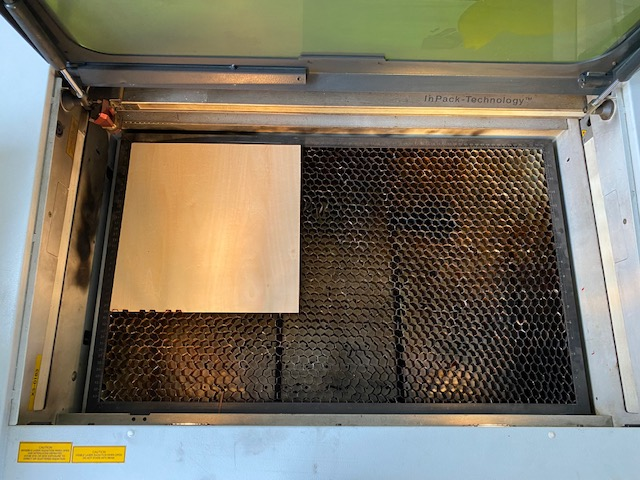

Then, hit the plug-in-like button on the JobControl software and wait for the computer to connect to the laser.

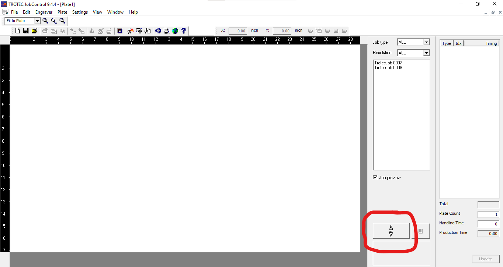

Click the job preview button directly above the laser connect button and single click each TrotecJob listed to see its preview. 

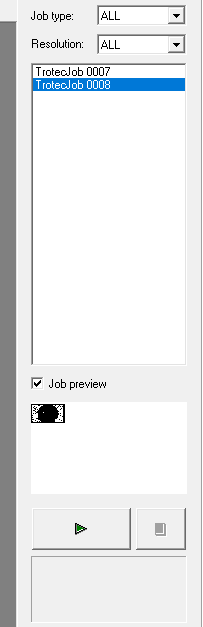

Once your design is found, double click it. Then hit the WYSIWYG button to preview the design on the simulated plate of the actual cutter. If it looks worse than it did in Inkscape don’t worry it will turn out a lot better than previewed.

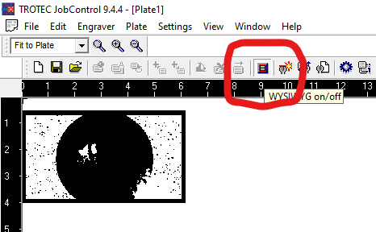

Finally, close the lid to the laser cutter and press the play button.

The final product for the example used in this tutorial looked like this:

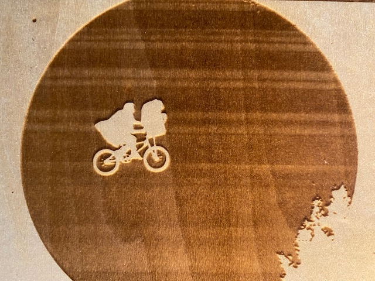
