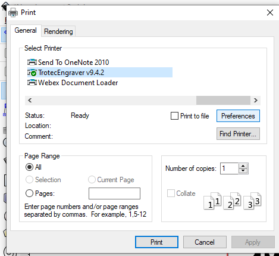
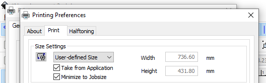

Printer Settings
======================

You’ve made your image and want to cut it out. Go to File menu, then select Print. The Trotec laser will be an option in the drop-down. Select the Trotec and then click Preferences.

Now, you’ll be in the laser settings menu. The first section will relate to the size of your piece. You can leave it as User-defined Size (i.e., this will take the 8.5”x11” size we set up initially), or you can check the Minimize to Jobsize box. This option reduces the cut area to a small perimeter around your image to make it easier to size and locate on the printer bed.

Next, under Material Settings, you’ll have a variety of material options depending on what type of stock you’ll be using. The idea here is that you can select the option based on your material and the material thickness. To proceed with the Memorial logo example, select:

  - Balsa
  - 1/8 Balsa

Notice that there are parameters under the black and red letters. These are the default parameters for this template. Remember!

.. raw:: html

    Red = Cut 

.. raw:: html

    Black = Etch

**NOTE:** Not all templates have been created to cut and etch. Select your profile based on the actions you want to complete. Some may set up to only etch, while others to only cut. If you only want to cut, Job Control will try to etch the image even if there are no black areas. This can add significant time to your job.

The red and black laser settings show the cutting and etching settings, respectively, to be sent to the laser based on the material you selected from the drop-down. This should also generate the material thickness. If you don’t see the material you’d like to cut listed here, jump to :ref:`Closing Notes`.

Under Process Mode, select Standard. There’s nothing here you need to adjust to perform a basic cut or etching operation.

.. figure:: ../_static/images/inkscape_print_settings.png
  :align: center

Now, press OK to go back to the printer menu. Select Apply, then Print. This will automatically launch the Trotec software, Job Control. Job Control opens a representation of the laser table and allows you to visualize where the laser will perform operations.

Positioning and Cutting
-----------------------

Job Control launches a layout that shows the bed of the Trotec laser cutter. Your cut parameters will appear at the top of the screen. There are a few things you’ll need to select before you start cutting. To preview your image on the stock, select View → WYSIWYG.

Next, you want to ensure that the laser autofocuses before you connect to the cutter. To do so, toggle on Autofocus |autofocus| from the top toolbar.

Next, connect to the laser cutter by pressing Connect.

After the computer connects to the cutter, the etching and cutting operations should appear on the right-hand side of the screen. You should see a red box with a time estimate for the cut and a black box with a time estimate for etching.

Before hitting go, there are a few more things to do.

  - Load your stock
  - Position your image on the stock

To load your stock, simply open the laser cutter and position the stock in the top left corner. This is the zero location for the cutter.

Best practice is to measure your stock thickness, length, and width. This will ensure that your intended image will fit on the cutting surface. Ensure the material type and thickness corresponds to the program you selected (link to where to change). Take a moment and verify your stock matches your settings.

Next, you can position the image on the stock. Click and hold the image preview in Job Control to pull it across the bed. Unfortunately, there’s not much available for dimensional referencing to ensure you’re in the position you want on the stock.

If you’d like to create a reference point on the stock, you can use the laser as a guide. The laser’s position on the bed appears as a red crosshair on the Job Control preview screen.

To move the laser position, use the arrows on the machine.

.. figure:: ../_static/images/trotec_laser_control.png
  :align: center

Now, you can drag your image to the position of the laser. This will allow you to select where your cut begins on the stock. You can actually see the laser position adjust on the top of the screen in Job Control. Click and drag your image to the crosshair, and the top left corner should snap to the laser indicator.

.. figure:: ../_static/images/jobcontrol_laser_position.png
  :align: center

Now you’re ready to cut! All you need to do is press play under the job preview (the screenshot below shows the pause button).

.. figure:: ../_static/images/jobcontrol_print.png
  :align: center

**Things to note:**

  - In this tutorial, we selected “Balsa 1/8”, but we cut 1/8” white particle board/white hardboard board.
  - We adjusted the etching intensity to 50% in Inkscape but left the word UNIVERSITY at 100%. You can see the difference in the finishes in the photo. For better results next time, we should adjust the opacity to 50% for all etchings. This is what we did for “Dr. Evil.” Here is the sample produced using the laser settings below.

    .. figure:: ../_static/images/jobcontrol_laser_settings.png
      :align: center

    .. figure:: ../_static/images/laser_logo_printed.png
      :align: center

    .. figure:: ../_static/images/laser_shaded_printed.png
      :align: center

  - The perimeter cut almost fully cut through the board. This is after the power was adjusted to 100 (from the 50 initially listed in the Balsa profile). The cut didn’t fully penetrate the board but was easy to remove with a utility knife following the cut. We can slow down the cutting speed to 0.75 so that the laser has time to penetrate the board. We can also adjust the wavelength to 7000. To see the original 1/8” balsa settings, go back to :ref:`Printer Settings`. This is what we did for the Picture Frame Border shown below.

    .. figure:: ../_static/images/jobcontrol_new_settings.png
      :align: center

.. |front| figure:: ../_static/images/laser_frame_front.png
      :align: center

.. |back| figure:: ../_static/images/laser_frame_back.png
      :align: center

|front| |back|

  - If you did your cut and you’re not happy with the results, you have two options:

    - Go back to Inkscape and export a new profile
    - Adjust the laser parameters in Job Control

In the case above, we followed option two. When the print was sent to Job Control, we overrode the Red Cut Settings to P=100. From a previous test cut, we knew that P=50 would not cut through the hardboard.

Closing Notes
-------------

You’re likely going to want to cut things that the lab hasn’t had the opportunity to attempt yet. As more profiles become dialed in and shared with the Student Design Hub, they will be posted in a reference table for the next group of users.

Expect to have some trial and error when using this system, and have enough material to make several cuts if you haven’t used the machine before. Once you figure out the optimal settings, please share them with us so that we can add them to the table below!

Also, Job Control will always default to the parameters of the first job loaded in a session. For each new operation, close Job Control and relaunch it. This means you’ll need to reconnect to the printer each time you make a cut with different parameters.

You can tweak the laser parameters BEFORE you connect to the printer. After you connect, Job Control will try to adjust the parameters back to the settings pushed from Inkscape.
