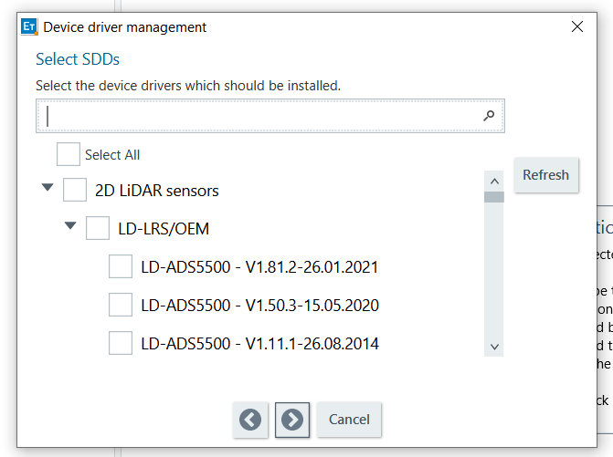
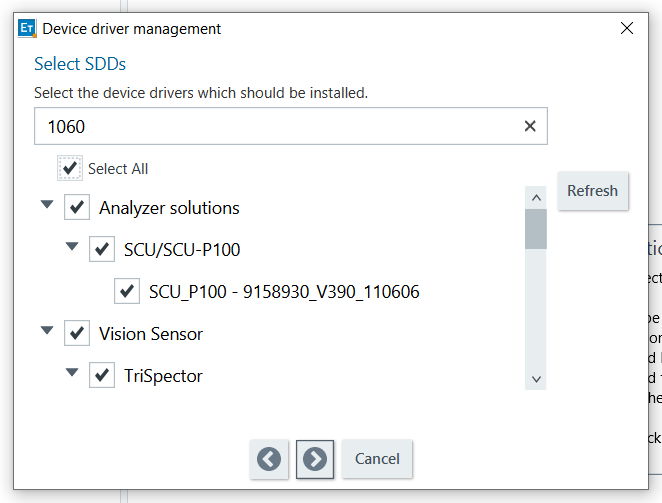
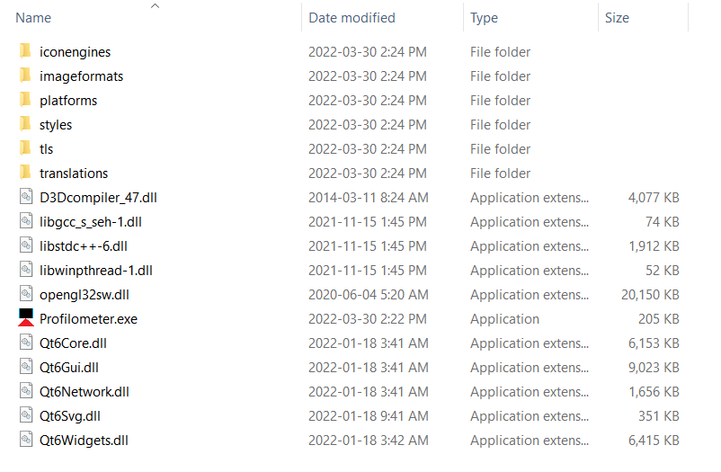
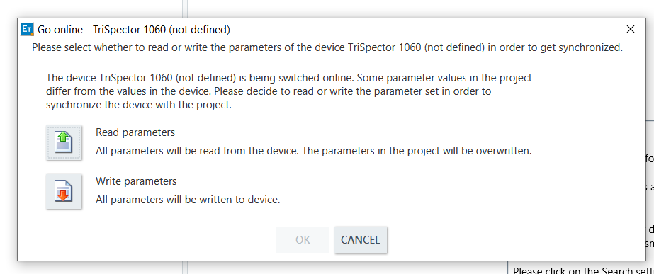

Profilometer
============
(picture of profilometer)
.. image:: ../_static/images/Profilometer_0.png
   :width: 1000px

The Student Design Hub lab has a device called a "profilometer". It develops a 3D image by running a laser across an object and recording the height of the laser beam at each increment. The profilometer uses a Trispector 1060 sensor to record data and an Arduino Uno to control the motor on the apparatus. These are both connected to a router, allowing any computer that is connected to that router to communicate with the sensor and the Arduino wirelessly. A program was created to make it easier for a computer to control the motor on the apparatus without having to be plugged into the Arduino. The steps for downloading and using this program are detailed below. The software required to communicate with the sensor is called SOPAS Engineering Tool, which can be installed from `here. <https://www.sick.com/ca/en/sopas-engineering-tool/p/p367244>`_

Installing and Configuring SOPAS
--------------------------------
After clicking the "Download" button in the SOPAS website, you will receive a zipped file. Extracting it will reveal the installer application. Run this application and work through the setup wizard to install the application. Once it is finished, run SOPAS. A message will pop up saying, "There are no SDD files installed. Do you want to install SDD files?" Click "Yes". 

When asked where to install from, select "From SICK driver repository" and go to the next section by clicking the right arrow.

When this prompt appears (shown above), input "1060" into the search bar and click the "Select All" checkbox. Your the pop up should look like this before you go to the next page:

   
Click the arrow again and wait for the installations to complete. Once they are done, go to the next page and click "Finish". The software is now ready to use with the profilometer.

Installing the Program for Controlling the Motor
------------------------------------------------
The ZIP file containing the program executable for controlling the profilometer can be downloaded from this link: 

:download:`Download ZIP File <Profilometer Controller.zip>`.

After downloading and extracting the ZIP file, open the folders until you see this:
(Picture of directory containing program executable)

   
This is file contains an executable file called "Profilometer.exe". This is the program. **Do not move the executable outside of this folder**. If you wish to make this file quickly accessible, you will have to create a shortcut for it.

**Note:** This program was made for Windows computers, so some (or all) the features may not work on other operating systems.

The Scanning Process
--------------------
The first step to producing a scan is to place an object under the scanner. To ensure the most detailed scan possible, place the item such that there is minimal overhang. The sensor can only see features of the object from above, so overhangs will not be included in the profile.
(diagram of overhang vs. no overhang)
.. image:: ../_static/images/Profilometer_4.png
   :width: 1000px
   
It is recommended that you place the object ~1 ft ahead of the laser line so that you have time to trigger the sensor. You will be able to perform a scan as soon as you have SOPAS configured and the profilometer controller program downloaded onto your computer.

First, make sure that the profilometer and the router on top of it are plugged into an outlet. Connect your computer to the router's Wi-Fi. You may have to press the button on the back of the router to connect. Once connected, you should be able to control the motor on the apparatus using the Profilometer Controller app. Try pressing the left and right arrow buttons (highlighted in the image below). **Note: Do not spin the motor the wrong way while the profilometer is at the end of the rail, as this may damage the motor or the contact sensors.**

.. image:: ../_static/images/Profilometer_5.png
   :width: 1000px
   
Now, either press the "Open SOPAS" button in the profilometer controller app or open SOPAS directly from where it is located on your computer. Once it is open, you should see the sensor pop up in the left area of the screen. If the sensor is already online, double click it and wait for a new window to appear. If it says it is offline, press the button that says "Offline" to switch it online again. When the following pop-up appears (below), select "Read parameters". Then just double click on the sensor in the left side of the screen and wait for a new window to pop-up:

   
The sensor has settings burned into its memory which should produce a decent image. The settings under "Motion" should not be touched, as they are configured specifically for the incremental encoder used by the profilometer apparatus. However, the settings for every section below that can be changed to make the profile as detailed and accurate as possible. More details on adjusting the settings in SOPAS are described :ref:`in the next section. <Adjusting the Scan Settings in SOPAS>`

Adjusting the Scan Settings in SOPAS
------------------------------------
