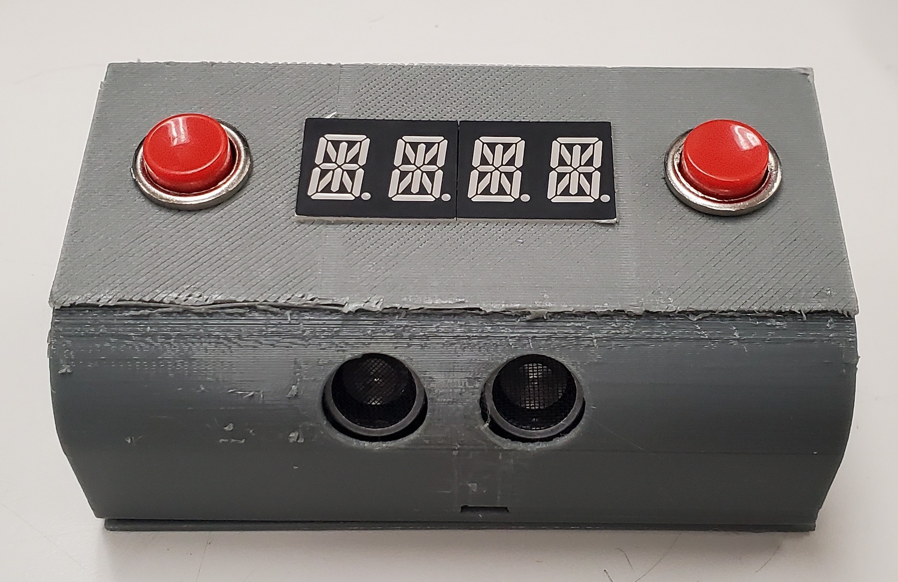
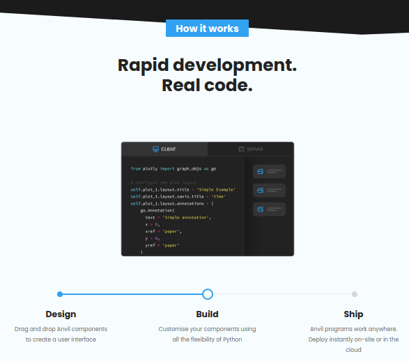
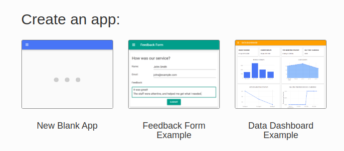
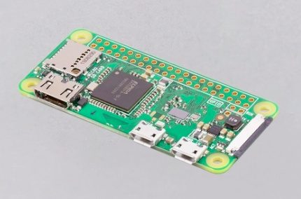

Project Overview
================

Internet of Things is one of the most important modern technologies of everyday life. The term IoT describes a system of devices that work together and share information over a network to accomplish a certain task. By automating tasks and collecting data, IoT devices can optimize resource utilization and improve decision-making, and are thus often called smart devices. IoT is also the basis of smart home devices like smart switches and thermostats. You can read more about IoT `here <https://internetofthingsagenda.techtarget.com/definition/Internet-of-Things-IoT>`_.

IoT technologies have been evolving rapidly over the last decade. Today, many tools are available for beginners to facilitate creating custom IoT devices at a low cost and writing functional web apps for free. By following this project, you will learn to use some of these tools to create a two-way over-the-internet communication between a hardware device and an online server, which resembles a smart IoT device. You can then apply the same methodology to innovate create your own IoT device.

In this tutorial, we will be building a smart sleep tracker with alarm functionalities. The device monitors a user’s hours of sleep and logs data to an online server. Through a web app, the user can view a weekly plot of their total hours of sleep every day and get the average, minimum, and maximum sleeping periods for the week. Users can also set multiple one-time and repeating alarms through the web app, and the device will fetch this information from the server to fire alarms. Finally, there is a digit display at the front to show time and two buttons on the device for snoozing and dismissing an alarm.

The two main tools used in this project are:

- **Anvil:** an interactive web app builder which will be used to create the app user interface and back-end server.

- **Raspberry Pi:** a small computer board to control the sensors and display and to communicate with the server.

Both Anvil and Raspberry Pi use Python programming language to control the electronic components and create server functionalities. We recommend that you check our `Python tutorial <https://munsdh.readthedocs.io/en/latest/Python.html>`_ before proceeding with this project.

Anvil
-----

Anvil is an online platform for building web apps using only Python for both server and client code. It does not use HTML, Javascript, PHP, or any of the common web development languages. Anvil provides a Python package for controlling the user interface (UI) elements, backend processes, and databases as an abstraction to facilitate creating web apps. Since it uses one of the most popular programming languages, Anvil is also suitable for beginners and hobbyists.

An Anvil app consists mainly of four parts:

- **User interface:** the elements which appear to the user on the screen to interact with.

- **Client code:** controls the UI elements and how they behave/respond to user actions.

- **Server code:** offers functions and methods for both the web app front-end and any other third-party devices (ex. Raspberry Pi) to interact with the app and update/retrieve data tables.

- **Data table:** permanent storage controlled by the server code to save/fetch information sent by the user or third-party devices interacting with the server.

The difference between Anvil server and client code in terms of execution is analogous to that between PHP and Javascript on a website. Anvil Server modules run on the server-side of the web app and cannot be modified by the end-user. On the other hand, the client code runs in the browser and can be viewed through the browser’s developer tools. As a security measure, Anvil does not allow data tables to be accessed directly by the client code; only server code can modify and read tables.

Anvil apps are created online through `anvil.works website <https://anvil.works>`_. Go to the website and sign up. After that, click “Start building”. You can then use existing templates or a blank template to build an app.

You can choose a theme for your app. This project uses a blank app with a Material Design theme. Once created, the app builder window is shown, and you can start working on the interface design and server code.

Raspberry Pi
------------

Raspberry Pi is a low-cost, small computer that is focused on electronics and programming development. It has a CPU, RAM, HDMI, and USB ports, just like a regular computer. A Raspberry Pi board is also capable of running a full operating system, using a monitor and a keyboard, and connecting to the internet. In addition, Raspberry Pi provides a set of pins, called the General Purpose Input/Output (GPIO) pins, that allows a user to connect external hardware components and control them through Raspberry Pi. Hardware components include buttons, displays, sensors, modules, motor controllers, and many more electronic components, and they are controlled using Python, one of the most popular and easy programming languages to use. Thus, Raspberry Pi is very common among students who are starting to learn electronics and programming. Professionals also use it as a fast, cost-effective method of prototyping for large projects. The board is also supported by a huge community of hardware and software developers who are constantly creating new electronics components and software packages.

There are many models of Raspberry Pi boards with varying features and specifications. This project uses a Raspberry Pi Zero W, a low-cost general purpose computer. The Raspberry Pi Zero W is the most suitable for the purpose of this project because of its small size (65x30 mm) and onboard wireless connectivity through WiFi. The board also has 40 GPIO pins which allow controlling the hardware needed for this project. For storage, the Raspberry Pi Zero W uses an external micro SD card as its hard drive, which hosts the operating system and user data. Finally, the board operates on 5V and can receive power from an adapter or a PC's USB port using a micro USB cable.

Since Raspberry Pi is a computer, it requires an operating system (OS) to function. There are many OSs that can run on Raspberry Pi. The official Raspberry Pi OS image can be downloaded from the raspberrypi.org website. Three versions of Raspberry Pi OS are available:

- **Raspberry Pi OS with desktop:** has a graphical user interface (GUI) for users to interact with the OS using peripherals (monitor, mouse, etc...).

- **Raspberry Pi OS with desktop and recommended software:** similar to the desktop only version but adds preinstalled tools and software programs to get started with Raspberry Pi.

- **Raspberry Pi OS Lite:** does not have a GUI but offers a terminal through which users can enter commands to interact with the OS.

For the purpose of this project, peripherals are not necessary. Instead, we will install Raspberry Pi OS Lite and access the Raspberry Pi’s terminal through a secure shell protocol (SSH) connection from a PC. SSH is a network protocol that allows users to securely access a computer over a network. This connection can be used to log in to a computer remotely, execute commands on the other system, and transfer files between two systems. SSH provides password authentication and encrypts the communication between the two network devices. You can read more about SSH `here <https://www.ucl.ac.uk/isd/what-ssh-and-how-do-i-use-it>`_.
