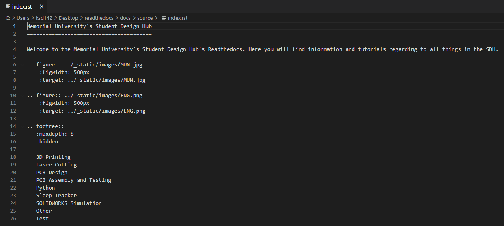

Pushing to Readthedocs with Github Desktop
==========================================
The content below provides a brief overview of how you can quickly push updates to the Memorial Student Design Hub readthedocs page using Github desktop. This is an alternate workflow to the "Sphinx and Readthedocs Tutorial" page. This workflow focuses solely on pushing updates and does not describe syntax. It also does not utilize the command prompt. By following this workflow you will understand how to quickly create the file architecture for a new tutorial page. 

Start by downloading and installing Github desktop 

https://desktop.github.com/

Launch GitHub desktop and login. This workflow assumes that you are already contributor on the readthedocs repository. Create a local clone the readthedocs repository per the prompt after launching github desktop. Ensure the path is somewhere intuitive to you (so you can find the path later).
Github Desktop will display the repository, along with any changes you make to the source files for the repository. You can minimize github desktop for now.

Navigate to the repository file path, in this case the foliepath might look like:

"C-->Users-->username-->desktop-->..."

In the source folder you’ll find all of the files making up your readthedocs webpage. The most important file in this folder is index.rst. Open index.rst in the editor of your choice (in this example I’ll use notepad++). Index.rst is the file that manages the readthedocs file explorer. 

If you’re planning to add a new subsection, navigate to the rst file and add the title of the new section. The title must be nested. We’ll add “Test”. 

Now that we’ve added “Test” it will appear in the menu on the left hand side of the screen. Readthedocs will try to reference an rst file titled “Test” to know what to do next. So, we should create Test.rst. To create test.rst open any other secondary index file. Think of the secondary index file as the next file explorer for your page. For example, the file titled “Laser Cutting” is the index file for the laser cutting tutorial content. Open “Laser Cutting” and save it as “Test”. 

Now that you have your “Test” index file, you can change the content of the file. Edit the file to have a unique header and remove any reference to other existing content at the bottom of the file. Our new file will have the title “Test Check” and it will look to reference file “Hello Patrick”.

 

You’ll notice that the file populates with Title “How are you today” instead of “Hello Patrick”. The file name is Hello Patrick.rst but the title within the file is “How are you today?”. This allows us to open the “How are you today?” tutorial page to see the included message. 

Now that you’ve created the architecture, you can push the files. Through this process you’ve created two .rst files. The first is “Test.rst” and the second is “Hello Patrick.rst”. Copy these files into the source folder of the repository. 

Now that you’ve added files, you can commit them to the readthedocs. Open github desktop. On the top left hand side of the screen you’ll see the changes you’re trying to implement. The "Green Plus" indicates that you’re adding new pages, while the "Yellow Dot" indicates you’re changing an existing file.

Before making any commits, its best practice to press “Fetch Origin” at the top of the screen. This will ensure that your repository is up to date before you push any changes. 

Next at the bottom left hand side of the screen you’ll see the “Commit” button and a text box. This text box is used to provide context for the changes you’re making and why you’re making them. If you share a repository with others, this helps people to understand when a change was made and why in case the change produces conflicts. When you’ve written a good description of your changes, select “Commit to Main”.

Now press “Push Origin” to push the updates! Everything you’ve changed will be pushed to the repository and should be reflected on the Readthedocs in the next ten minutes. 

.. figure:: ../_static/images/GITHUBDESKTOP11.png
    :figwidth: 700px

