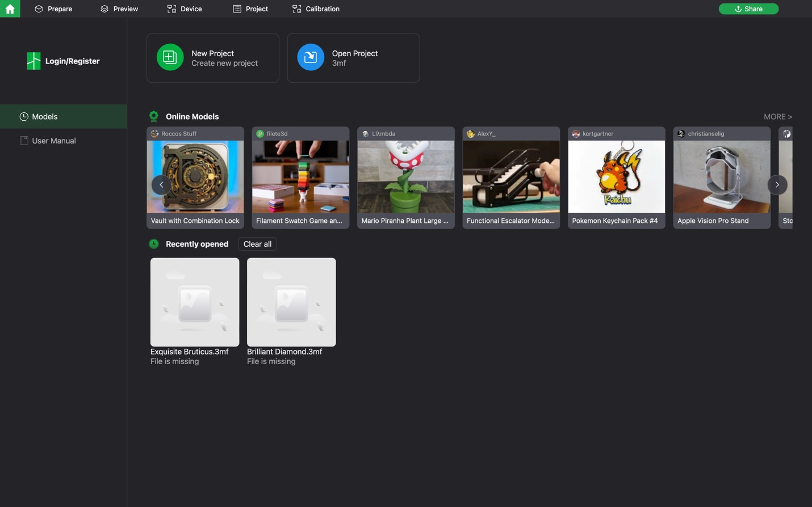
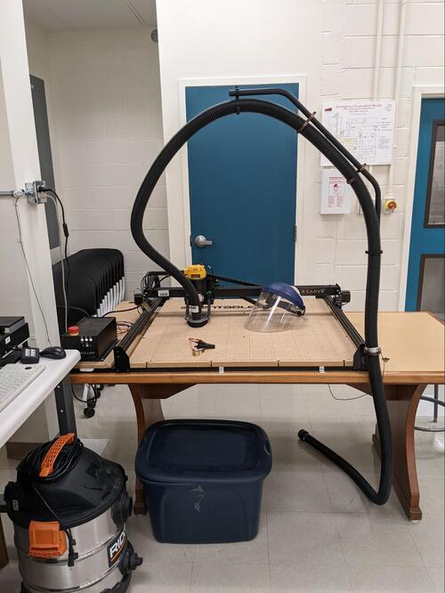

Read Before Operating - Bambu P1S Quick Start Guide
==================================================

Step 1: Downloading Bambu Studio
---------------------------------
First step to using Bambu P1S is to download the Bambu Studio as it is a proprietary software.
You can download it `here <https://bambulab.com/en/download>`_. Install the correct application for your respective operating system.

Step 2: Configuring Bambu Studio
---------------------------------
Start by clicking on ‘New Project’ as shown below.

Next, select the correct printer type: Bambu Lab P1S 0.4 Nozzle

Step 3: Slicing STL File
-------------------------
You are now ready to slice your STL file. Import or drag the STL file into Bambu Studio by
clicking File
