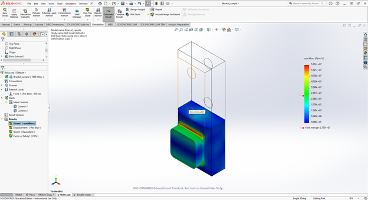

Read Before Operating - Bambu P1S Quick Start Guide
==================================================

Safety & Operations Notes: 

*  There is an emergency stop button on the X-Carve controller, this will cut power tot eh system immediately if there is an issue.

*  Always wear eye protection when operating the CNC. There is no cover so particles can fly up and enter your eyes.

*  Never run teh CNC without first connecting the shop-vacuum. This will minimize particles in the room that you may inhale or get in your eyes.

*  **NEVER** leave the machine **UNATTENDED** when in use. The computer must also be connected to the machine to function.

*  **DO NOT** handle any bits for this machine without **GLOVES.** The BITS are extremely SHARP.

*  It is critical to ensure your work piece is secure before you start any cutting operations. You can clamp or screw your work piece to the spoil board on the x-carve bed.
 
*  You may ruin your workpiece if the machine is not properly zeroed in the Z plane. You can use the z-probe to establish an accurate reference for your depth of cuts. 

Step 1: Downloading Bambu Studio
---------------------------------
First step to using Bambu P1S is to download the Bambu Studio as it is a proprietary software.
You can download it `here <https://bambulab.com/en/download>`_. Install the correct application for your respective operating system.

Step 2: Configuring Bambu Studio
---------------------------------
Start by clicking on ‘New Project’ as shown below.

Next, select the correct printer type: Bambu Lab P1S 0.4 Nozzle
.. figure:: ../_static/images/XC1.jpg
    :figwidth: 600px
    :target: ../_static/images/XC1.jpg

Step 3: Slicing STL File
-------------------------
You are now ready to slice your STL file. Import or drag the STL file into Bambu Studio by
clicking File
