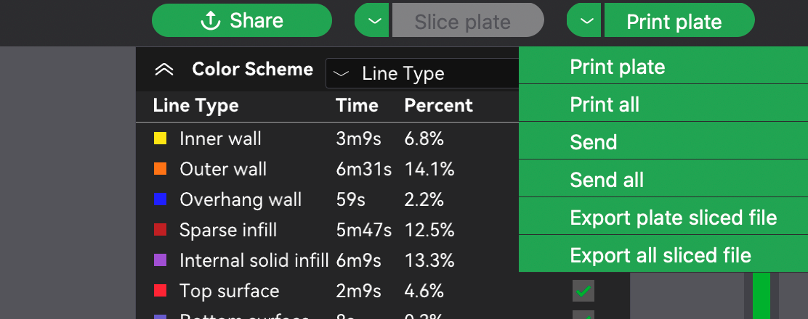

Read Before Operating - Bambu P1S Quick Start Guide
==================================================

.. contents:: Table of Contents
   :depth: 2

Step 1: Downloading Bambu Studio
---------------------------------
First step to using Bambu P1S is to download the Bambu Studio as it is a proprietary software.
You can download it `here <https://bambulab.com/en/download>`_. Install the correct application for your respective operating system.

Step 2: Configuring Bambu Studio
---------------------------------
Start by clicking on ‘New Project’ as shown below.

.. figure:: ../_static/images/P1S_04.jpg
    :figwidth: 600px
    :name: P1S_04.jpg
    :target: ../_static/images/P1S_04.jpg

Next, select the correct printer type: **Bambu Lab P1S 0.4 Nozzle. IF THE WRONG PRINTER IS SELECTED, IT WILL DAMAGE THE PRINTER**

Step 3: Slicing STL File
-------------------------
You are now ready to slice your STL file. Import or drag the STL file into Bambu Studio by clicking File Import  Import 3MF/STL/STEP/SVG/OBJ/AMF… 

Use the options in the top to orient your model to lay flat on the bed and in an orientation that will minimise the use of supports. If supports are required, then enable them from the “Support” tab.

.. figure:: ../_static/images/P1S_07.png
    :figwidth: 600px
    :target: ../_static/images/P1S_07.png

Click on the “Strength” tab to change infill percentage (most prints will do will with 10-20% infill).

Step 4: Slicing and Exporting 
-----------------------------
Now hit “Slice plate” on the top of the screen. 

Click on the drop-down arrow and click “Export all sliced file”

Transfer the file to the SD Card and you are now ready to head over and start printing!

Step 5: Setting up Bambu
-------------------------
Turn on the printer on the bottom left corner on the back of the printer and place the filament in the spool holder. **When printing, use your own filament and do not use any that is not permissible to be used**. 
`Bambu PLA <https://ca.store.bambulab.com/products/pla-basic-filament>`_  and `ESUN PLA+ <https://www.amazon.ca/1-75mm-Black-Printer-Filament-2-2lbs/dp/B01EKEMDA6/ref=sr_1_11?crid=WJ6WAH6ONA0X&dib=eyJ2IjoiMSJ9.UikmRW7fvnnRUWXATZwe-va6pwSST4q-UL6KmphWGCGxhKYkR3gHF6q2yyKYtawryuuBDggr2jAthrTkCXTzpN2dpySL4NSPfvI3FqjqMnhns9Gm-uAncVic0w_Qh913dktfzHCyMC2sphKdfrpSiDdY_NpIf1pEAnoIs6pA25DvSILgjhwbuDE6SW2Cxc_jgGW-JRCsAqh8zidYJRzg7_6ydpf8Zdv8rijA4JEVaZ5-bd1ylNgi9Ab1Fsou4GLnHaI89MRpy-WzyUsQJofyuqF7wpy-i7WhdRofx1MfxNM.hLuOSTXyF4VlU-pFQ6mu7RwBl8WPah4r3xRHakgJCVo&dib_tag=se&keywords=esun+pla+plus&qid=1709750917&sprefix=esun+pla+plu%2Caps%2C116&sr=8-11>`_ are the recommended filaments. You can also buy them locally from `COLEMAN3D <https://coleman3d.ca>`_.

Click on the second option on the left column and then click “Feeding”. 

    

Hit “Load” and insert filament from the back. Keep hitting retry until the old filament has been removed and your filament colour is clean.

Once your filament has been successfully loaded, click on the 4th option the left column to access the file. Find your file name and select print. *DO NOT PUT GLUE ON THE PLATE. IT IS A TEXTURED PLATE AND DOES NOT REQUIRE GLUE**.

Congratulations your model is now printing!