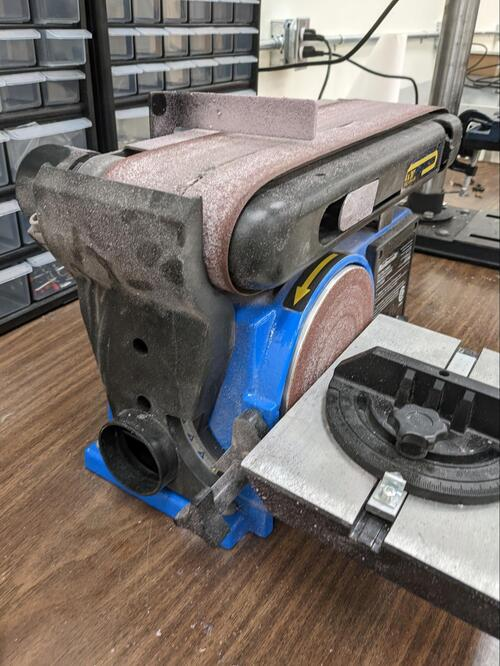

Read Before Operating - Belt Sander Quick Start Guide
=====================================================

Safety & Operations Notes: 

*  A belt sander is like any other piece of rotating equipment. Hair should be tied up, jewelry removed, and other catch hazards mitigated before use.

*  Always wear safety gloves and protective glasses when operating the belt sander. It is easy for particles to fly up into your eyes while sanding, and for you to accidentally touch the belts when cleaning up a work piece.

*  The belt sander has a table with an adjustable guide, this can be used to sand precise angles in your part.

*  The material should be held so the machine pulls it away from the operator. If there is any sort of “kick back” when the material is held against the belt then you should consider how you are holding the piece.

*  This belt sander is designed for wood and plastic. Metals can be processed but it may ruin the belts. If a belt is damaged please inform a member of the SDH staff. 

Overview: 

Belt sanders are excellent tools for rapid removal of material. It can be used to remove rough surfaces, and sharp edges. The belt sander is located in the back of the SDH (EN1040). 

The belt sander is better for softer materials like plastics, woods, foam and even aluminum. Steel can be sanded down as well, but will take more time.

The vice in front of the machine can be used as a guide for a material.

Before using the belt sander, ensure the Shop VAC is connected to the back to pick up any residue from sanding. Turn on the vacuum as you sand your part to pick up any particles. 

If you are unsure about how to use the machine, try watching this guide https://www.youtube.com/watch?v=x1FehVIkq_k 

