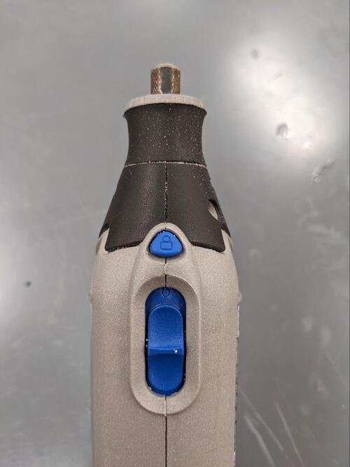

Read Before Operating - Dremel Quick Start Guide
================================================

Safety & Operations Notes:
-------------------------
*  Always wear safety gloves and protective glasses when operating the dremel. The disks can be brittle causing them to break and fly off. Dremels can produce fine dust that is irritating to your skin and eyes.

*  A dremel is like any other piece of rotating equipment. Hair should be tied up, jewelry removed, and other catch hazards mitigated before use.

*  A dremel can be used free hand, but if you feel there is a risk that the part may shift you should secure it in a clamp before cutting.
 
*  The speed selected should be appropriate for the material that is being worked on. There is no general guide for this as the different heads, materials and speeds provide limitless possibilities. As a rule of thumb, start with a lower RPM and work your way up. Softer materials like plastic and wood will use a lower RPM than harder materials.

Overview:
--------
A dremel is a handheld multipurpose rotary tool. There are various heads that can be swapped out to perform different tasks. There is a variable speed dial on the tool that allows the user to adjust the RPM.

There are attachments for carving/engraving, grinding, sanding, cutting and polishing. 

To change the dremel tooling head. Press down on the lock button and loosen the collet (this may require a small wrench). To secure a new tool, slide the shaft into the collet at the end of the dremel. Tighten the collet by rotating it and tug on the bit to make sure it is secure.

Here is a video to help use a dremel: https://youtu.be/zenwKTMC1R0