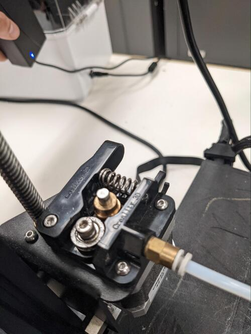
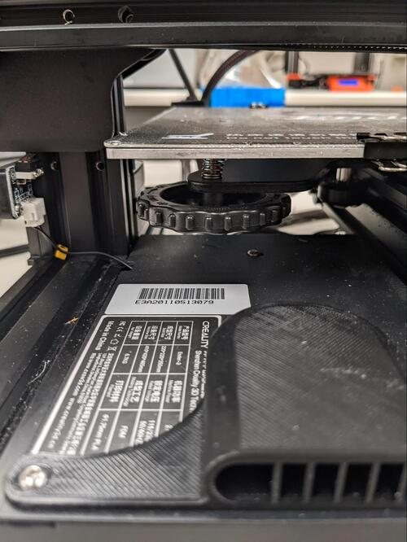

Read Before Operating - Ender 3 Quick Start Guide
=================================================

Safety & Operations Notes: 

*  Ensure the bed is level by following the leveling procedure in this guide

*  Use windex and a cloth to clean the bed surface

*  Ensure the clips are holding the bed down

*  **DO NOT** put your hands near the nozzle or print bed during printing or when the printer is heated

*  Use a slicer like Prusa or Cura to import and slice the file, then load the file using a micro SD card reader

*  SD card readers are found in the yellow bin at the front of the SDH

Overview: 

The Ender 3 V2 is located in the DDPL. 

Do not touch the nozzle or bed during printing. Keep hands away from the machine while in use to avoid injury. 

Once the printer is preheated to the right temperature the filament can be loaded. 

Make sure the print bed is clean. This will ensure the first layer of your print goes down well. Use isopropyl or windex and wipe away with a rag. 

To load filament, press and hold the extruder lever on the back. Then insert the 1.75mm filament through the small hole into the guiding plastic tube until filament comes out the other side. If it does not, there may be an issue with the extruder.

To level the machine go to Prepare then auto home.

.. figure:: ../_static/images/Ender32.jpg
    :figwidth: 700px
    :target: ../_static/images/Ender32.jpg

 Wait for the nozzle to move to the front left of the bed. Adjust the platform height by turning the knob underneath. Use a piece of standard printer paper to assist with the adjustment. The nozzle must lightly scratch the paper, offering a small amount of resistance when moved.

Complete this adjustment on all 4 corners. Repeat this process 1-3 times for the most accurate 

When preparing a print, move the sliced file onto an SD card using a USB SD card reader. 

Watch the first layer of the print. If the filament is not sticking to the bed, the nozzle is too high.
If the filament looks like it is being flattened and coming out slightly translucent, the nozzle is too low.

