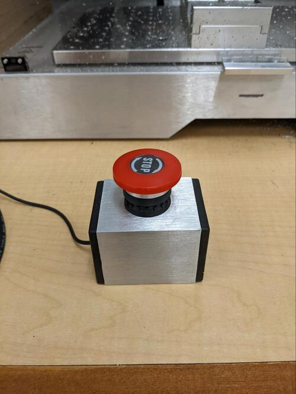

Read Before Operating - Evo-One Mill Quick Start Guide
======================================================

Safety & Operations Notes:

* **DO NOT** handle any bits for this machine without **GLOVES**. The **BITS** are extremely **SHARP**.

*  To change a **BIT**, follow the tutorial linked below.

*  There is an e-stop connected to the rear of the machine, this will cut power to the operations if there is an issue.

*  **DO NOT** leave this machine unattended while running.

*  A computer with Cre-Mov must be connected to the mill to operate it. If the computer enters standby so will the Mill.

*  There is a z-probe connected to the rear of the mill that can be used to zero the z-axis of the system before starting any operations.

*  Make multiple shallow cuts instead of large cuts. This will be easier for the machine to handle and have less of a chance of damaging the machine or the stock.

*  The E-stop must be disengaged before operating. If you are getting no response from the machine, the button is likely pressed.  

Mill Tutorial: https://munsdh.readthedocs.io/en/latest/CNC%20Mill.html

Overview:

A mill is a computer numerically controlled machine that uses a rotating spindle to remove material. To make use of this mill one must download the Cre-Mov software from the makerdreams website. 

Make sure the lid is properly closed before operating. There is a safety built into the cover that wills top the mill mid operation of the lid is lifted. Do not try to open the lid and touch the mill during operation. 

The Z-offset must be set before cutting. Use the Z-probe attached to the machine to set the Z-offset. Here is a guide with a video on using the z-probe: https://docs.sainsmart.com/article/yhgowhcb8x-what-is-a-z-probe-how-do-i-use-it

Secure your stock. There are clamp supports and screws located in the black box below the table the mill is sitting on. These screws/clamps can fit into the aluminum bed and keep the stock secure. 

There is also a vice and a frame that can be screwed into the bed to hold the stock. Make sure to account for the thickness of the spoilboard and the vice / clamps in your toolpaths. This may limit some vertical operations and the maximum travel in the z-direction. . 

Feeds and speeds can be determined using the spindle RPM and the tool diameter. A handy calculator can be found here Free CNC Speeds and Feeds Calculator.

When processing aluminum you may need to use a cutting fluid. Use shallow cuts and cutting fluid on the bit periodically to ensure the best possible surface finish. 

