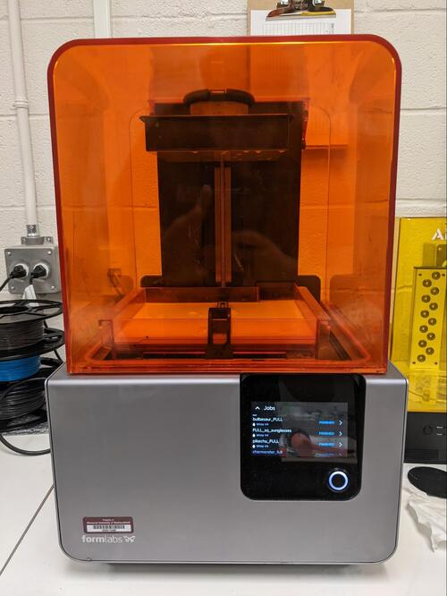

Read Before Operating - Form 2 Quick Start Guide
================================================

Safety & Operations Notes: 
-------------------------

*  Resin & Isopropyl Alcohol

*  Review the MSDS sheet for both before handling. You should not handle chemicals without proper training in WHMIS

*  https://formlabs-media.formlabs.com/datasheets/1801051-SDS-ENEU-0.pdf Resin

*  https://rsc.aux.eng.ufl.edu/_files/msds/2/Isopropyl%20Alcohol.pdf Alcohol

*  When handling resin in any capacity, **WEAR GLOVES.**

Printer:
-------

*  The build plate must be free of any residue like hardened resin or dirt.

*  Ensure that there is enough resin in the cartridge/tank.

*  Make sure the wiper is securely connected to the small black footing on the printer in front of the resin tank. The wiper locks into this footing and moves through the resin tank during a print.

*  Inspect the resin tray for any particulates or hard pieces. If some are floating in the tray it should be drained and cleaned before use.

*  Remove parts from the bed of the printer using a scraper. 

Slicer: 
------

*  Using the “One Click Print” function in the Pre-Form Slicer you can get a very good quality print with no hassle. Download on the Formlabs site: https://formlabs.com/software/ 

Wash and Cure Station:
---------------------

*  Submerge removed parts in isopropyl alcohol - 5 minutes in the wash station is adequate. Leaving parts for too long will reduce their structural integrity.

*  Remove the supports with flush cutters.

*  Cure the part for 3-5 minutes. Overcuring will decrease the parts structural integrity.

A full workflow for this system may be found here : https://munsdh.readthedocs.io/en/latest/Resin.html

Overview: 
The Formlabs Form 2 printer prints uses resin. This allows for more precision compared to the filament printers. 

