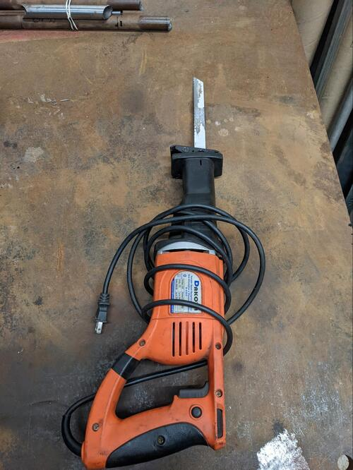
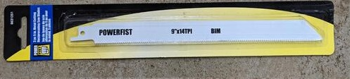
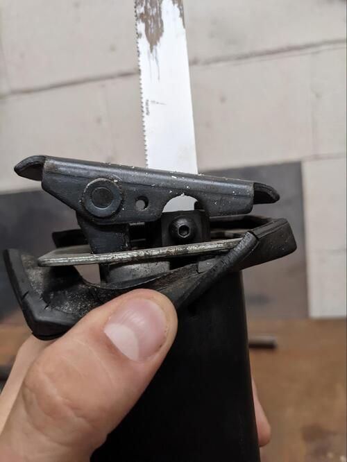

Read Before Operating - Reciprocating Saw Quick Start Guide
===========================================================

Safety & Operations Notes: 

*  Before making any cuts you must ensure your work piece is secure. If the material moves during a cut it can cause the blade to snap and result in injury.

*  Always wear safety glasses. Scraps of material can very easily be thrown up into your eyes.

*  While making a cut, press the shoe of the blade against the material to keep the saw stable.

*  Choose a blade that is about 2-3 inches longer than the thickness of the material you are cutting to ensure the blade does not wobble.

*  Ensure the battery is taken out or the cord is unplugged before installing a new blade.

*  This saw is like any other piece of rotating equipment. Hair should be tied up, jewelry removed, and other catch hazards mitigated before use. 

Overview: 

The saw has a blade that moves back and forth in a rapid, push-pull motion. The tool should be held with both hands as it can kick back during operation. This saw can be used for a range of materials, like woods and metals. 

This saw should be used to make short cuts in tough-to-reach places.

First a blade must be chosen for the saw. Generally, the side of the blade will list the materials it is rated for. The TPI, refers to the teeth per inch will be: 
higher for metals and 
lower for woods. 

The blade can be changed using a 4mm hex key to tighten/loosen the blade mount. 

One should measure and mark the material to be cut before any sort of cut is made. The material should also be secure. If the object would move during cutting, use clamps to ensure it will not.

While cutting it is important to wear safety glasses. Scraps of material can very easily be thrown up into your eyes

While making a cut, press the shoe against the material to keep the saw stable. Press and hold the trigger to get the saw up to speed. Then guide the blade through the material.

Here is a video guide on how to use the reciprocating saw: https://www.youtube.com/watch?v=qv2yOiae2t8
