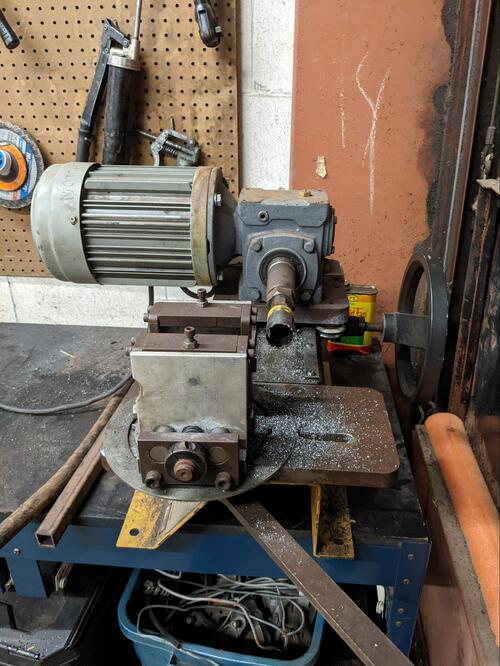
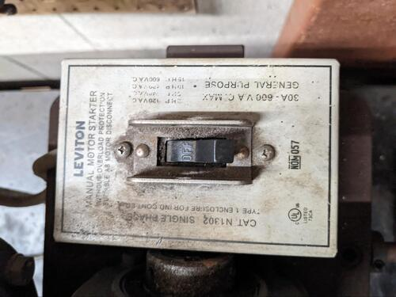
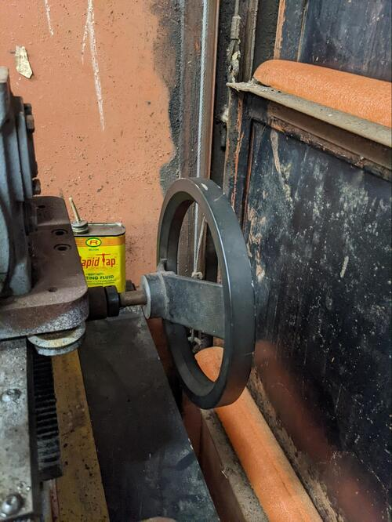
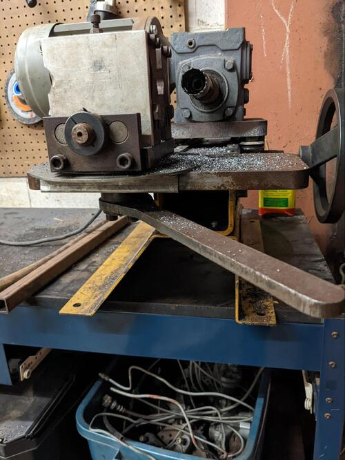
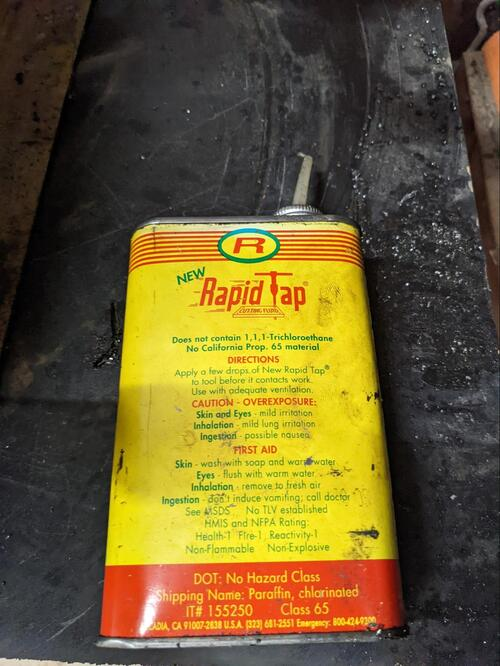
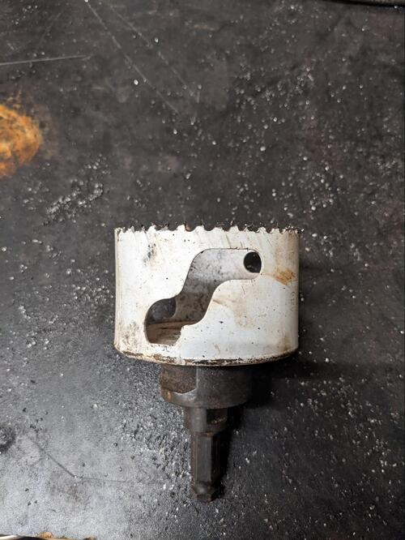
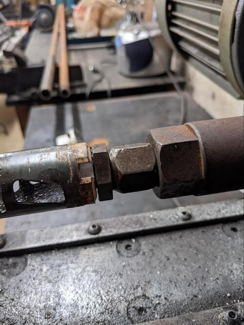

Read Before Operating - Tube Notcher Quick Start Guide
======================================================

Safety & Operations Notes: 
-------------------------

*  The tube notcher is like any other piece of rotating equipment. Hair should be tied up, jewelry removed, and other catch hazards mitigated before use. 

*  Keep your hands away from the shaft while it is operating.

*  Work pieces must always be secured in a vice - never operate this machine without securing your material.

*  The machine can produce hot metal shavings that can burn your skin, be wary of these shaving while the machine is in operation.

*  Using cutting fluid is not required but will help with the quality of produced cuts.

*  When finished a notch, make sure to clean large chunks of metal from the inner diameter of the cutter as it may impact the next cut you try to do.

*  After cutting your workpiece will have metal burrs, be careful handling the piece after work is complete. Deburr the material as soon as possible.
 

Overview: 
--------
The notcher motor is a low RPM high torque machine. Its stall torque is much more than your arm, so it is important to be mindful when operating the machine.

No hand jewelry, no wrist jewelry, no long sleeves, no gloves, wear eye protection (safety glasses, not just normal prescription glasses), and keep hands away from the shaft while rotating/operating.

Only handle work holding vice, notch cutter, or workpiece when the notcher is off and not spinning.

Hot chips may/will spit from the cutting cutter, they are not hot enough to cause serious burns but one should be mindful of them. 

On/off switch on the right side of the moving platform and it is the only electrical switch on the machine.

The large wheel is what moves the notcher platform towards and away from the workpiece. The wheel must be moved manually.

An adjustable crescent wrench is used to tighten the vice jaw.

The large flat-bar handle under the vice is for locking/loosening the vice for linear movement forward/away from the operator's position (i.e. location of notch in the held workpiece) and for setting the vice angle. 
   
This handle should be loosened with a rubber mallet. 

Cutting fluid is not required but will help in the cutting operation. When it starts smoking, you know it's working. The fumes can irritate some people, so be cautious. 

When notching a workpiece, feed the cutter into the workpiece such that there is a firm amount of applied pressure and a reasonable amount of noise is generated (it is somewhat of an experience thing). If cutter teeth break, it's no big deal. They'll still cut if only 1-4 teeth are missing. 

The vice is predominantly for round tubes.To replace the notch cutter, use two wrenches and rotate in the respective counter directions. Cutters are secured to the shaft through a long set screw.

Cutters larger than 1" need a step-down adapter (should already be installed) in order to take the set screw that fits into the shaft. Set screws can be swapped from cutter to cutter.

When finished a notch, make sure to clean large chunks of metal from the inner diameter of the cutter.

Try to keep the notcher clean using the soft bristle brush to clean away the chips. Cutting fluid may junk up the brush so make sure to clean the brush after.

Deburr/file the sharp edges after a cut.

The machine has a tendency to gain some inaccuracy after rotating for some time (~3mm) so don't expect very tight tolerances.

