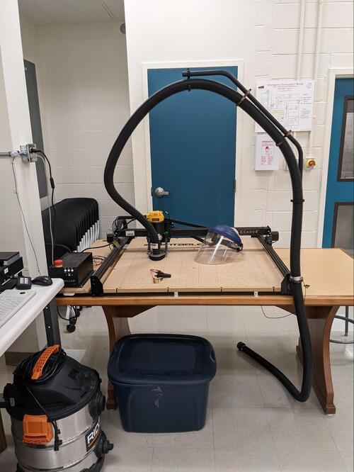
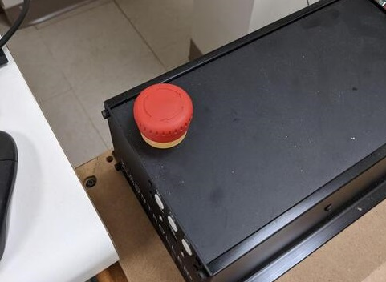

Read Before Operating - X- Carve Quick Start Guide
==================================================

Safety & Operations Notes: 

*  There is an emergency stop button on the X-Carve controller, this will cut power tot eh system immediately if there is an issue.

*  Always wear eye protection when operating the CNC. There is no cover so particles can fly up and enter your eyes.

*  Never run teh CNC without first connecting the shop-vacuum. This will minimize particles in the room that you may inhale or get in your eyes.

*  **NEVER** leave the machine **UNATTENDED** when in use. The computer must also be connected to the machine to function.

*  **DO NOT** handle any bits for this machine without **GLOVES.** The BITS are extremely SHARP.

*  It is critical to ensure your work piece is secure before you start any cutting operations. You can clamp or screw your work piece to the spoil board on the x-carve bed.
 
*  You may ruin your workpiece if the machine is not properly zeroed in the Z plane. You can use the z-probe to establish an accurate reference for your depth of cuts. 

X-Carve tutorial: https://munsdh.readthedocs.io/en/latest/X-Carve%20CNC%20Router.html 

Overview:

The X-Carve is a CNC router located in the Student Design Hub. This machine is compatible with any Computer Aided Manufacturing Package. There is a workflow on the SDH tutorial page for using Inventor and Fusion360 with this unit. To get started please review X-Carve CNC 

After creating the file, connect the USB connection from the X-Carve P/S interface into your computer. 

The procedure for leveling with this z-probe can be followed in this video: https://www.youtube.com/watch?v=nMj6Kc7DmPI 

The e-stop must also be disengaged to begin a cut.

To change a bit, follow the tutorial on the read the docs. 

The router makes a considerable mess when in use. Make sure the Shop VAC is connected to the machine using the large black tubing.The black tubing can be found in a tub below the table This will ensure the material cut from the stock will be sucked up by the Shop VAC

The dial on the router has a range from 1 to 6. The chart below shows the relationship between the range and RPM.

 
