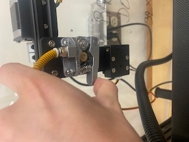

Read before Operating - Ender 5 Quick Start Guide
=================================================

1. This printer has the largest print bed and will take a long time to heat to the appropriate temperature. Make sure the enclosure is over the printer before starting.

2. Slice you STL in your preferred slicer. PrusaSlicer is recommended but Cura or any other slicer should work. **Ensure that when saving the G-code, the file name is less than 16 characters or the file wont appear on the ender 5 screen.**

3. To change the filament first preheat the nozzle to appropriate temperature by going temp>manual. When nozzle reaches the desired temperature go to settings > refuel and use the buttons to retract or extrude filament. The filament should be inserted in the boden drive as seen below.

4. Since the bed is so big it is not uncommon for the levelling to be off. For instructions on how to level the ender 5 see :ref:`Ender 5 Leveling Guide`