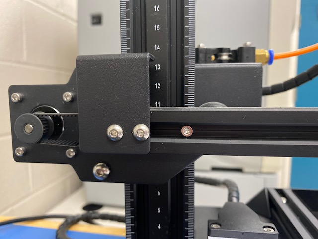
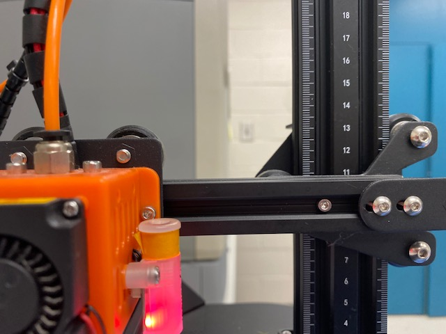
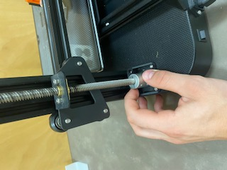

Read before Operating - Eryone ER-20 Quick Start Guide
======================================================

1. Check to make sure the X-axis bar is level
* This is done by reading the measuring scale on both sides of the vertical main frame and ensuring the bar is at the same height on each side. Adjust the height by twisting the screws behind the vertical main frame. 

2. Turn on the printer and load the filament being used.
* For help loading filament visit :ref:`Advanced Workflow`

3. Open **PrusaSlicer** and import your stl file by going file>import>stl. 

4. ** Import a configuration file by going file>import>config. Then navigate to the MicroSD card file and select Er20 Config.ini **
* The file has set parameters for PLA filament. If using another filament simply adjust that under the filament section on the right of the plater. You can adjust the filament temperature under filament settings.

5. Slice and Print!
* SD cards should already be in the printers and SD card readers are available at the front of the room in a yellow basket. Be sure to return the reader after use!

