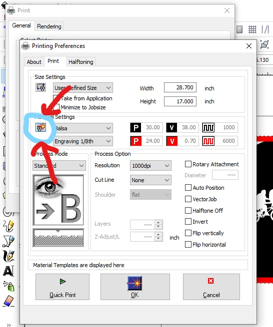

Read before Operating - Laser Cutter Quick Start Guide
=======================================================

1. Turn on laser cutter in the back left corner

2. Launch Inkscape on the computer and import your file.
* For a in-depth tutorial for the laser cutter and inkscape see :ref:`Inroduction`

3. Double check fill and stroke colours

4. When going to print, go to preferences and select your material. Hit the button highlighted below and make sure the settings allign with the chart :ref:`Material Cut Parameters`

5. When starting the print make sure the bed is calibrated using the tool as specified in :ref:`Trotec Launch`

6. Keep the lid shut at all times when laser is running. 

8. If the material (not the laser) catches on fire it means that you have too much power/current for how fast you are going. When this happens,
* Turn off the laser cutter
* Make a :ref:`New Material` preset and adjust power/current, speed, and PPI/Hz. For information on each parameter see: https://www.troteclaser.com/en-ca/learn-support/helpcenter/laser-parameters-definition

7. When finished cutting, wait a couple minutes to let the fan suck out the fumes under the lid

