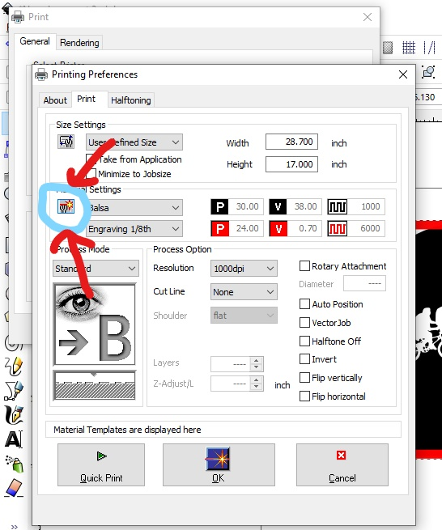

Read before Operating - Laser Cutter Quick Start Guide
=======================================================

1. Turn on the laser cutter by pushing the switch in the back left corner

2. Launch Inkscape on the computer and import your file.
* For a in-depth tutorial on the laser cutter and inkscape software see :ref:`Laser Cutting`

3. Double check the fill and stroke colours and ensure the black and red areas correlate to etch and cut, respectively.

4. When ready to cut, go to file>print>preferences and select your material. Hit the button highlighted below and make sure the settings allign with the chart :ref:`Material Cut Parameters`

5. When starting the print make sure the bed is calibrated using the tool as specified in :ref:`Trotec Launch`

6. Keep the lid shut at all times when the laser is running. 

7. If the material (not the laser) catches on fire it means that you have too much power/current for how fast you are going. When this happens,
* Turn off the laser cutter
* Contact the SDH or a Faculty Technician for further support
* Make a :ref:`New Material` preset and adjust power/current, speed, and PPI/Hz. For information on each parameter see: https://www.troteclaser.com/en-ca/learn-support/helpcenter/laser-parameters-definition

8. When finished cutting, wait a couple minutes to let the fan suck out the fumes under the lid to avoid inhaling the fumes and causing a smell in the room.
* If the smoke is not getting extracted, let one of the SDH staff know. The filter likely needs to be changed. 

NOTE: Sometimes you may find that your file will not transfer from InkScape to Trotec Job Control. The printer only has the capacity to transfer a limited amount of data to job control at a time. If you notice your full job doesn't transfer, break it down into sections and trasnfer them one at a time. Each section moved can then be oriented in Job Control on the laser cutter surface. 
