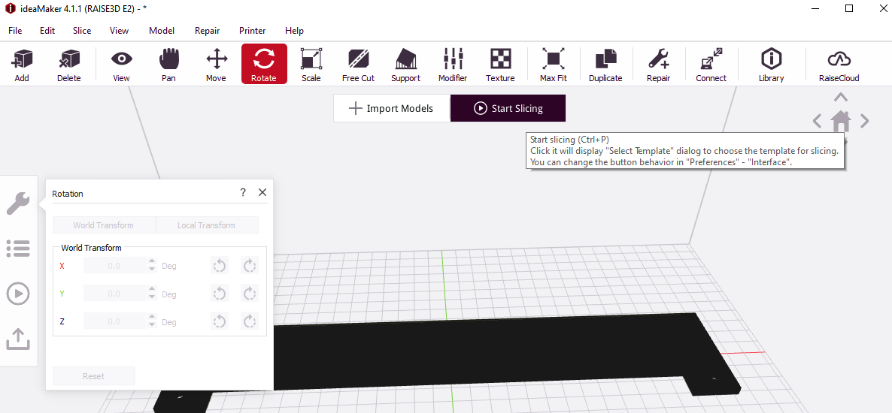
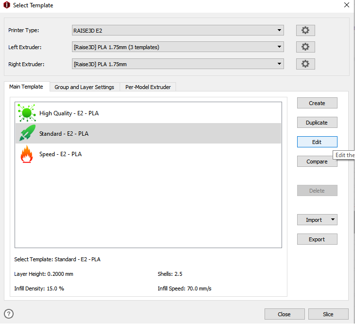
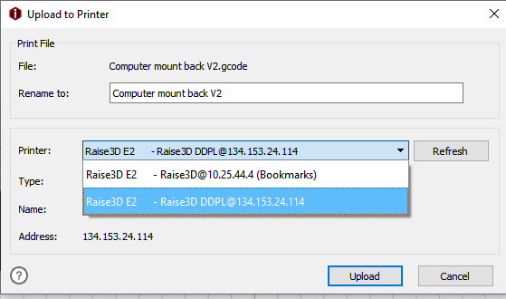

Read before Operating - Raise 3D E2 Quick Start Guide
=====================================================

1. Power on the printer with the switch in the back right corner of the printer.

2. Launch the IdeaMaker slicer to slice your stl. IdeaMaker is optimized for use with the Raise3D and will help you optimize your printing results. 

3. Once your part is oriented corrctly hit "Start Slicing" then choose a preset and hit edit. In the edit menu's you can access all printer settings. See photos below.

4. If using the computers in the DDPL you can upload your G-code directly to the computer. Make sure when selecting the printer it is the one with DDPL in brackets.

5. If using a computer that is not already connected through cloud you can use a usb stick and plug it in to the printer. 

6. To start your print simply hit the print button on the Raise 3D screen and navigate to your file. 

The majority of calibration, adjustments and, filament changing is done through the Raise 3D interface. Taking some time to familarize yourself with the screen is recommended.

It is important that you complete a bed leveling procedure before operating the printer. Failing to do so can result in the print head gouging the build plate, and ruining the nozzle. 

Always watch the first several layers of your print to ensure that it is adhering properly to the build plate. 

For more details on 3D Printing please see the SDH 3D Printing Tutorial Page: :ref:`3D Printing`