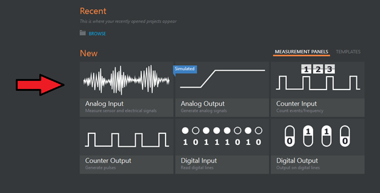

1. Ensure all DAQ connections are snug and sensors are being used for the correct purpose

2.. Using NI DAQ Express software. Make NI user account or login to the pop-up if you already have one.

3. Hit go and select project type. 
* If unfamiliar with DAQ Express interface see tutorial :ref:`Using NI DAQ Express`

4. Its good practice to check the following parameters:

* Signal Type
* Channel
* Units
* Nominal Resistance
* Radiometric Sensitivity
* Initial Voltage

5. Remember the difference between Run, Stop and Record
* The run command allows the user to collect data and analyze it in the measurement pane, but not record the data

