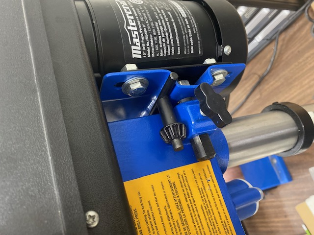
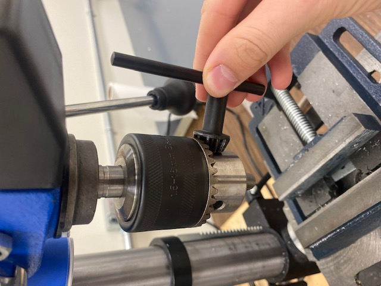
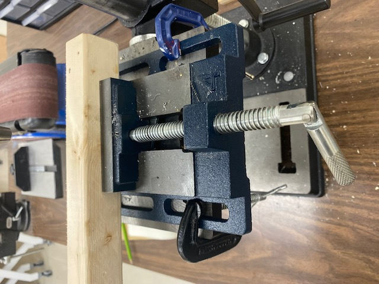
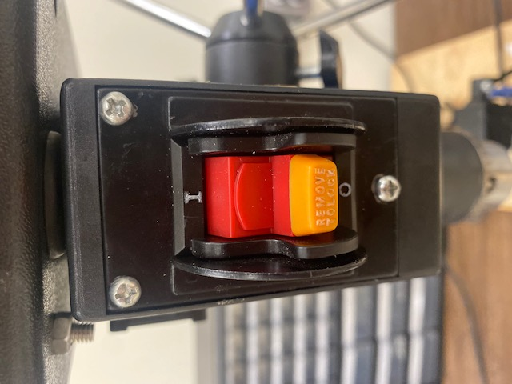

Read before Operating - Drill Press Quick Start Guide
=====================================================

1. Take key from the location on the right side of the drill (See picture below) and use it to loosen and remove a drill bit not being used and tighten a new drill bit in the chuck. Make sure the bit is snug.

2. Clamp your piece using the vise grip and/or the C-clamps found in the toolbox. Since the vise grip is not mounted to the drill press, use C-clamps to mount the vise.

3. It is mandatory to wear safety glasses when operating the press and recommended you wear gloves when dealing with sharp pieces.

4. Use the button in the center of the drill press to turn it on and never leave the press running while unattended. 

5. When done using thedrill press clean up the shavings using a broom or the shop vac and return the chuck key to where it was found.