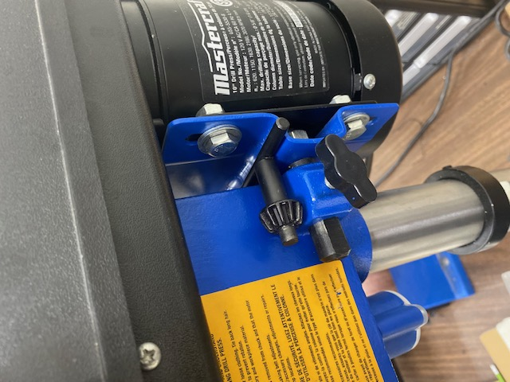

Read before Operating - Drill Press Quick Start Guide
=====================================================

1. Take key from the location on the right side of the drill (See picture below) and use it to loosen and remove the drill bit not being used in the chuck and tighten a new drill bit in the chuck. Make sure the bit is installed straight and is snug in the chuck.

.. figure:: ../_static/images/qs/drillkey.jpg
  :align: center

2. Clamp your work piece using the vise grip and/or the C-clamps found in the toolbox. Since the vise grip is not mounted to the drill press, use C-clamps to mount the vise.

.. figure:: ../_static/images/qs/drillclamp.jpg
  :align: center

3. It is mandatory to wear safety glasses when operating the press. Gloves are not recommenced when operating the machine, but they are recommended when handling sharp work pieces and raw materials.

4. Remove all jewelery, clothes with strings, and tie up long hair before using the drill press. Anything that could get caught in the press during operation should be removed.

5. Use the button in the center of the drill press to turn it on. Using a slow and controled motion, slowly lower the bit into your stock. For the best results, small shallow cuts are recommended. Never leave the press running unattended. 

.. figure:: ../_static/images/qs/drillbutton.jpg
  :align: center

6. When done using the drill press clean up the shavings using a broom or the shop vac and return the chuck key to where it was found.

For best practices on how to safely use a drill press, please review this video: https://www.youtube.com/watch?v=805L6-UBa-0 