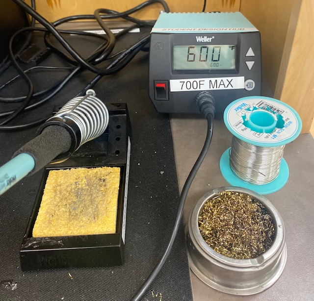
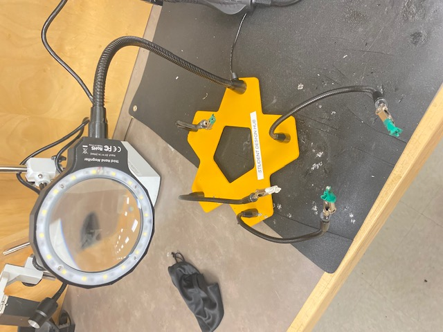
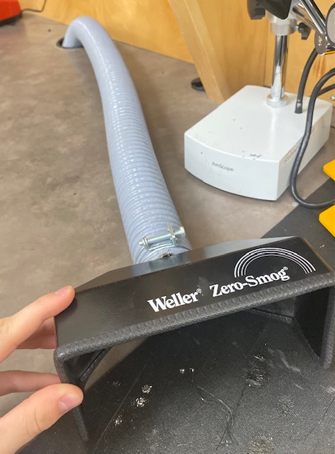
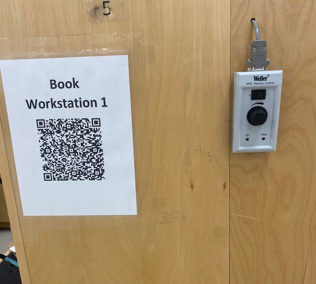

Read before operating - Solder Station Quick Start Guide
========================================================

1. The tip of the iron can get very hot. Under not circumstance should the top of the iron be touched and should be handled with caution.

3. Clean the nozzle before each use with the grey tin of stainless steel wool and then with the wet sponge

4. Tin the tip of your iron with a little bit of solder before and after each use to avoid oxidization.

5. Use yellow clamp to safely hold components

6. Bring the fumehood to location of soldering to extract fumes. Turn it on using the button by Workstation 1 on the left side and Workstation # on the right side.

* If you wish to change the temperature, use the arrows on the machine to adjust. If the temperature is locked, hit the menu button and use the arrows to set the temperature to the same temperature it is locked at. Hit the menu button again and it should be unlocked.  
