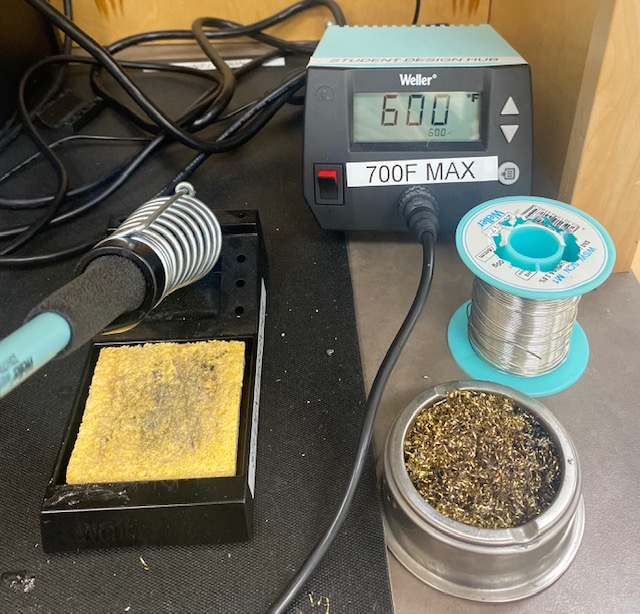
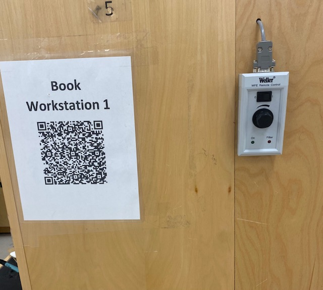

Read before operating - Solder Station Quick Start Guide
========================================================

1. The tip of a soldering iron can get very hot (up to 700 degrees). Under no circumstance should the top of the iron be touched or handled when powered on. Soldering irons should always be handled with caution from the handle.

2. It is good practice to clean the tip of the iron before each use. There should be a grey tin of stainless steel wool at each station. Heat the iron and rub the tip in the wool until clean, then finish cleaning the tip with the wet sponge in the base of the iron holder.

3. The sponge in the iron holder should be wet before you start soldering. Wet the sponge with water before starting any work. 

4. Before starting any soldering the fumehood should be moved adjacent to your work piece. This will extract any fumes. Turn it on using the button by the side of Workstation 1 on the left side of EN1040 and Workstation 3 on the right side of EN1040.

.. figure:: ../_static/images/qs/solderfume.jpg
  :align: center

5. Safety glasses are required while soldering. 

6. Tin the tip of your iron with a little bit of solder before and after each use to avoid oxidization. The tip will have difficulty conduting heat if it is not tinned. 

7. Use the yellow helping hands clamps to safely hold components that you plan to solder. This leaves your hands free to focus on the work. 

.. figure:: ../_static/images/qs/solderclamp.jpg
  :align: center

Please review this video for more details on soldering safety: https://www.youtube.com/watch?v=gW-7yeUW7-k
