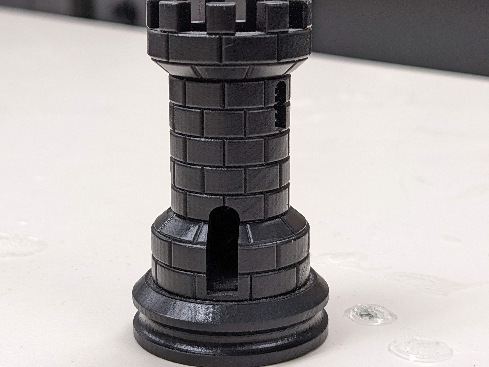
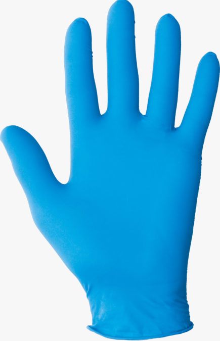

Introduction to Resin Printing
==============================
**Form Labs Form 2 Resin Printer**

Overview
^^^^^^^^

Resin printing or stereolithographic 3D printing (SLA) is an additive manufacturing process similar to traditional 
3D printing. While traditional printers work by melting and extruding filament, a resin printer works by curing light-sensitive resin. A 
projector or laser fires a UV light to turn the liquid resin into a hardened plastic. 

.. figure:: ../_static/images/RESIN1.jpg
    :figwidth: 700px
    :target: ../_static/images/RESIN1.jpg

In FDM printing, there are various materials with different properties that must be adjusted for. 
A standard resin with constant settings will be used in the Form 2 but resins that print for speed or durability exist in industry. 

Resin printers work upside-down compared to traditional fused deposition modelling (FDM) printers. 
Meaning that the print bed repeatedly lowers into a vat of resin, decreasing its depth each layer until the print is completed. 

The process of resin printing can be quite messy. The printing material itself is a toxic liquid and thus must be handled with care. 
Spills can and will happen, so it is best to be cautious and slow down when operating the printer or preparing the resin. 

Hazard
^^^^^^

The resin itself can irritate the skin even in brief contact. Fumes from the resin can also be hazardous to your lungs. 
Great care should be taken to ensure the space is well ventilated, and gloves MUST be worn. 

    .. figure:: ../_static/images/RESIN2.1.jpg
    :figwidth: 500px
    :target: ../_static/images/RESIN2.1.jpg

    Resin parts should be handled with gloves until the part has been cured. If any resin makes contact with bareskin, 
    wipe away any excess with a paper towel and then wash the affected area with dish soap. 
    Do NOT use isopropyl alcohol to clean the resin as it can be absorbed by the body.

Disposal
^^^^^^^^

Resin and the solution created from the rubbing alcohol and resin cannot be disposed of normally. The solution must be exposed 
to UV light until the resin cures and floats from the bottom. Once this cured resin is retrieved the alcohol 
can be reused to wash more parts. The resin tanks and cartridges MUST be cleaned this way. Pouring resin down the drain or 
disposing of it as normal waste is a hazard to public health and the environment. 

Required Tools and Equipment
^^^^^^^^^^^^^^^^^^^^^^^^^^^^

* Gloves
* Respirator (if in enclosed space)
* Scraper to remove print from bed
* Isopropyl alcohol for cleaning
* UV light for curing 
* Funnel (transfer resin from different containers) 
* Paper towels for cleaning small spills and resting resin soaked objects on
* Snippers/cutters to remove support materialECHO is on.
