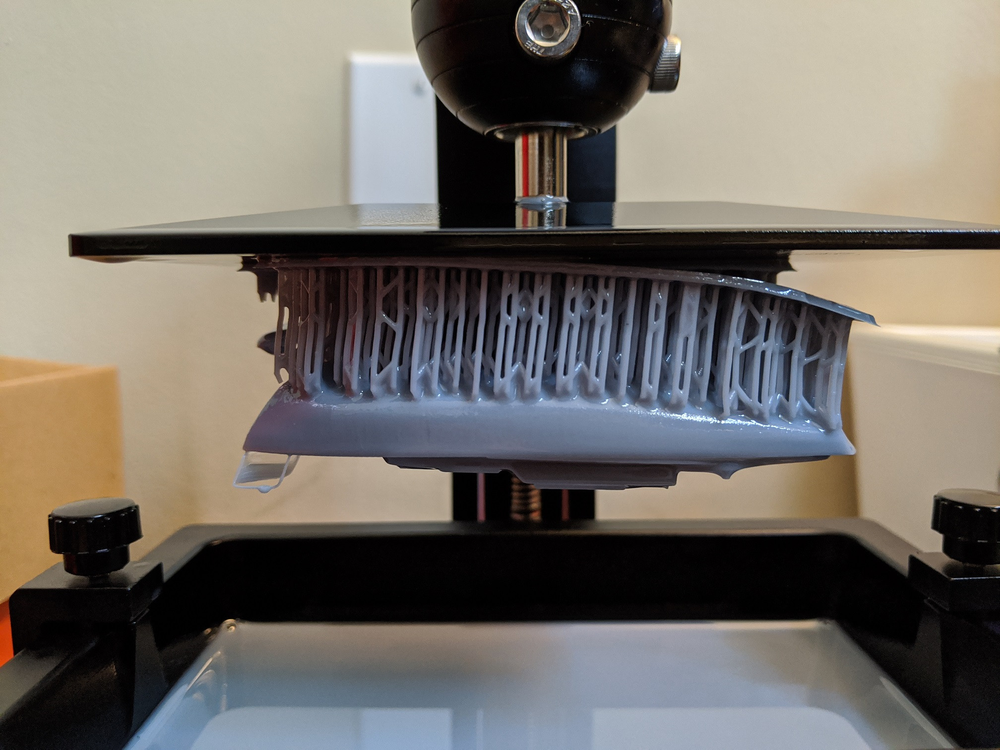

Resin Printing
==============
Introduction to Resin Printing
------------------------------
.. figure:: ../_static/images/RESINF.jpg
    :figwidth: 600px
    :target: ../_static/images/RESINF.jpg

Resin printing or stereolithographic 3D printing (SLA) is an additive manufacturing process similar to traditional 
3D printing. While traditional printers work by melting and extruding filament, a resin printer works by curing light-sensitive resin. A 
projector or laser fires a UV light to turn the liquid resin into a hardened plastic. 

In FDM printing, there are various materials with different properties that must be adjusted for. 
A standard resin with constant settings will be used in the Form 2 but resins that print for speed or durability exist in industry. 

Resin printers work upside-down compared to traditional fused deposition modelling (FDM) printers. 
Meaning that the print bed repeatedly lowers into a vat of resin, decreasing its depth each layer until the print is completed. 

The process of resin printing can be quite messy. The printing material itself is a toxic liquid and thus must be handled with care. 
Spills can and will happen, so it is best to be cautious and slow down when operating the printer or preparing the resin. 

Hazard
^^^^^^
The resin itself can irritate the skin even in brief contact. Fumes from the resin can also be hazardous to your lungs. 
Great care should be taken to ensure the space is well ventilated, and gloves MUST be worn. 

    
.. figure:: ../_static/images/RESIN2.jpg
    :figwidth: 400px
    :target: ../_static/images/RESIN2.jpg

Resin parts should be handled with gloves until the part has been cured. If any resin makes contact with bareskin, 
wipe away any excess with a paper towel and then wash the affected area with dish soap. 
Do NOT use isopropyl alcohol to clean the resin as it can be absorbed by the body.

Disposal
^^^^^^^^
Resin and the solution created from the rubbing alcohol and resin cannot be disposed of normally. The solution must be exposed 
to UV light until the resin cures and floats from the bottom. Once this cured resin is retrieved the alcohol 
can be reused to wash more parts. The resin tanks and cartridges MUST be cleaned this way. Pouring resin down the drain or 
disposing of it as normal waste is a hazard to public health and the environment. 

Required Tools and Equipment
^^^^^^^^^^^^^^^^^^^^^^^^^^^^
* Gloves
* Respirator (if in enclosed space)
* Scraper to remove print from bed
* Isopropyl alcohol for cleaning
* UV light for curing 
* Funnel (transfer resin from different containers) 
* Paper towels for cleaning small spills and resting resin soaked objects on
* Snippers/cutters to remove support materialECHO is on.

Setting Up the Form 2
---------------------

Set up
^^^^^^
The Form 2 requires minimal set-up and is designed for ease of use; following the steps given by the printer 
should help guide anyone attempting resin printing.

First, ensure that the printer is plugged in and connected to the internet. The power cable and ethernet cord should be 
plugged into the back of the machine. If not connected via ethernet, navigate to the WIFI tab on the printer’s 
touch screen and connect via WIFI.

Levelling
^^^^^^^^^
This step is very important. The printer must be level; there is a small levelling disc that can be 
used to raise or lower each foot.

.. figure:: ../_static/images/RESIN3.jpg
    :figwidth: 500px
    :target: ../_static/images/RESIN3.jpg
If not level, the printer will show what foot must be adjusted on the touchscreen.

    

    
The printer needs the back right corner raised to be level.

Inserting Resin tank
^^^^^^^^^^^^^^^^^^^^
After levelling, the resin tank can be inserted. There are small feet on the resin tray that correspond with holes on the printer. 
A minimal amount of force is required to lock the resin tank in. There is a wiper that sits across the length of the resin tank; 
this must be locked in as shown below. The wiper keeps the resin from sitting too long and will be active during printing.

    

Make sure the build platform is secure. The platform or bed slides onto a metal rod and is secured by a small cam mechanism.

.. figure:: ../_static/images/RESIN6.jpg
    :figwidth: 400px
    :target: ../_static/images/RESIN6.jpg
    

Inserting Resin
^^^^^^^^^^^^^^^
Now the resin can be inserted into the printer. This can be done by pouring the resin into the tray and then inserting the 
cartridge in the back.  Make sure to shake the bottle for 30 seconds before pouring to ensure it is well mixed.
The Form 2 takes specialised resin cartridges that fit into the back of the printer.

    

This allows the Form 2 to know the amount of resin left and dispense into the resin tank when necessary. Before starting a print, 
the Resin cap must be opened for ventilation. The Form 2 will request that this is done prior to printing. 

Best Practice
^^^^^^^^^^^^^
Resin tanks should be stored away from direct sunlight and should be cleaned and emptied before storing. 
Resin cartridges should also be stored away from direct sunlight. Any additional printer parts and 
resin can be found in the cabinet below the Form 2 in the DDPL. 

.. figure:: ../_static/images/RESIN8.jpg
    :figwidth: 400px
    :target: ../_static/images/RESIN8.jpg  

Use as much resin as you need. Although completely filling the resin tank will ensure there is enough resin for your print;  
resin can be lost transferring it back into the cartridge.

After the part has been removed from the build platform inspect the platform for any stuck pieces of hard resin. 
The bed should be removed and cleaned with isopropyl alcohol and paper towel after prolonged use; this ensures print quality
and protects the resin tank from damage.

Preform Slicer
--------------

Preform is the slicer that must be used with the Formlabs 2, any other slicer will not communicate with the printer. 
Very little work must be done to slice the model. On start up the slicer will ask for the printer model and type of resin 
being used. The printer will be a Form 2 named “UbiquitousSwan” and choose the resin you are using, in this case; it is white. 
The version can be found on the resin cartridge. The layer thickness should be selected for the highest resolution to get 
the highest amount of detail.

Import the STL file by using the import function in the file settings or by dragging and dropping the file into the slicer window. 

.. figure:: ../_static/images/RESIN10.jpg
    :figwidth: 400px
    :target: ../_static/images/RESIN10.jpg

One Click Print
^^^^^^^^^^^^^^^
The Preform slicer has a unique feature, the one click print. After importing the model click the magic wand icon in the tabs
in the top left corner of the program. This feature will automatically select an orientation for the part as 
well as automatically support it. The orientation may not be optimal, so try it a few times! One click printing will give 
worse results than manual orientation and support.

.. figure:: ../_static/images/RESIN12.jpg
    :figwidth: 400px
    :target: ../_static/images/RESIN12.jpg

Case Against One Click Printing
^^^^^^^^^^^^^^^^^^^^^^^^^^^^^^^
The one-click print is a very quick and easy method to get decent resin prints. However to get the best quality possible 
the part must be orientated and supported manually. This can be done by following the part orientation and support 
placement guides below. Make sure to check every layer for unsupported islands to ensure the print will succeed. 

Uploading and Starting Your Part
^^^^^^^^^^^^^^^^^^^^^^^^^^^^^^^^
Once the slicer has finished the part can be uploaded to the printer using WIFI or Ethernet. Then select the job (print) 
on the printer and hit print, it may ask you to go through a couple of checks including inspection of the build 
platform as well as opening the small tab on top of the resin cartridge.

.. figure:: ../_static/images/RESIN14.jpg
    :figwidth: 400px
    :target: ../_static/images/RESIN14.jpg

.. figure:: ../_static/images/RESIN14.1.jpg
    :figwidth: 400px
    :target: ../_static/images/RESIN14.1.jpg

Once the print has started the Form 2 will heat the resin up to the proper printing temperature and mix it with the wiper.

Post Processing
---------------

In contrast to FDM prints, resin will always require post processing. Once the print has completed it is best to let it 
sit for a few minutes to allow excess resin to drip down into the resin vat. 

.. figure:: ../_static/images/RESIN15.1.jpg
    :figwidth: 400px
    :target: ../_static/images/RESIN15.1.jpg

After the part has sat for an appropriate amount of time it is time for post processing!

Washing
^^^^^^^
The part must first be washed with isopropyl alcohol to remove excess surface resin. The ANYCUBIC wash and cure station 
makes post processing significantly easier. The alcohol must be poured into the station and there is a small holder 
for the part to sit. Pour the alcohol until the 1000 or 1500 line, or however much you need for the part to sit submerged. 
Place the part inside the metal frame inside the tub and hit start. Small parts should only need a few minutes to be washed. 
After the part is washed the plastic tub containing the alcohol must be removed and the part is taken out to be dried. 

DO **NOT** leave the part submerged in alcohol for an extended time. The part will lose integrity and become mushy. 

.. figure:: ../_static/images/RESIN16.jpg
    :figwidth: 400px
    :target: ../_static/images/RESIN16.jpg

.. figure:: ../_static/images/RESIN17.jpg
    :figwidth: 400px
    :target: ../_static/images/RESIN17.jpg

Support Removal
^^^^^^^^^^^^^^^
Dry the part with a paper towel. Supports can be removed before or after the curing process but it is advisable to do it before curing. 
The resin before curing is softer and easier to remove. Supports must be removed with caution; a support can take a piece of the 
part with it when removed. Use a flush cutter or snipper when removing supports; take time to ensure they are removed as close 
to the surface as possible to minimize surface imperfections. If the supports can be removed with ease then manually 
removing them with gloves will work; this however is not best practice. 

.. figure:: ../_static/images/RESIN18.1.jpg
    :figwidth: 400px
    :target: ../_static/images/RESIN18.1.jpg

Submerging the part in hot water (60-70C) before curing the part and after washing will allow the supports to be removed
with little or no damage to the part. There is an electric kettle below the Form 2 where the resin cartridges are stored. 
Be careful not to leave the part submerged for too long or have the water temperature too high; 
this can damage the small details on the part. This water is now a solution with resin and must be cured and disposed of 
the same way as isopropyl alcohol (Leave in a container exposed to UV). There is a sink and a kettle located in the DDPL 
but DO NOT allow the water and resin solution to flow down the drain.  This method can be used to remove supports if 
using cutters and sanding tools is not viable.

Curing
^^^^^^
The turntable is then attached to the station and it must be switched to cure mode. If the turntable is not next to the 
Form 2 or  the wash and cure station, check below where the resin cartridges are stored. Place the part on the 
turntable and let it cure. The wash process should take about 5 minutes while the curing time can vary between 5-20 minutes 
based on the part. It is important not to overcure the part as overcuring will reduce the integrity of the part, 
can introduce warping and alter the color. Curing the part will harden the surface layers. If a resin part is sticky to 
the touch then it is not done curing.  

.. figure:: ../_static/images/RESIN19.1.jpg
    :figwidth: 400px
    :target: ../_static/images/RESIN19.1.jpg

Sanding
^^^^^^^^^
Sanding is not always necessary. The supports can come off cleanly in some instances but the majority of the time will 
require a small amount of sanding to get a perfect finish. The parts are typically small and can be sanded by hand or even a rotary tool. 
Resin is fragile and prone to surface mark; try using a higher grit first to test. It is important to be in a well ventilated area 
or wear a respirator due to the resin particles. 

The benchy has small surface imperfections on the back where supports were placed.

Advanced Resin Workflow
-----------------------

Supporting Your Part
^^^^^^^^^^^^^^^^^^^^
Preform has a built in auto-support setting that will give reliable results. Rafting works the same way it does on FDM printing 
but is used more frequently in resin printing. The support structures holding up your part all start from the raft. A thinner raft 
will provide less support while a thicker raft will increase the amount of force needed to remove the part from the build bed.

The number of supports (density) can be changed as well as the touchpoint size. The touchpoint size determines how much 
material from the support is physically making contact with the model. A small touchpoint size will reduce surface imperfection 
but will offer less support. 

Individual touchpoints can be modified, added or removed in the support settings tab. 

Parts cannot print in mid-air, it is impossible! Thus, we must use supports to help print complex parts. The Preform slicer 
has a built in setting for finding unsupported minima (low points) and islands (pieces of the part printing in air. 
Click the < button and find the job info box. Enable the show minima setting from there.

This can also be done manually by dragging the print slider tool on the right hand side of the slicer. Each layer of the 
part can be viewed individually and inspected for unsupported pieces. 

Form 2 Wiper
^^^^^^^^^^^^
Orienting a model at an angle creates supports of varying lengths. If you are printing on a Form 2, you can place the 
longer supports closer to the wiper side. This decreases the distance the wiper travels during the final layers—reducing 
the cumulative time it takes for your part to print.

.. figure:: ../_static/images/RESIN22.jpg
    :figwidth: 500px
    :target: ../_static/images/RESIN22.jpg

Print Angle
^^^^^^^^^^^
In practice this means tilting surfaces 10 to 20 degrees and avoiding printing directly on the bed. If a part has a
slight angle then there is less surface area per layer giving a lower chance of the part sticking to the 
resin tank and ruining the print.

Overhangs and Islands
^^^^^^^^^^^^^^^^^^^^^
An island is a section of the print that is printing without any support. An overhang is also a kind of island, 
but is generally above another piece of the part. It is impossible for a layer to print in mid-air
but it is possible to orientate the part to prevent the overhang in the first place. Overhangs should be avoided 
when possible by properly orienting the part. In the event the islands cannot be prevented, make sure to 
provide adequate support from the bottom of the island. Low points on the model will be indicated in red.

Lowest Point
^^^^^^^^^^^^
 The lowest point of the part is considered to be the minima. All other layers of the part will be built on top of minima. 
 Ideally there should be one minima that is well supported. If there are multiple, try to reduce the amount and 
 make sure they are stable. 

Intersection Integrity
^^^^^^^^^^^^^^^^^^^^^^
Parts with complex geometry are often printed on resin printers. To ensure integrity at joints and intersections 
it is best to have the intersecting features face down towards the build plate. This will ensure that the layers 
will separate into individual paths at the joint, instead of layers coming together at the joint. 

Suction
^^^^^^^
If your part has an internal or enclosed hollow it is important that drainage holes are added to the part to 
minimize the suction force while printing. The hole must not be on the top of the print as this will not reduce 
suction during printing. The hollow can also be filled. This must be done in another 3D design package as 
Preform does not have the capabilities to do so. 

The drainage hole is placed correctly on the left model. The right drainage hole will not allow air to 
move freely during printing.

Resin Troubleshooting 
---------------------

Residue in the Resin
^^^^^^^^^^^^^^^^^^^^
Small hardened pieces of cured resin as well as other debris can potentially fall into the tank below. 
Run the wiper gently through the resin tank, lifting it slightly off the bottom of the tank. If debris is found 
the tank must be emptied and refilled. The resin must be filtered when emptied to remove residue. There are coffee
filters in the cabinet below the Form 2 in the DDPL.

Overfilling the Build Platform
^^^^^^^^^^^^^^^^^^^^^^^^^^^^^^
It is important to tilt larger models and not overfill the build platform with parts. An overfilled platform can 
make prints stick to the resin tank or even fall loose in the resin. The suction pressure is too great for the 
build platform to overcome, so the print fails. Printing less models at a rotated angle means less surface area 
per layer which will be easier to print.

Printer is Not Level
^^^^^^^^^^^^^^^^^^^^
The Form 2 must be levelled prior to printing, however it is possible the printer was moved during the printing process. 
The layer lines of the print will not be 90° and the print will fail. This will result in prints that are “loose” and 
do not adhere to the build plate correctly. Make sure the build plate and printer are level and the resin is at the right 
temperature for printing.

Unsupported Minima or Islands
^^^^^^^^^^^^^^^^^^^^^^^^^^^^^
When a section of a part is thin, lacking detail or missing completely it could be due to a lack of support material. 
To prevent this, always inspect the printing process using the slider on the right side of the Preform slicer window. 
Add supports to the failed section or reorientate the model to improve printability.

Hollowing
^^^^^^^^^
Be careful when hollowing the part as it is possible for a section to become too thin to print. A section is too 
thin if the walls are less than 2mm thick. In general, walls should be at least 3-5mm thick for best results. 
It is always important to add drainage holes on models that are hollowed to reduce the suction force.

Hardware Maintenance
^^^^^^^^^^^^^^^^^^^^
The Formlabs website has a great troubleshooting and maintenance guide for hardware problems. 
It can be found here:

 https://support.formlabs.com/s/article/Troubleshooting-and-maintenance-guides-Form-2?language=en_US
