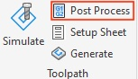
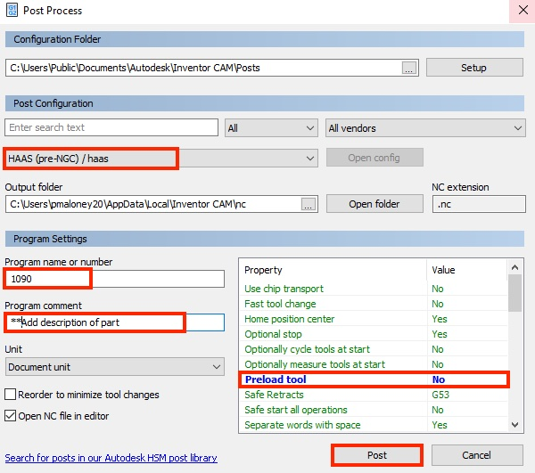

Running the Program
===============
    
*DO NOT run the program until the ENTIRE section has been read. 

After you complete t=he stock setup and tool chsanges and offets, you are ready to run the program. 

First, you will have to load the program onto the USB device located at the side of the control panel.

To load the program onto the USB:

1. Take the USB out of the side of the CNC control. *PIC*

2. Once the USB is inserted into the computer, open your CAM setup and click ‘Post Process’ located under 'Toolpath'.

    a. Make sure to pick the correct machine configuration. This should be 'HAAS (pre-NGC)/haas'.
    
    b. Make sure that under 'Program Settings', you select 'Preload tool' to be 'No'
    
    c. Make sure the program is named as numbers (4 digits, ideally 1___).
    
    d. Save the program under the USB device.

3. Bring the USB back to the CNC.

Bringing up the program on the control panel:

1. To bring the program up on the panel, press 'List Program’ > USB (using the cursor) > ‘enter’.

2. Find the folder you put your program in using the cursor. When found, press ‘enter’. 

3. Find the program using the cursor. When found, press ‘select program.’
*Video doing this*

The above step should have opened your program in the 'MEMORY' tab. If it doesn't open 'Memory' automatically, you can manually do it by pressing the 'MEM' button. 

There are a number of important things to do before you run the program...

* Make sure it’s the right program: 
    * If you included a description in your CAM setup, that should show up in the memory tab on the screen.
    * Every tool you set up should be listed at the beginning of the code.
* Make sure the coolant is set to turn on. This is the M8 command at the beginning of the code.
* Graph the program. To do this, make sure you’re in memory. If not, press ‘MEM.’ Next, press ‘setting/graph’ TWICE and then ‘cycle start.’ Watch to make sure the program graphs the correct toolpath. 
* **IMPORTANT:** Make sure the 'Rapid' is set to 5%! This is to make sure that you’ll have time to stop if the tool is about to crash. 
* Point the manual coolant nozzle towards the stock piece.
* Make sure everything is removed from the table inside the CNC machine, and the door is closed.
* Press the RESET button 2 or 3 times just to make sure the program is reset to the beginning. 

Once you ensure that you have followed all the above steps and have done your tool offsets correctly, you can run the program.

Running the Program: 

1. Press 'Start cycle'
* Keep your hand on the feed hold at all times! If something goes wrong, you must be able to hit that button asap!
* Make sure the automatic coolant nozzle is pointing at the tool. Each tool may require the nozzle to be moved. You can do this manually by pressing 'Feed hold' so you can see what you're doing and then 'Coolant up' or 'Coolant down' and move the nozzle into the correct orientaation. When you're done, press 'Cycle start' again. 
    You can also adjust the coolant nozzle before you run the program so that you do not need to touch it during the program. For more information on this, see __

**EMERGENCY STOP button**

