Setting Up the Apparatus
========================

With the study opened we now have to prepare the part for the simulation by recreating the operating environment. In the 
case of the sample bracket, the bracket will be held to the wall using its 2 bolt holes and a load will be applied to an eye 
hook that's mounted to the hole at the end.

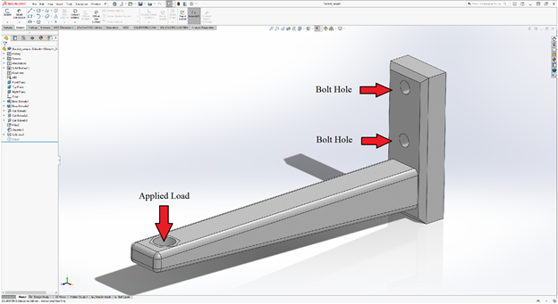
	
Creating the Virtual Wall
^^^^^^^^^^^^^^^^^^^^^^^^^

 I’ll begin by establishing a fixture to hold the back of the bracket against the wall by first creating a support wall that 
 the bracket will be held to. 
 
 .. figure:: ../_static/images/SettingUptheApparatus2.png
    :figwidth: 600px
    :target: ../_static/images/SettingUptheApparatus2.png
	 
SOLIDWORKS allows us to create virtual walls to help simulate how the bracket will be held. This is done by right clicking 
the connections option in the manager tree and selecting “contact set” to establish a connection between a part and a 
virtual component unrelated to the part (wall, floor, etc.). 

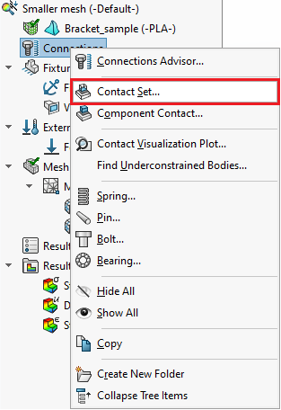
	
A virtual wall is established to simulate the bracket being mounted to the wall. Without the inclusion of the virtual wall, 
the bracket would have no surface to be bound to and would be allowed to move freely during the simulation with the load 
applied. The virtual wall will act like a boundary which the bracket will not be able to move through, just as if the 
bracket were to be secured to the wall. 

Note the use of a virtual wall instead of fixed geometry in the fixtures option (which will also fix the back of the bracket 
in place) since if the bracket breaks in simulation, it is still held flat against the virtual wall, whereas a fixed 
geometry will allow it to break freely. Once in the properties menu, select “virtual wall” in the contact type and select 
the back face for “set 1” (the contact area for the part) and the front plane for the target plane (contact plane of the 
wall).

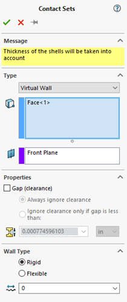

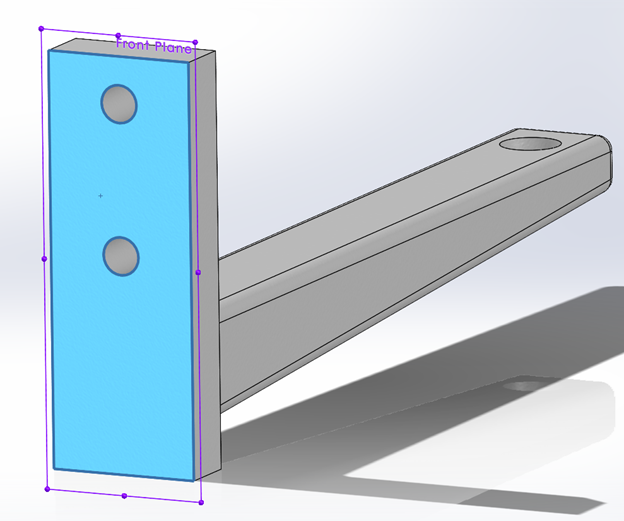
	
Applying Bolt Hole Fixtures
^^^^^^^^^^^^^^^^^^^^^^^^^^^
 
Next, we will simulate the bracket being secured via the bolt holes by applying a ‘Fixed geometry” fixture to the bolt holes.
Similar to the idea of the virtual wall, we want to properly simulate the bracket being secured by the bolt holes to the 
wall. While we have already simulated the bracket being “fixed” to the wall, we have yet to represent the bracket being 
secured to the wall **by the bolt holes**. To do this, we can create a “Fixed Geometry” fixture along the inside of the bolt 
holes to simulate the bolts having been inserted into the bracket securing it to the wall and properly simulate the inner 
holes holding the place.

Fixed geometry can be accessed by right clicking the “Fixtures” property in the design tree and selecting fixed geometry.

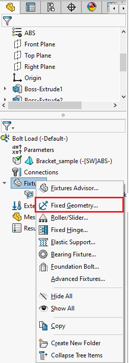
 
With the property window open, we can see an example of how a part will move with the selected fixture, along with some 
other options for fixture type. For the bolt holes, we will stay with fixed geometry and in the “Faces, edges, vertices for 
fixture” box select both bolt hole surfaces as shown below. Hit ok and the fixture should now be applied to the bracket, 
verified by the green arrows. 

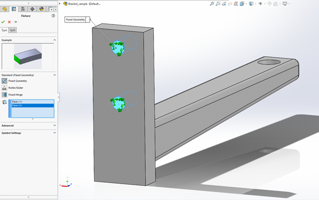
 
While we have simulated the bolt being inserted in the bolt hole, the tension on the bolts have not been represented, which 
is a common application that's done to bolts and is called “preloading bolts”. A preloaded bolt is a bolt that's been 
torqued to so that the bolt is in high tension. This tension induced in the bolt creates a compressive force called a clamp 
force, which can help transfer the stress from the bolt and into the part while also increasing joint rigidity & helping to 
reduce the effects of fatigue. If you wish to more accurately simulate the bolts holding the bracket in place via the bolt 
holes, you can choose to simulate the preloaded bolts on the bracket using the 'Bolt' setting under the “Connections” option 
in the simulation task window.
 
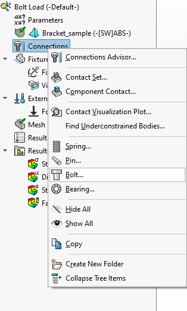
	
Adding External Force & Split Profile
^^^^^^^^^^^^^^^^^^^^^^^^^^^^^^^^^^^^^

Next we will add an external load to the bracket to simulate the load that would be acting on the bracket. The bracket will 
be put under load using an eye hook that is mounted through the hole at the end of the bracket and secured with a nut. We 
can simulate this by creating a profile in the shape of the nut at the bolt hole on the top face of the bracket arm. 
Right-clicking the external loads option and selecting “Force” will open up the load property manager.
 
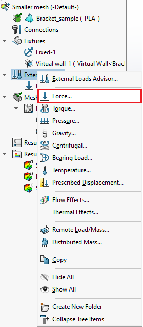
 
To start, the nut profile that the load will be applied to will need to be sketched. This can be done from the force property 
window by selecting “Split” and selecting the “Create Sketch” option.

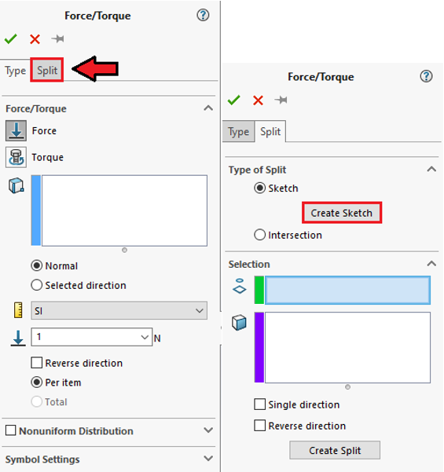
  
The nut will be sketched by selecting the top face of the bracket arm and using the polygon tool. 
 
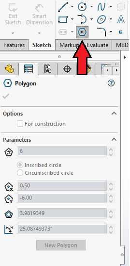
 
Once the nut has been drawn, parameters for the sketch can be set in the property window to your liking. Once all parameters 
have been set, hit the OK check mark in the top left and click “Exit Sketch” in the model window. The force property window 
should now have the recently made sketch and top face of the backet arm entered in for the “Project Sketch” & “Other Faces 
To Split” selections.

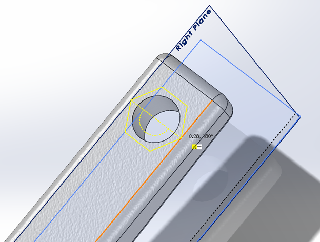
	
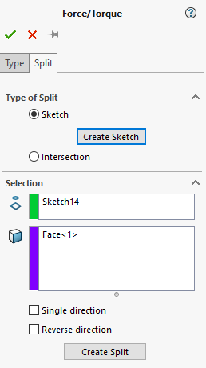
  
Hit the green checkmark and select yes when asked if you wish to split the selected face. Once completed, the default type 
menu will reopen with the sketched area now highlighted as the selection for the face of interest.

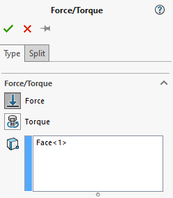
 
Next, set the load to be 200 lb:

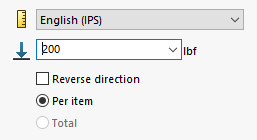
 
Hit OK to apply the load to the simulation.

	
Creating the Bracket Mesh
^^^^^^^^^^^^^^^^^^^^^^^^^

Next, we will create the mesh to complete the analysis. To do so we will right-click the mesh feature and select “Create 
Mesh”:
 
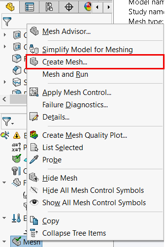
 
Selecting “Create Mesh” will open up the property window along with all of the listed options. 

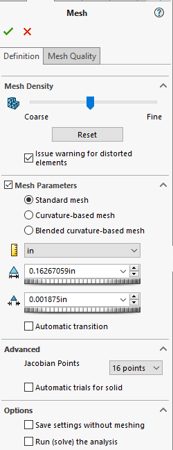
  
You may choose to start with any mesh quality setting you wish, however, to start we will just simply go with what's listed 
by default for meshing options, as later on we will look to refine the mesh in specific areas to attain more accurate 
results on the analysis. 

Running the Study
^^^^^^^^^^^^^^^^^
With the study prepared, we can now begin executing the simulation to see how our model will perform and fail. When looking 
at failure for our bracket model the two modes of failure we will look at are failure due to shear and failure due to 
buckling, which we will be discussing later when we move to the buckling study. 

Knowing all of this information and having prepped our bracket in the static study, we can now begin executing the 
simulation by selecting “Run This Study” in the command toolbar and Solidworks will then begin to simulate the system:

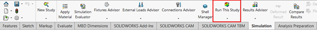

Depending on the complexity of the part, mesh, or even your computer graphical capabilities this process may take a longer. 
If your material’s yield stress is known you can use it to determine what load your bracket can theoretically handle before 
yielding which, if given for the material in Solidworks, will be displayed below the plot legend. 
 
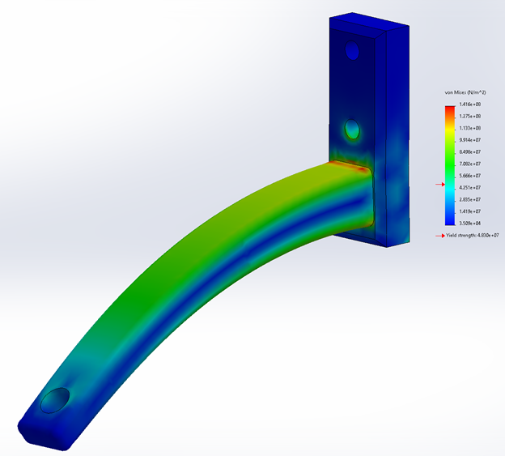

	
 
  

