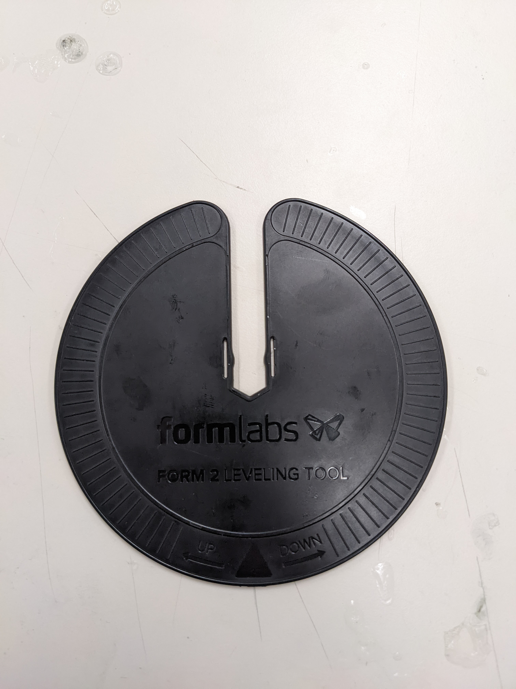
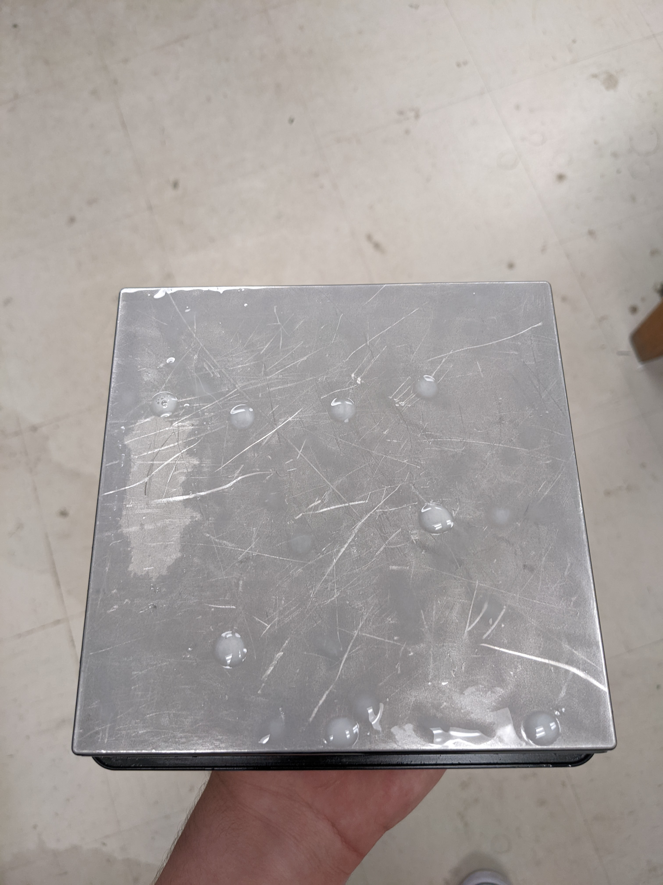
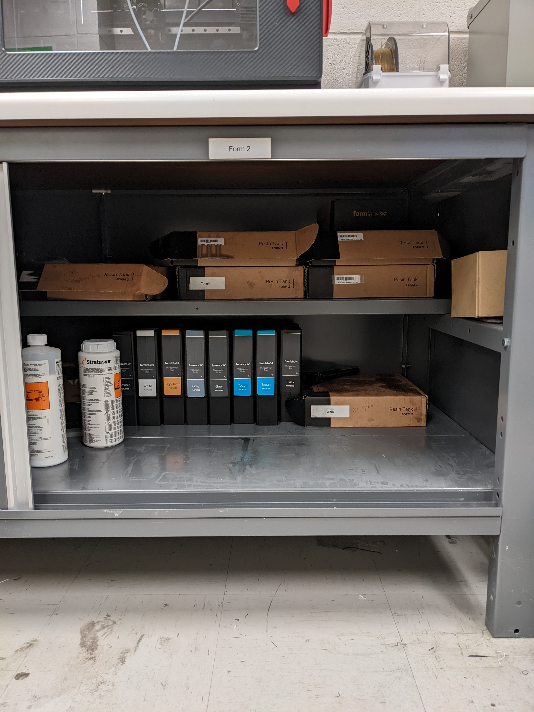

Setting Up the Form 2
=====================

The Form 2 requires minimal set-up and is designed for ease of use; following the steps given by the printer should help
 guide anyone 
attempting resin printing.

First, ensure that the printer is plugged in and connected to the internet. The power cable and ethernet cord should be plugged 
into the back of the machine. If not connected via ethernet, navigate to the WIFI tab on the printer’s touch screen and connect via WIFI.

This step is very important. The printer must be level; there is a small levelling disc that can be used to raise or lower each foot.

If not level, the printer will show what foot must be adjusted on the touchscreen.

.. figure:: ../_static/images/RESIN4.jpg
    :figwidth: 500px
    :target: ../_static/images/RESIN4.jpg
    
    .. figure:: ../_static/images/RESIN4.1.jpg
    :figwidth: 500px
    :target: ../_static/images/RESIN4.1.jpg

The printer needs the back right corner raised to be level.

After levelling, the resin tank can be inserted. There are small feet on the resin tray that correspond with holes on the printer. 
A minimal amount of force is required to lock the resin tank in. There is a wiper that sits across the length of the resin tank; 
this must be locked in as shown below. The wiper keeps the resin from sitting too long and will be active during printing.

.. figure:: ../_static/images/RESIN5.jpg
    :figwidth: 500px
    :target: ../_static/images/RESIN5.jpg
    
    .. figure:: ../_static/images/RESIN5.1.jpg
    :figwidth: 500px
    :target: ../_static/images/RESIN5.1.jpg

Make sure the build platform is secure. The platform or bed slides onto a metal rod and is secured by a small cam mechanism.

    
    .. figure:: ../_static/images/RESIN6.1.jpg
    :figwidth: 500px
    :target: ../_static/images/RESIN6.1.jpg

Now the resin can be inserted into the printer. This can be done by pouring the resin into the tray and then inserting 
the cartridge in the back.  Make sure to shake the bottle for 30 seconds before pouring to ensure it is well mixed. 
The Form 2 takes specialised resin cartridges that fit into the back of the printer.

.. figure:: ../_static/images/RESIN7.jpg
    :figwidth: 500px
    :target: ../_static/images/RESIN7.jpg
    
    .. figure:: ../_static/images/RESIN7.1.jpg
    :figwidth: 500px
    :target: ../_static/images/RESIN7.1.jpg

This allows the Form 2 to know how much resin is left and when to dispense it into the tank. Before starting a print
the cap of the resin bottle must be opened for ventilation. The form 2 will request this before starting a print.

Best practice
=============
Resin tanks should be stored away from direct sunlight and should be cleaned and emptied before storing. 
Resin cartridges should also be stored away from direct sunlight. Any additional printer parts and resin can be found 
in the cabinet below the Form 2 in the DDPL. 

Use as much resin as you need. Although completely filling the resin tank will ensure there is enough resin for your print;  
resin can be lost transferring it back into the cartridge.

After the part has been removed from the build platform inspect the platform for any stuck pieces of hard resin. The bed 
should be removed and cleaned with isopropyl alcohol and paper towel after prolonged use; this ensures print quality 
and protects the resin tank from damage.