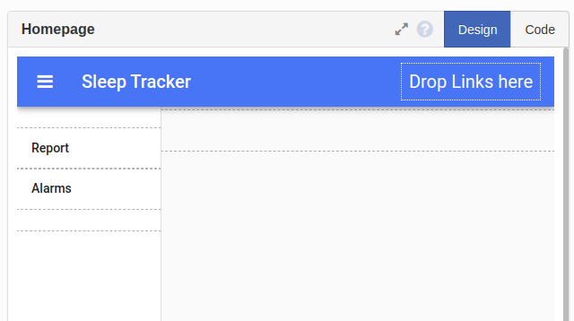

Software
========

Software for the sleep tracker consists of mainly three parts: Raspberry Pi code, Anvil server code, and Anvil client code. The figure below shows how all three parts interact together. The Raspberry Pi code is responsible for maintaining the clock display, checking the user’s sleeping status changes, and firing upcoming alarms. The Pi communicates directly with the Anvil server and sends triggers when the user sleeps/wakes up. The client code manages the information displayed on the web app interface. It interacts with the server to receive the daily hours of sleep and prepares the weekly report information based on that data. Also, the client code sends to the server any changes made by the user to alarms. The server code’s primary purpose is to process requests received from the client code and the Raspberry Pi. It provides getter and setter methods to allow both the client code and the Raspberry Pi to access the data tables.

We need to establish a connection enable the communication described above. Interactions between the Anvil web app client code and the Anvil server occur through a direct call to the server using :python:`anvil.server` package. For example, the following statement calls a server function :python:`my_function` from the client code:

.. code-block:: python

  anvil.server.call(“my_function”)

Passing arguments and receiving values is done through the same function; data sent to the server is added as extra arguments to :python:`anvil.server.call`, which then returns any replies sent back by the server:

.. code-block:: python

  received_data = anvil.server.call(“my_function”, sent_data)

The Raspberry Pi communicates with the server through the same function. However, unlike the web app which is hosted on Anvil’s server, the Raspberry Pi is a remote third-party device. Therefore, a connection needs to be first established between the Raspberry Pi and Anvil. This is done through Anvil’s uplink key. An uplink key is a unique identifier to an Anvil web app and allows third-party services to communicate with the web app. An example of an uplink key is:

.. code-block:: python

  ANVIL_UPLINK_KEY = "H4HM5VZW2YWAVDU722T7QMWQ-FMUD3NRAEUZ2BWLK"

A web app’s uplink key is found under the app settings (shown later :ref:`here <Uplink Key>`). For the Raspberry Pi to establish a server connection using an uplink key, the following command is inserted before calling a server function:

.. code-block:: python

  anvil.server.connect(ANVIL_UPLINK_KEY)

  anvil.server.call(“my_function”)

Anvil
-----

.. _Anvil Interface:

Interface
^^^^^^^^^

Anvil provides a drag-and-drop design editor to create a user interface using a variety of elements in the Anvil Toolbox. In Anvil, a user interface consists of one or more pages, called Forms. Forms can be created by clicking the plus sign next to "Client code" on the side.

Toolbox components can be dragged and dropped on the Form to build up the interface. For all the screenshots below, the dashed outlines show how components are placed on the Form.

You need to create three forms for the web app:

- **Homepage:** it is the landing page when the user first fires the app. Create the Homepage as a Standard Page, so it includes an app bar and a sidebar by default. You need to add two Label elements to the sidebar for the user to view the weekly report or the alarms page.

- **Report:** displays information about the user’s sleeping schedule. It consists of Plot and Label components. The Plot component shows the daily hours of sleep for the past seven days. Useful information like the minimum, maximum, and average sleeping time is calculated in the Label elements below the Plot. Each of these elements has an ID which is used by the client code to assign the calculated values during runtime.

- **Alarms:** lists alarms set by the user. The Form consists of a Repeating Panel that displays current alarms and a Button to add new alarms. A Repeating Panel is a component that hosts multiple elements of the same format. It uses a fixed template to generate a form for each item in a given list. The Repeating Panel on the Alarms form fetches alarm times from the data table and lists them all in the same format. The form AlarmTemplate is the template used to specify how alarms are displayed on the Repeating Panel.

On AlarmTemplate, two DropDown elements are used to set the hour and minute. For repeating alarms, the bottom row of buttons sets the days on which the alarm fires. The side buttons are for activating and deleting the alarm.

Data Tables
^^^^^^^^^^^

The web app requires three data tables to store alarms data and sleep state records. You can create these tables from the Data Tables tab under Services.

- **Alarms:** stores information about alarms created by the user so that it is fetched by the Raspberry Pi to fire alarms. The fields include the hour and minute the alarm is set to fire at, whether the alarm is active, and the days  the alarm is set to repeat on.

- **Sleep Hours:** saves the total sleep period for each day and it used to create the sleep hours plot on the Report form. The first column is the date, and the second column lists the period (HH:MM:SS) of sleep recorded on that day.

- **State Record:** keeps track of changes in the sleep state. The first column is a timestamp of when the state was recorded, and the second column shows the new sleep state. A checked box indicates sleeping, and an unchecked box indicates waking up.

Client Code
^^^^^^^^^^^

The client code runs in the browser and controls the web app interface, where every component has an ID used when referring to that element in the client code. Anvil automatically creates a client code file for each form and that includes a class named after the form, a statement that sets form properties, and lines to import essential packages. The developer can add code to the :python:`__init__` function to run when the form opens or create functions in the class.

.. code-block:: python

  # Packages imported by Anvil
  from ._anvil_designer import Form1Template
  from anvil import *
  import anvil.server
  import anvil.tables as tables
  import anvil.tables.query as q
  from anvil.tables import app_tables

  class Form1(Form1Template):
    def __init__(self, **properties):
      # Set Form properties and Data Bindings.
      self.init_components(**properties)

  	  # Any code you write here will run when the form opens.

The client code section involves scripts written for the four forms mentioned before: Homepage, Report, Alarms, and AlarmTemplate.

**Homepage**

The homepage defaults to the Report page when launched. This is done through the client code by adding an instance of the Report page to :python:`content_panel`, the default front panel on the Homepage form.

.. code-block:: python

  self.content_panel.add_component(Report())

The client code also has two functions that are fired when the sidebar menu buttons (Report and Alarms) are clicked. The :python:`alarms_page_click` is shown below as an example; the function works by clearing :python:`content_panel` and adding the corresponding form clicked.

.. code-block:: python

    def alarms_page_click(self, **event_args):
      self.content_panel.clear()
      self.content_panel.add_component(Alarms())
      pass

**Report**

The Report client code is responsible for updating the sleeping schedule plot through the :python:`update_plot` function. Inside :python:`update_plot`, a call is made to the server function :python:`get_week_report` to fetch the total hours of sleep in the past seven days and the minimum, maximum, and average sleep period.

.. code-block:: python

  week_report = anvil.server.call('get_week_report')

The function returns the data in a tuple of two objects. The first object (index 0) is a list of weekdays and the total hours of sleep each day, and the second object (index 1) is another tuple holding three objects: the maximum, minimum, and average sleeping hours for the week. Each of the list’s elements, as well as the maximum and minimum objects, is a Python dictionary of two items: Date and Period.

.. code-block:: python

  days_data = week_report[0]
  high_data = week_report[1][0]
  low_data = week_report[1][1]
  average_data = week_report[1][2]

Anvil uses the Plotly graphing library to create plots. In the code below, a bar graph is plotted with the date on the x-axis and the sleep period on the y-axis. The Period items are reformatted to an integer format to use a dot instead of a colon as a time separator. This way, Plotly is able to scale the graph and column lengths relative to each other. The resulting graph is then assigned to the :python:`week_plot` Plot component, which was added earlier to the interface.

.. code-block:: python

  self.week_plot.data = go.Bar(
  	x = [d['Date'] for d in days_data],
  	y = [float(p['Period'].split(':')[0] + '.' + 	p['Period'].split(':')[1]) for p in days_data],
  )
  layout = go.Layout(yaxis={'type': 'time','tickformat': '%H.%M'})

**Alarms**

When started, the Alarms page’s client code makes a server call to fetch existing alarms from the data table. It then sets the alarms on the Repeating Panel :python:`alarms_panel`.

.. code-block:: python

  alarm_data = anvil.server.call("get_alarm_data") self.alarms_panel.items = alarm_data

There is also a function, :python:`add_alarm_click`, called when the user clicks to add a new alarm. This action causes a server call to create a new record in the alarms table and another call update the alarms page to reflect the change.

.. code-block:: python

  def add_alarm_click(self, **event_args):
  	anvil.server.call("add_new_alarm")
  	self.alarms_panel.items = anvil.server.call("get_alarm_data")
  pass

In the third line, the list returned by the data table is passed to the Repeating panel to be displayed on the Alarms form. When setting a list using :python:`alarms_panel.items`, the Repeating Panel template, in this case, AlarmTemplate, is applied to each item in the list. The template also has a client code that specifies how data passed to the template is mapped to the interface components.

**AlarmTemplate**

The template’s :python:`__init__` function starts by initializing its components with values passed from the Repeating Panel. These values can be accessed using the self.item tuple. For example, the following lines set the selected alarm time to the hour and minute drop-down lists.

.. code-block:: python

  self.hour.selected_value = self.item['Hour']
  self.minute.selected_value = self.item['Minute']

A similar code is used to toggle the “repeat” buttons for each weekday.
Besides the main function, two functions exist to delete and update alarm settings based on user changes. Buttons and DropDown components have a “change” event that triggers these functions.
The :python:`delete_alarm_click` function makes a server call to remove an alarm, from the data table and update the Alarms interface.

.. code-block:: python

  def delete_alarm_click(self, **event_args):
  	anvil.server.call("delete_alarm", self.id)
  	self.remove_from_parent()
  pass

To edit an alarm, the server function :python:`edit_alarm` is called. In the code below, the function takes the alarm ID (automatically generated by Anvil when a new row is inserted in a table), the field to update (field name is stored in the tooltip string), and the new value. It then updates the alarms table accordingly.

.. code-block:: python

  anvil.server.call("edit_alarm",
  				self.id,
  				event_args['sender'].tooltip,
  				event_args['sender'].selected_value)

Server Code
^^^^^^^^^^^

The server code runs on Anvil’s servers and provides the client side and the Raspberry Pi with functions to access and update data tables. These functions can be divided into three categories: functions to manage alarms, functions to prepare sleep report, and functions used by the Raspberry Pi.
All functions start with the :python:`@anvil.server.callable` decorator to allow these functions to be accessed outside the server code.

**Functions to Manage Alarms**

When adding a new alarm, the predefined function :python:`add_row` is called to insert a row into the alarms table. All of the alarm properties (active and repeating days) are set to False. The attribute names correspond to the column names in the data table.

.. code-block:: python

  app_tables.alarms.add_row(Active = False, Repeat = False,
  					Mon = False,
  					Tue = False,
  					Wed = False,
  					Thu = False,
  					Fri = False,
  					Sat = False,
  					Sun = False)

For editing an alarm, the :python:`get_by_id` function is used to retrieve a row, where the alarm ID is passed by the AlarmTemplate code.

.. code-block:: python

  alarm = app_tables.alarms.get_by_id(alarm_id)

Changing values in the returned tuple automatically updates the corresponding field in the table.

.. code-block:: python

  alarm[field] = value

Deleting an alarm entry is similar to editing it. Calling the function delete on the returned row removes that row.

.. code-block:: python

  alarm = app_tables.alarms.get_by_id(alarm_id)
  alarm.delete()

**Functions to Prepare Sleep Report**

The week’s report consists of data for the plot and summarizing information (maximum, minimum, and average hours of sleep). The function :python:`get_week_report` first fetches the sleep hours table and filters the last seven entries through a for loop. This makes the list needed to plot the daily hours of sleep, :python:`last_week`.

.. code-block:: python

  table = app_tables.sleeping_hours.search()
  table_length = len(table)
  last_week = []
  for index in range(table_length - 7, table_length):
  	last_week.append(table[index])

To find the minimum and maximum sleep periods, data from the last seven days is passed to another function, :python:`get_week_data`. This function creates two variables, low and high, holding the minimum and a maximum value for the sleep period. It then loops through all days while comparing each day against the stored values; if a smaller value is found, then :python:`low` is updated, and if a bigger value is found, :python:`high` is updated.

At the end of the loop, the variables :python:`low` and :python:`high` will have found the maximum and minimum entries in the list. Simultaneously, a third variable, :python:`total`, adds up all the sleep periods to calculate the average sleeping period at the end.

.. code-block:: python

  for day in days:
  	period = timedelta(hours = datetime.strptime(day['Period'], '%H:%M:%S').hour,
  	minutes = datetime.strptime(day['Period'], '%H:%M:%S').minute)
  	total += period
  	if period <= low:
  		low = period
  		low_data = day
  	if period >= high:
  		high = period
  		high_data = day

  average = total/7

Note: in the lines above, the function :python:`datetime.strptime` is used to convert the value stored in the sleep hours table from characters in String format to integer-based Date format so that periods of time can be compared properly.

**Functions used by the Raspberry Pi**

One of the main functions used by the Raspberry Pi is :python:`update_state`, which is called whenever the ultrasonic sensor detects a change in the user’s sleeping status (lying on bed or left bed). In both cases, the Raspberry Pi calls the :python:`update_state` function, passing the new state and the last recorded state.
There are two primary operations done by the server function :python:`update_state` when it is called:

- Appending to the state record table: the function logs changes in the state along with a timestamp in a table for the user to check a more detailed version of the weekly report.

.. code-block:: python

  new_date_time_str = datetime.strftime(datetime.today(), '%Y-%m-%d %H:%M')
  app_tables.state_record.add_row(DateTime=new_date_time_str,
						State=new_state)

- Updating the sleeping hours table: the function calculates the time difference between the last recorded state, :python:`last_date_time`, and the new state, :python:`new_date_time`. It then adds the number to the total sleep period recorded for the corresponding day, :python:`day_total_hours`, so that the period is updated in the Report form plot.

.. code-block:: python

  day_total_hours = (app_tables.sleeping_hours.get(Date = date_str))
  new_date_time = datetime.strptime(new_date_time_str, '%Y-%m-%d %H:%M')
  time_dif = new_date_time - last_date_time
  day_total_hours['Period'] = str(last_period + time_dif)

Another server function used by the Raspberry Pi is the :python:`get_next_alarm` which finds the next alarm to ring and returns it to the Raspberry Pi. The function is a recursive function that works by first filtering the alarms table for alarms that are either:

- Active and not repeating (i.e. active in the current day),

- Active and set as repeating for the current day,

and in both cases:

- The alarm time is past the current time.

The returned alarms are then sorted in ascending order, and the first alarm is sent back to the Raspberry Pi.

.. code-block:: python

  alarms_today = app_tables.alarms.search(
  	q.all_of(
  		q.any_of(
  			q.all_of(**active_alarms),
  			q.all_of(**active_repeating_alarms)
  		),
  		q.any_of(
  			q.all_of(
  				Hour = hour,
  				Minute = q.any_of(q.greater_than_or_equal_to(minute))
  			),
  			Hour = q.any_of(q.greater_than(hour), "00")
  		)
  	)
  )
  alarms_today = sorted(alarms_today, key=by_time)

If no alarms are set for the current day, the function checks for the first alarm the following day and applies a recursive approach calling itself until it checks all the weekdays. The second argument of the function, :python:`added_days`, keeps track of how many more days have been checked.

.. code-block:: python

  if len(alarms_today) == 0:
    tomorrow = date + timedelta(days=1)
    tomorrow = tomorrow.replace(hour=0, minute=0)
    return get_next_alarm(tomorrow.replace(tzinfo=None), added_days + 1);

If no active alarms are found and the last weekday is reached (i.e. when seven days have been added to the counter :python:`added_days`), the function returns a null variable.

.. code-block:: python

  if added_days == 7:
    return {'DateTime':None, 'ID':-1}

Lastly, an additional function, :python:`deactivate_alarm`, is called by the Raspberry Pi when the use dismisses an alarm. This function modifies the alarms table to turn off the dismissed alarm so that it is not repeated when fetching the next upcoming alarm.

.. code-block:: python

  def deactivate_alarm(alarm_id):
    alarm = app_tables.alarms.get_by_id(alarm_id)
    alarm['Active'] = False

Raspberry Pi
^^^^^^^^^^^^

The Raspberry Pi code starts with initializing components’ pin numbers (according to the pin :ref:`connections table <Pin Connections>`) and their mode (whether an input or output pin). For example, the buzzer is connected to pin 25 and is an output device, so the code is:

.. code-block:: python

  GPIO_BUZZER = 25
  GPIO.setup(GPIO_BUZZER, GPIO.OUT)

Since the 14-segment display uses I2C, it is connected to the SCL and SDA pins of the Raspberry Pi. The I2C interface is set up easily using the board library, and Adafruit’s Seg14x4 library manages the initialization and control of the display.

.. code-block:: python

  i2c = board.I2C()
  clock = Seg14x4(i2c)

For the buttons, interrupt events are implemented to snooze or dismiss an alarm, and these interrupts cause a call to the corresponding function when a button is pressed.

.. code-block:: python

  def snooze(channel):
	   global snoozed
	    snoozed = True

  GPIO.add_event_detect(GPIO_SNOOZE, GPIO.RISING, callback=snooze, bouncetime=bounce_time)

Next, the necessary global variables are declared for use throughout the code. This includes the Anvil uplink key, which connects the Raspberry Pi to Anvil’s server.

.. code-block:: python

  ANVIL_UPLINK_KEY = "YOUR_KEY_HERE"

The code is then organized into functions for controlling alarms and detecting sleep. Inside the main function, two separate threads that run simultaneously are defined and started. In the code below, the first thread, :python:`clock_thread`, manages displaying time and firing alarms, while :python:`anvil_thread` connects to the server and updates the sleeping state.

.. code-block:: python

  if __name__ == "__main__":
  	clock_thread = Thread(target = start_clock, args = ())
  	anvil_thread = Thread(target = start_anvil, args = ())
  	clock_thread.start()
  	anvil_thread.start()

**Anvil thread**

The Anvil thread starts by initializing a connection to the Anvil server through the uplink key defined before.

.. code-block:: python

  anvil.server.connect(ANVIL_UPLINK_KEY)

After a successful connection, the Raspberry Pi calls the server function :python:`get_next_alarm` to retrieve the upcoming alarm from the server alarms table.

.. code-block:: python

  alarm = anvil.server.call('get_next_alarm', datetime.today(), 0)

Next, an infinite loop keeps checking the distance to the bed every second. In the code below, if the value is less than that measured when the bed is empty (i.e. user lying in bed), and the last recorded state is “not sleeping,” then the Raspberry Pi calls the server to update the sleeping state, indicating the user is in bed. Similarly, if the distance is that of an empty bed and the user was sleeping before, a server call is also made.

.. code-block:: python

  while True:
  	dist = distance_to_bed()
  	if dist < empty_bed_dist and not sleeping:
  		sleeping = True
  		anvil.server.call('update_state', sleeping, last_state)
  	elif dist >= empty_bed_dist and sleeping:
  		sleeping = False
  		anvil.server.call('update_state', sleeping, last_state)
  	time.sleep(1)

The function, :python:`distance_to_bed`, uses the traditional ultrasonic formula to measure distance. A HIGH signal is sent through the trigger pin as a pulse for 0.00001 seconds, and the time taken for its reflection to be received by the echo pin is recorded. Multiplying the total time by half the sound speed (34300 cm/sec.) gives the distance to the bed.

.. code-block:: python

  GPIO.output(GPIO_TRIGGER, True)
  time.sleep(0.00001)
  GPIO.output(GPIO_TRIGGER, False)

  StartTime = time.time()
  while GPIO.input(GPIO_ECHO) == 1:
  	StopTime = time.time()
  TimeElapsed = StopTime - StartTime
  distance = (TimeElapsed * 34300) / 2

**Clock thread**

The clock thread consists of a continually running loop that gets the current time in hours and minutes format and prints it to the display.

.. code-block:: python

  time_now_no_dot = datetime.strftime(datetime.today(), '%H%M')
  clock.print(time_now_no_dot)

The dot between the hours and minutes on the display blinks every second. At the end of the loop, the variable blink is flipped to control blinking.

.. code-block:: python

  blink ^= 1
	time.sleep(1)

With every cycle, the loop checks the alarm yet to be fired. If it is time, the alarm is fired in a separate thread so that it does not obstruct updating the clock time.

.. code-block:: python

  if alarm['DateTime'] is not None and datetime_now >= alarm['DateTime'].replace(tzinfo=None) and not fired:

  	alarm_thread = Thread(target = start_alarm, args = ())
  	alarm_thread.start()

**Alarm thread**

The alarm thread repeatedly turns the buzzer on and off in short periods of time, creating the classic alarm “beeping” sound. This action continues in an infinite loop, as shown below, until the alarm is either dismissed or snoozed. The variables dismissed and snoozed are global variables modified by the dismiss and snooze buttons interrupt functions declared at the beginning of the code.

.. code-block:: python

  while not dismissed and not snoozed:
  	# Alarm sound loop
  	for i in range (4):
  		GPIO.output(GPIO_BUZZER, True)
  		time.sleep(0.075)
  		GPIO.output(GPIO_BUZZER, False)
  		time.sleep(0.075)
  	time.sleep(0.5)

When the loop is broken, the function then decides the following action to take. If the alarm was dismissed, a server call is made to deactivate the alarm in the alarms table, and the Raspberry Pi fetches the next alarm from the server. However, if the snooze button was pushed, a ten-minute delay period is added to the alarm time to be fired again later.

.. code-block:: python

  if dismissed:
  	anvil.server.call('deactivate_alarm', alarm['ID'])
  	alarm = anvil.server.call('get_next_alarm', datetime.today(), 0)
  elif snoozed:
  	alarm['DateTime'] = alarm['DateTime'] + snooze_period

The alarm thread is destroyed when the function terminates after that. However, since it is a separate thread, the clock thread keeps running and updating the time.
