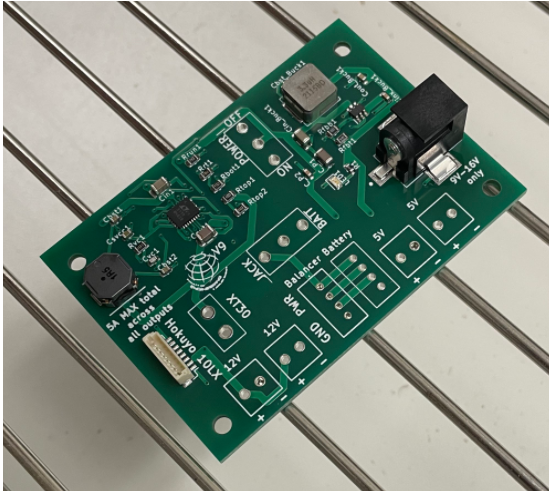

Soldering THT Components
========================

**Need: Solder flux, Soldering Iron**

Soldering is the process of joining two metals together by heating up both metals with a soldering iron, then melting a filler metal to flow into the joint. All you simply need to do is heat up the flux and the metal pin, and the flux should flow.

Watch this `video <https://www.youtube.com/watch?v=AqvHogekDI4>`_ to learn more about soldering techniques.

