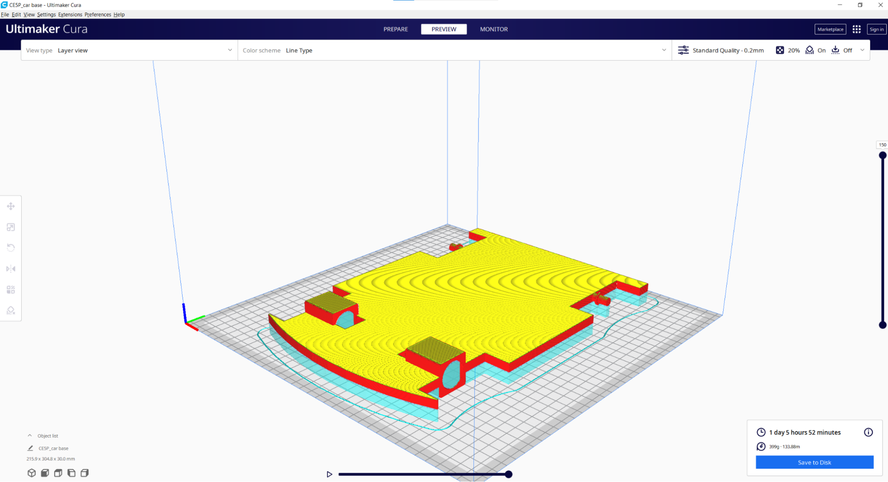

Soldering and Car Manufacturing
===============================

When assembling your circuit for the car, you will need to solder some of the wires to your components. The first bit of soldering you will need to do is to connect the two wires to the back of the DC motor. If you are unfamiliar with soldering see attached youtube video for a quick start guide: https://www.youtube.com/watch?v=Qps9woUGkvI 

Next, you will need to solder your Vcc end from the Arduino and the Vcc end from the motor driver together. When connected they both should lead out to one wire which can be connected to the power source. It should create a three-way meet which will be a parallel circuit.

Repeat this process with the ground wires.

Once all your soldering is complete, this part of the tutorial becomes very broad as DC motor control can be applied to tons of different projects, many of which are not simple cars.

Many manufacturing techniques will be used to make your projects. Most of these techniques have tutorials already posted on this website. The car in the tutorial was designed in SolidWorks CAD modeling and made with 3D printers. The car base was made with ASA filament, the rims with ABS and the tires with TPU. For a tutorial on 3D printing, see :ref:`3D printing`.

If you are unfamiliar with CAD modeling and want a basic design to mimic the car made in this tutorial you can use these STL files and follow the 3D printing tutorial linked above.

* STL CarBase
* STL Rim with MOTOR
* STL Rim
* STL Tire

The parts were sliced with 20% infill in PrusaSlicer.

Everyone’s assembly and mechanical aspects will be different but some common mounting methods are by using: tape, command strips, twist ties, hot glue, clamps, etc. It might also be useful to account for mounting in the design of your prototype and making space for each specific component. 

In the assembly of the car used in this tutorial, the motors were slid in the slots made in the front of the car that was designed in CAD, and super glued in place. The back wheels have bearings inserted with a press fit that are squeezed in a protruding notch in the back of the car. The tires are secured to the car using more super glue and the Vcc and ground connections are soldered to a battery connector which plugs directly into my battery.

