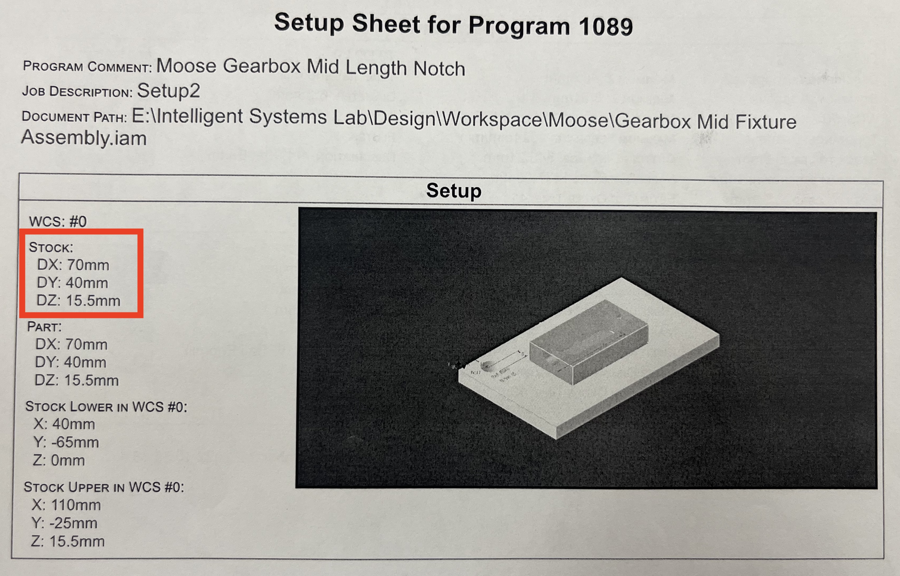
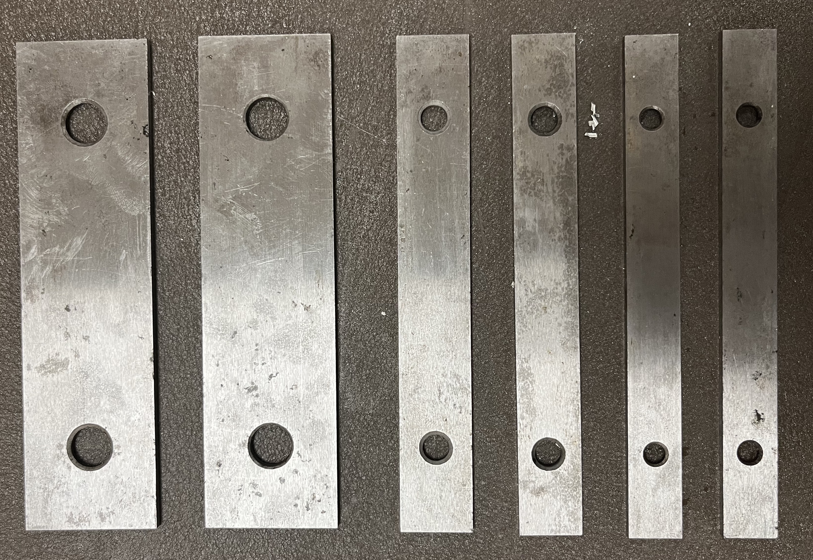
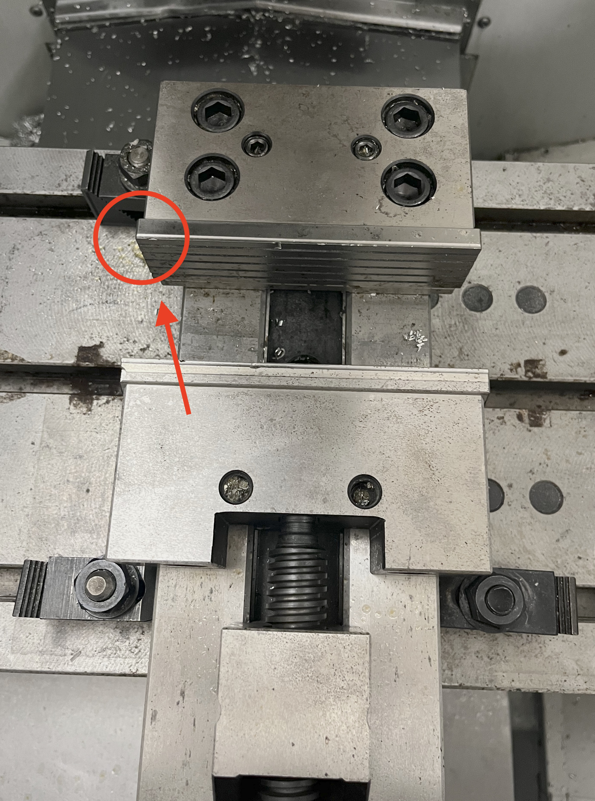
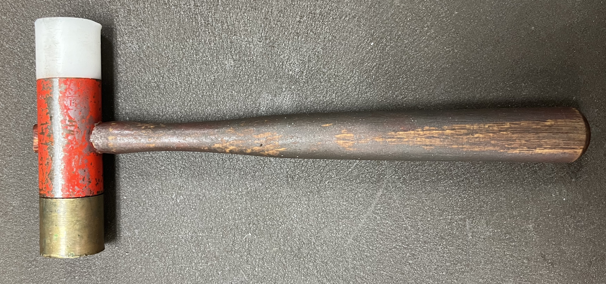

Stock Setup
===========

Work Holding
-------------

The first step in stock preparation is decding how to hold your work
piece in the vise. There are multiple ways that the vise can hold your
stock piece however, depending on the cuts that will be made, one setup
may be favoured over another. This step must be decided **before** you
prepare your stock because different holdings will require different
stock measurements. Additionally, adding additional material to your
stock should be done in CAM so that when you print your setup sheet, the
stock measurements will be exactly what you need.

For the part used in this specific tutorial, we will be using a bottom
hold. For this holding setup, the additional stock will need to be added
to the bottom of the piece (in the z axis).

\*TIP: When adding extra stock to the thickness (z-direction), add an
amount so that the thickness corresponds to a thickness that is
available in the stock room (ie. 1/4 or 1/2 inch).

**NOTE:** If this is the first time the CNC has been used for the day, it's best to run a spindle warmup before you begin. For more information on how to prep the machine for the day, see :ref:`Machine Preparation`

--------------

Preparing the Stock
--------------------

Once the work holding type is determined, you must prepare the stock.
Using the setup sheet, under setup, look at the ‘stock’ measurements.
These are the exact measurements of the stock piece you previously set
in the CAM software.

1. Head to the stock room at the back of the machine shop with your
   setup sheet and caliper in hand.
2. Begin by measuring the thickness of the pieces. This corresponds to
   the z-measurement.
3. Once you find the correct thickness, take the piece to the workbench.
4. Using your caliper, measure the width and length of the stock and
   mark the distance. Make the stock a little larger because the saw
   doesn’t cut straight.
5. Head to the saw and cut the piece. **Do not** cut until the coolant
   begins to flow.
6. Once the stock has been cut, head to the sand belt and deburr all the
   edges.

**IF** you need to face the edges to straigten the piece: Using vertical
mill, place the stock in the vise using the flattest edge, and use the
face or end mill as needed. Deburr edges as needed.

--------------

Fixing Stock on Vise
---------------------

When your stock is ready to go, you can begin fixing it into the vise.
To do this, begin by opening the CNC door and opening the vise.
Depending on the position and height of the stock, you may need a set of
parallels - this is to ensure you don’t machine the vise. These can be
found in the metal case behind the machine. There are various sizes so
make sure you choose a suitable size.

1. Place the top left corner of the stock in the top left corner of the
   vise. This is the machine’s set ‘zero’. Use parallels if necessary.

2. Begin tightening the vise. Ensure the parallels haven’t moved and
   that the stock is laying flat on them. To keep everything in place,
   hold the stock in place with one hand and use the other to tighten
   the vise. \*\ **GIF**
3. When the stock is tightened, slide your finger along the parallels to
   make sure they don’t move.
4. If they don’t move, continue to :ref:`Tool Changes`. If they move,
   take the hammer from the top drawer of the toolbox and hit each end
   corner of the stock then, try to move them again.

5. If they still move, tighten the vise again and repeat step 4. Repeat
   until they do not move.

Now you have your stock secured in the vise.

**NOTE:** It is important that the stock is fixed to the top left corner
as this is the machines’ set ‘zero’. If the stock is not positioned in
this corner, the offset will be wrong and the part will be machined
incorrectly.

--------------
