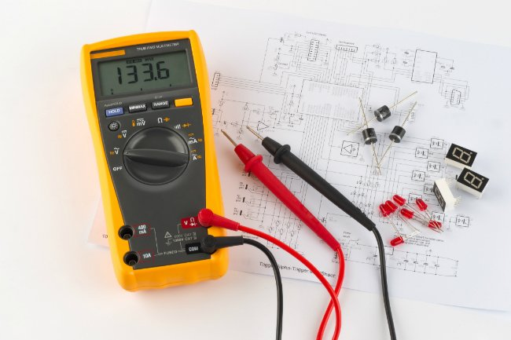

Testing Circuit Boards
======================

After full assembly, the circuit board needs to be confirmed as fully and appropriately functional through testing. Using a multimeter, the voltage output at each output (connectors, terminal blocks) should be confirmed as the expected outputs.  
 
Watch this `video <https://www.youtube.com/watch?v=wAc8PPw-peI>`_ to learn more about the type of faults that can exist in a circuit.

    
`Here <https://www.bobvila.com/articles/how-to-use-a-multimeter/>`_ for how to use a multimeter.
