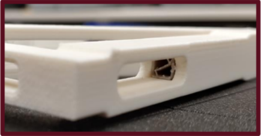
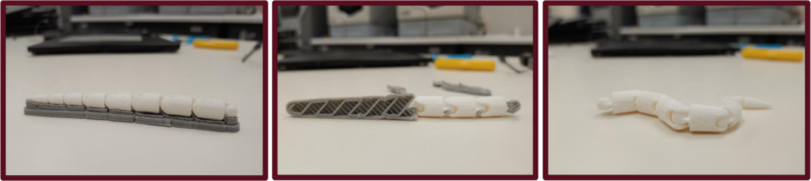
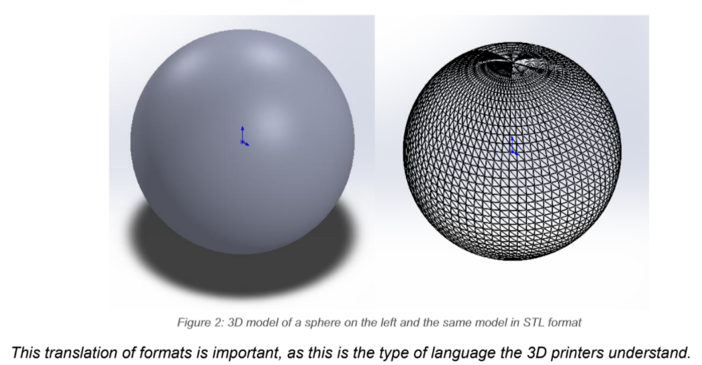

The Basics of 3D Printing
=========================

.. figure:: ../_static/images/3DPDG1.PNG
    :figwidth: 700px
    :target: ../_static/images/3DPDG1.PNG

Welcome
-------

Welcome to Memorial University's Student Design Hub! Here you have access to multiple 3D printers where can
bring your digital designs to life!

Overview
--------

3D printing or additive manufacturing is a process in which solid objects are made from a digital file. The
most widely used technique is Fused Deposition Modeling (FDM).FDM is the process of feeding a polymer-based 
material through a nozzle in which the material melts and gets extruded in a distnict pattern onto a flat 
surface where it will harden again. 3D printers repeat this process with many distinct and thin layers to 
mold the material into the desired design. The relative speed of creating these parts (a couple of 
hoursdepending on size, design, and infill) allows for proof of concepts to be developed rapidly, moving
past 3Dmodeling, a very powerful tool tied to 3D printing. The end results used to be used exclusively for
prototyping, however, due to the advancements of 3D printing technology and materials, 3D prints are being 
used more frequently as end products and parts.

For more detailed information please visit the sources used under Reference List

Materials
---------

The most common materials for 3D printing are **Poly Lactic Acid (PLA)** and **Acrylonitrile Butadiene
Styrene (ABS)**. PLA filament is a biodegradable material that is easy to print due to its low heating
requirements, however it does not possess a very high resilience to UV rays, its more suitable for parts
used indoors and at around room temperature. ABS filament in the other hand requires a higher
temperature to be printed, but it offers UV resilience as well as better mechanical properties in high
temperature environments. There are many other materials available to print as well, depending on the
printer you use. Some materials are:

* Polyethylene Terephthalate Glycol (PETG)
* Thermoplastic Polyurethane (TPU)
* High Impact Polystyrene (HIPS)
* Polycarbonate (PC)
* Thermoplastic Elastomer (TPE)
* Nylon
* Acrylonitrile Styrene Acrylate (ASA)
* Polypropylene (PP)
* Polyvinyl Alcohol (PVA)
* Glass Fiber or Carbon Fiber Infused
* Metal or Wood Fill
* Etc.

Modelling
----------

One of the advantages of 3D printing is that very complex models can be achieved. However, when
crafting your 3D model in a computer-aided design (CAD) software, such as SolidWorks, some design
considerations can help ensure better results.

**Resoultion:** Similar to image resolution, a 3D printer has a minimum feature, analogous to a pixel in a
picture, this is the smallest “dot” a 3D printer can extrude accurately and consistently. 
This is called the printers resolution. Resolution is divided into XY-resolution, and is influenced by factors 
such as nozzle diameter and the smallest movement capable of the stepper motor on the printer. Because of this, 
each printer can have a different minimum layer height, but a general rule of thumb is a minimum layer height of 0.2mm.
Anyhting less than 0.2mm may arise consistency and accuracy issues

.. figure:: ../_static/images/3DPDG3.PNG
    :figwidth: 600px
    :target: ../_static/images/3DPDG3.PNG

.. figure:: ../_static/images/3DPDG4.PNG
    :figwidth: 600px
    :target: ../_static/images/3DPDG4.PNG

**Orientation:** Printing orientation of the 3D model can greatly
improve the surface quality of the print. The figure displays the same
3D model printed horizontally and vertically. The horizontal print on the left 
displays a “staircase” pattern finish, while the vertically prited part on the 
right has a much smoother finish due to it's logical orientation. 
A logically oriented part accounts for minimal overhang areas and lofts the scale vertically.
When printing parts that would undergo a mechanical
load, the former would support more force applied to it at the peak of
the semi-dome than the latter.

.. figure:: ../_static/images/3DPDG5.PNG
    :figwidth: 600px
    :target: ../_static/images/3DPDG5.PNG

**Size:** Each printer has maximum length, width and height in which it can print. When considering the size
of your design consider the size of the print bed and the orientation of your part. If the design cannot be 
scaled down and is simply too big for the printer, making the prototype is seperate prints the combining 
with post-processing may be a viable option.

**Wall Thickness:** A minimum wall thickness is required for the
model to be able to print and be structurally sound. This dimension
would be affected if the model needs to support any force, but as a
rule of thumb for ABS it is recommended to use a minimum wall
thickness of 1.2mm. Different materials and printers have their own configurations.
If thin wall prints are required see :ref:`Thin Wall Printing` in :ref:`Building the 
Supermarine Spitfire Mk IX Plane` Case Study. 

**Shrinkage and Assembly:** When printing parts that are design to
be connected to each other, keep in mind the shrinkage that the
prints will undergo. This deviation of the print from the model’s
nominal size is also known as **dimensional accuracy** and is
generally around 0.1% or ±0.2mm.

.. figure:: ../_static/images/3DPDG6.PNG
    :figwidth: 800px
    :target: ../_static/images/3DPDG6.PNG

**Embossed and Engraved Details:** Engraving refers to details added into the print (inwards),
a minimum line thickness of 1 mm and a depth of 0.3 mm is recommended. By contrast, embossing
are details that protrude from the printed model, a line thickness of at minimum 2.5 mm and a
depth of at least 0.5 mm is advice. Engravings are usually preferred as they require much lower
tolerances than embossing details.

.. figure:: ../_static/images/3DPDG7.PNG
    :figwidth: 800px
    :target: ../_static/images/3DPDG7.PNG

**Support Material:** To be able to achieve intricate designs most 3D printers employ support
materials. The most popular support method is breakaway supports. Breakaway support materials 
are temporary beams that are printed around your model to support overhangs or ares where the 
melted plastic cannot support itself until hardened. These can be broken away as soon as the print has
been finished, but in certain complex geometries they tend to leave residue behind
and/or are difficult to completely remove without damaging the print. This is caused if the design possess
deep channels/crevices in the inside faces of the model, where no exit hole is accounted for. With that
being said the difference is minimal and breakaways are the best option for the majority of prints you will complete.
This is very important to keep in mind when modeling your 3D design. Every printer in the Student Design Hub uses this
method of support for 3D printing. Another method to create supports is through soluable supports.
Soluble support materials work the same as breakaways but instead they leave a smoother finish and are
easier to remove because they are able to be dissolved in water instead of having to be broken away.
However this method of support material is only available through one printer located in the Digital Design and
Prototyping Lab and is a quite longer process.

.. figure:: ../_static/images/3DPDG9.PNG
    :figwidth: 600px
    :target: ../_static/images/3DPDG9.PNG

**Moving Parts:** Support material allows for the printing of preassembled models
with moving parts, for these to successfully print a minimum clearance of 0.4mm
is advised, the greater the space that can be afford, the better chance the model has to print properly.

STL Format
----------

After you have finished your design, save the SolidWorks model in the native format SolidWorks Part File
(SLDPRT) as well as the Standard Triangle/Tessellation Language file format (STL) [1]. To save your
model in STL format go to File>>Save as, and change the file format from SolidWorks Part (*.prt;*.sldprt)
to STL (*.stl) in the prompted window, as shown in the image below:

.. figure:: ../_static/images/3DPDG11.PNG
    :figwidth: 600px
    :target: ../_static/images/3DPDG11.PNG

The SLDPRT file stores the part as a solid model, keeping the specified details of material, color, and
texture. On the other hand, an STL file stores only the information of the 3D model surface, it represents
this surface as small adjacent triangles.

Printing
--------

Once you have the .STL file, it will be imported into a slicer, a software that produces a path for the 3D printer to
follow to be able to print the model. This set path is known as G-code, and it
tells the printer what movements to make from the begging to the end of the print. More on this in :ref:`Generating the G-Code`

.. figure:: ../_static/images/3DPDG13.PNG
    :figwidth: 700px
    :target: ../_static/images/3DPDG13.PNG

