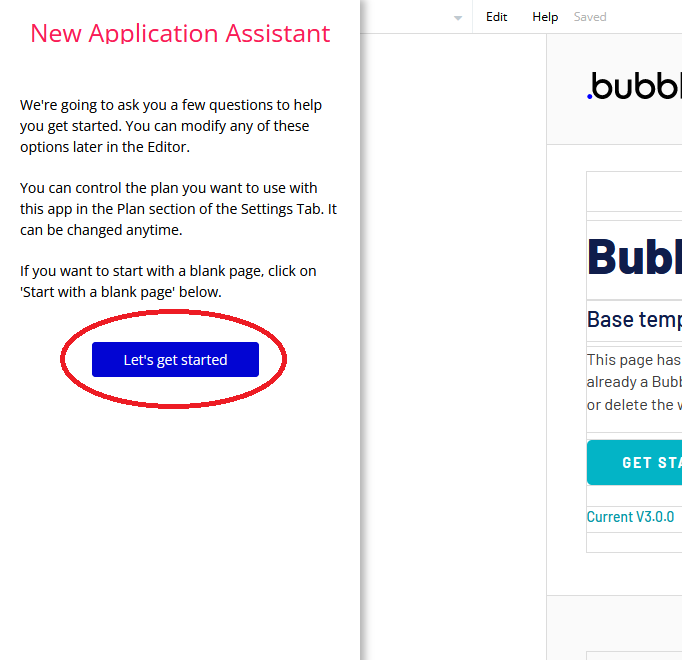
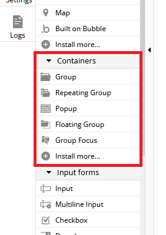
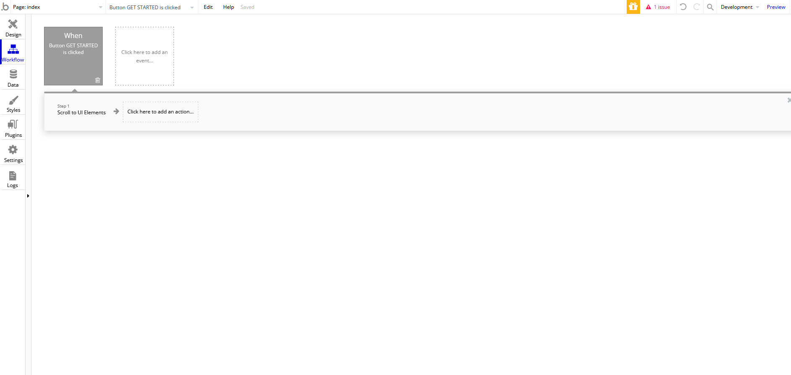
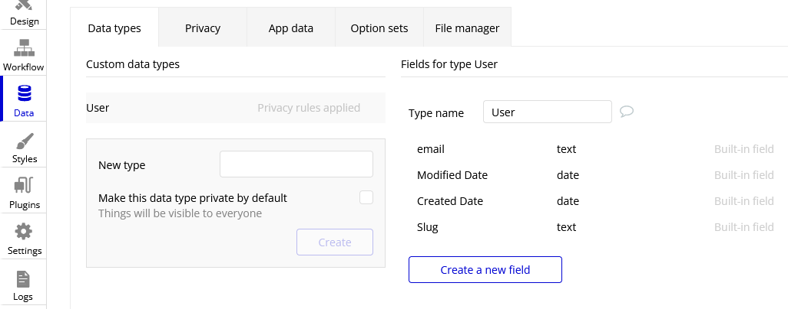
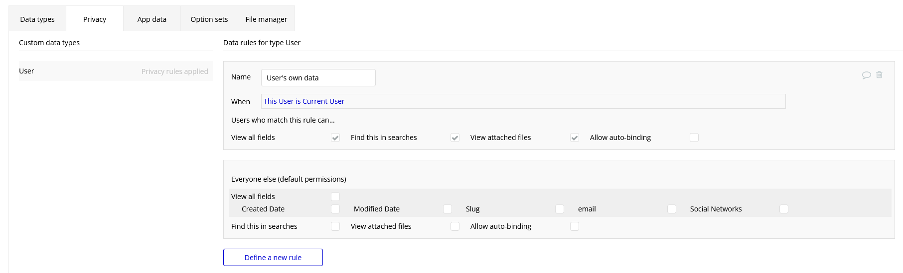
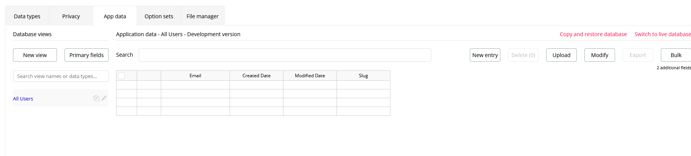
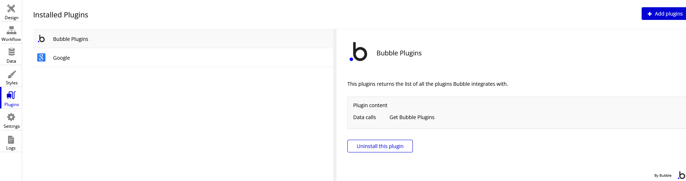

The Basics of Bubble
====================
Bubble.io is a code-free online web tool that is used to make many kinds of web applications. It is very versatile and can be used for anything ranging from social media sites, online marketplaces, landing pages, etc. This tutorial will explain the basics of using the interface and also show how to make a few simple web apps.

The following subsections will describe how to get started with Bubble and some of its most basic features that you will inevitably use while making your apps.

Creating a New App
------------------
To start making apps with Bubble, you must first create an account. After that is done, navigating to the home screen will show a label that says "My apps" along with a blue button which says "New app":

.. image:: ../_static/images/Bubble_1.png
   :width: 1000px

After clicking the blue button, a popup will appear that will allow you to give your app a name, specify the type of app you want to build, etc. Please note that your app's name must be unique from all other app names create on Bubble (not just your own apps):

.. image:: ../_static/images/Bubble_2.png
   :width: 1000px

Press the blue button to be taken to the Bubble editor. You will see a popup on the left side of the screen called "New application assistant." By clicking "Let's get started," you will be able to change the icon and title that displays in your app's tab when it is running, along with a few other features that will be discussed later on.

It is useful to keep in mind that you can always hover your cursor over anything in Bubble to get access to its reference page, where you can learn all about what it does.

.. image:: ../_static/images/Bubble_15.png
   :width: 1000px

The Design Tab
--------------

You should now see the Bubble editor's Design tab. You can access this tab anytime by clicking on the small box on the left side of the screen that says "Design" on it. This is where you will decide how your app will look to its users. You will be able to drag and drop elements into the viewing area on the right side of the screen. You will also be able to resize, rotate and reposition those elements to your liking. Right now there is a default webpage showing in this viewing space, but that can easily be cleared by drag-selecting everything and pressing the "delete" button on your keyboard.

.. image:: ../_static/images/Bubble_4.png
   :width: 1000px

The UI builder on the left allows you to add new elements to the page by dragging and dropping (or clicking and then dragging on the white space).You may notice several useful features under the "visual elements" dropdown:
..
   Same comment as above. Crop the image so that it only shows what you're talking about. Better to make it clear where your reader should look. Please make this change throughout. 
.. image:: ../_static/images/Bubble_5.png
   :width: 250px

Here is a brief explanation of each:

| **Text** - Allows you to add text to the screen. Its font type and size can be changed.
| **Button** - Allows you to add a button to the screen. Making the button do something requires starting a *workflow*, which will be discussed later.
| **Icon** - Adds a common icon of your choosing to the screen (a "like" button, for example).
| **Link** - Adds hyperlinked text to the screen.
| **Image** - Adds an image to the screen.
| **Shape** - Adds a rectangle to the screen.
| **Alert** - Shows a temporary message when an event occurs. Triggered using a workflow.
| **Video** - Adds a playable video to the screen. Video must be accessed through Youtube or Vimeo.
| **HTML** - Allows you to embed HTML code into your web app.
| **Map** - Allows you to add a map that can be navigated and referenced by other elements in your app.
| **Built on Bubble** - Adds an optional Bubble watermark to your app.
| 
| Within the UI builder there is also a dropdown called "Containers." It contains several features that are necessary for almost every kind of web app:

Here is what each container does:

| **Group** - Groups multiple elements together.
| **Repeating Group** - Repeats groups of elements vertically/horizontally on the page. Useful for displaying lists of data (comments on a post, for example).
| **Popup** - Shows a small "page" (really just a group) overlapping the original page when an event triggers it (a login popup, for example).
| **Floating Group** - A group of elements that stays in the same position on the screen as the user scrolls through the site.
| **Group Focus** - A group of elements that shows only when an event triggers it, and disappears once the user clicks outside of it.
| 
| The UI builder also has a dropdown titled "Input forms." These elements allow the user to enter information into the web app:

.. image:: ../_static/images/Bubble_7.png
   :width: 250px

Here is what each input element does:

| **Input** - Allows the user to enter a single-line input.
| **Multiline Input** - Allows the user to enter a multiline input.
| **Checkbox** - Adds a checkbox to the interface.
| **Dropdown** - Allows the user to choose an input from multiple options (an example would be sorting posts in order of most popular, most recent, or least recent).
| **Search Box** - Searches a database for the user's input and provides search suggestions.
| **Radio Buttons** - Allows the user to choice from a list of choices, but only one option is allowed at a time.
| **Slider Input** - Lets the user choose a value from a range of values (or specify a range within these values).
| **Date/Time Picker** - Lets the user input a date (and time, if needed).
| **Picture Uploader** - Lets the user upload an image to the app.
| **File Uploader** - Lets the user upload a file (of any type) to the app.
| 
| In each element dropdown, you may notice that there is an option to "Install more..." at the bottom. Clicking this option opens the plugins page, which will be discussed later. These are all the basic UI elements that you will need to build your apps.
..
   We should hyperlink things we "talk about later"

The Workflow Tab
----------------

The purpose of this tab is to add functionality to the elements you created in the design tab. For example, the event that occurs as a result of pressing a button would be specified here. The triggers/actions that can occur in a given workflow are too numerous to list in this tutorial, so it is best just to learn them as you need them. We will briefly talk about the basic interface.

Clicking on the event block lets you specify which event will trigger the action. It could be a page loading, a button being clicked, a popup opening, etc. Once an event is picked, a action section will appear, allowing you to choose what happens when this event occurs.

.. image:: ../_static/images/Bubble_9.png
   :width: 1000px

Using the options presented in the actions tab is mostly self-explanatory, but can quickly become complicated in the later stages of building your app. The best way to get comfortable using it is through examples, which are available in the later sections of this tutorial.

The Data Tab
-------------
As you use Bubble, you will start to see references to database terminology:

| **Types** - Data templates that have several fields. For example, "user" is one of the preloaded data types in Bubble. Its fields include the user's email, the date their account was created (Created Date), the date the user's account was modified (Modified Date), and the user's account's slug. The "User" type defines what data is associated with a user's account.
| **Things** - Instances of a type. To use the "User" example again, this would refer to a specific user's account. When you create a new thing, you must specify what this thing's type is. If it is of type "User", then you are creating a new user account.
| **Fields** - Attributes of a type. A thing of type "User" has an associated Email, Creation Date, Modified Date, and Slug. More fields can be added to a type as desired, but default fields cannot be deleted.
..
   There's a System message popping up here when you preview the page. Please resolve it. 

There are several tabs within the data tab, each dedicated to dealing with different parts of your app's data. Each will be described below.

| **The "Data types" Tab** - This tab deals with creating, viewing, editing, and deleting data types. It also lets you add/delete fields of each type (except for the default fields).

   
| **The "Privacy" Tab** - This tab Lets you set privacy rules for each data type, such as what can be shared or searched by other users.

| **The "App data" Tab** - This is where you can view, create, edit, or delete instances of different types (things). For instance, the information of someone who created an account with your app would be accessible in this tab.

| **The "Option sets" Tab** - Allows you to create, view, edit, and delete dynamic sets.

.. image:: ../_static/images/Bubble_13.png
   :width: 1000px

| **The "File manager" Tab** - Allows you to upload, view, and delete files that users have uploaded to your app (can be of any file type).

.. image:: ../_static/images/Bubble_14.png
   :width: 1000px

The Styles Tab
--------------

.. image:: ../_static/images/Bubble_92.png
   :width: 1000px

This tab opens automatically whenever you try to edit the style of one of the elements in the design tab. It allows you to change the appearance of the element by altering fonts, colors, shapes, etc.

The Plugins Tab
---------------

Bubble has a vast library of plugins for integrating third-party services into your app. Some of the most popular plugins allow you to integrate Facebook, Google, Amazon, PayPal, etc. directly into your app. Pretty much any app that you could ever want to make will require a plugin.
