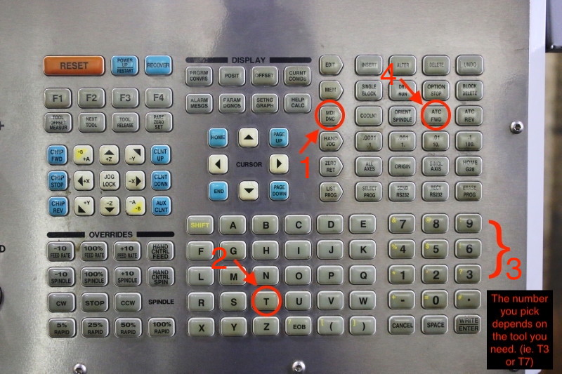
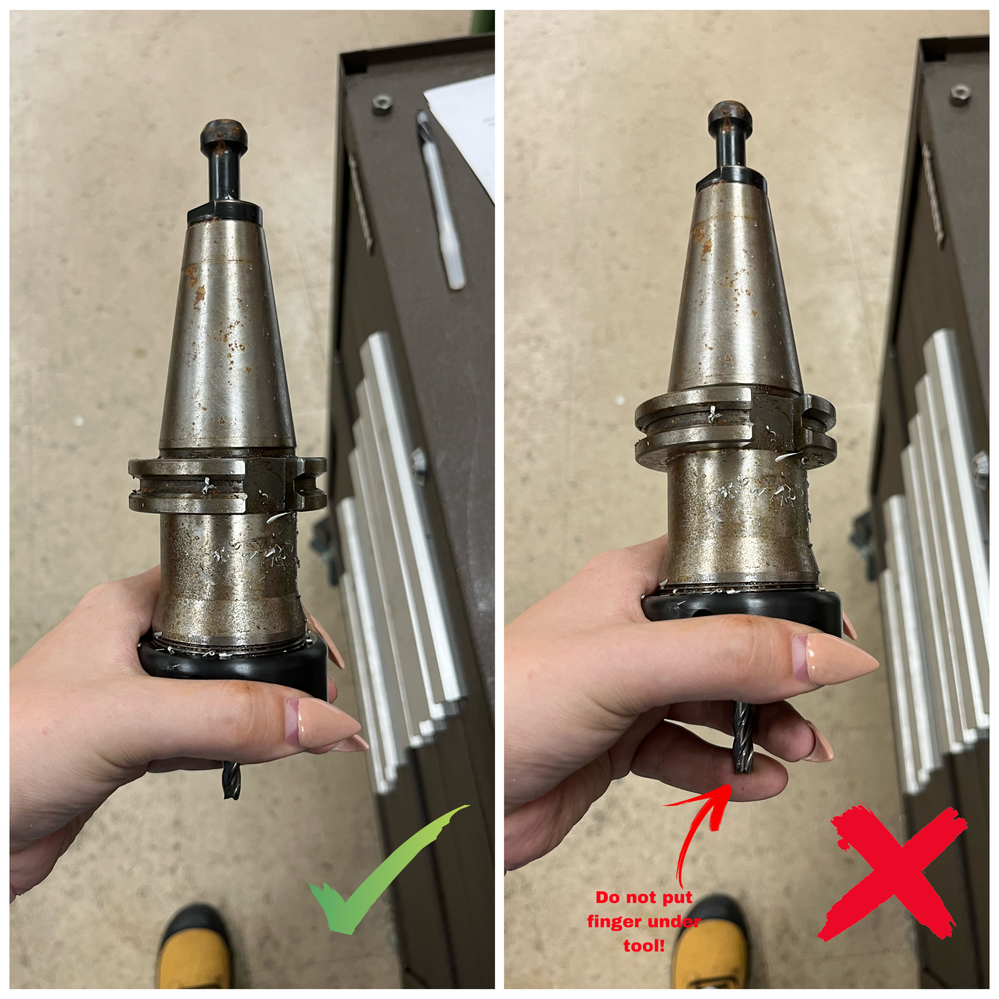
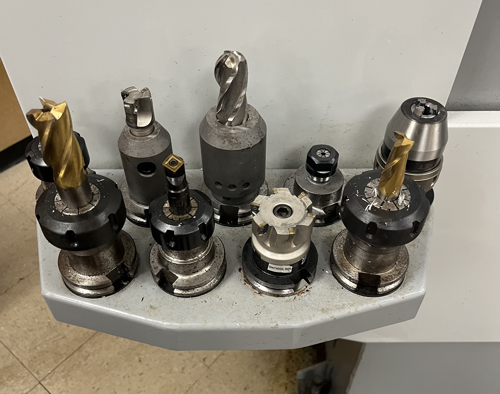
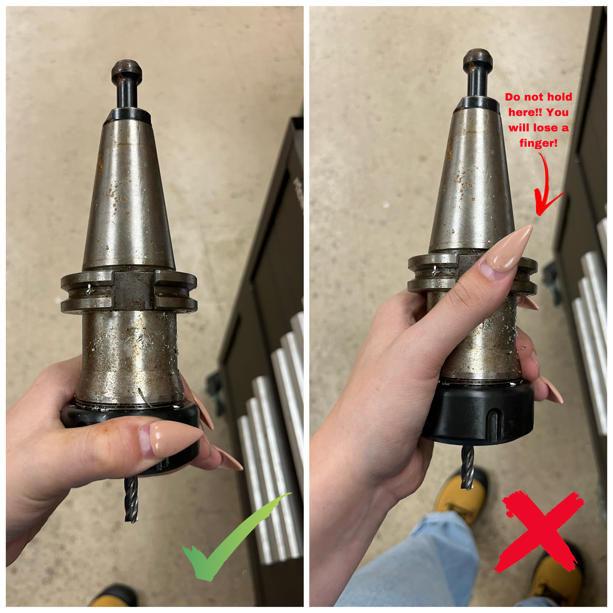

Tool Changes
============

Once the stock has been secured in the vice, the next step is to make
sure you have all the tools needed. Make sure to read this whole section
prior to beginning tool changes as there are important notes throughout.

To begin preparing the tools for the CNC:

1. Look at your setup sheet. Under ‘Tools’, there will be a list of
   tools. Under each tool, you will need to focus on the following
   sections:

   a. The slot allocated for the tool (ie. T1) - This is the slot that this specific tool HAS to be in. You may have to change the tool (see below). 

   b. The type of tool (ie. flat end mill) - This is the type of tool. See *LINK* for tool types. 

   c. Tool diameter (ie. 6.35mm) - This is the shaft diameter of the tool and is useful when looking for the specific tool size (especially for drill and chamfer tools)

   d. The tool description (ie. ¼” Flat Endmill) - This includes the full tool description (size, type, etc.)

2. Begin with your first tool (ie. T1). To bring this tool to the
   spindle, close the door, click MDI (manual input data) > T1 > ATC fwd
   (Automatic tool changer forward).

3. Once the selected tool number is in the spindle, check to see what the tool is. The tool may be
   the correct one already. However, this is rarely the case. If the
   correct tool is already in the slot, move on to the next tool (repeat
   steps 2 & 3 for each specific tool listed on the setup sheet).

If the correct tool is **not** in the slot:

4. Remove the current tool from the spindle. To do this:

   a. Place one hand on the tool (Hold the black part. MAKE SURE YOUR FINGER IS NOT UNDER THE TOOL. The tool is heavy and will drop so you do not want your hand to get squat or cut.) 
       

       b. Press the tool release button. **GIF**

5. Once you have removed the current tool, find the correct tool. First,
   check to see if the tool you’re looking for is already in a tool
   holder at the front of the mill (as pictured) or in the tool changer.

   a. If the correct tool is in front of the mill skip to step 6. 

   b. If it’s in the changer follow steps 2, 3, 4 and then 6. 

   c. If the correct tool is not there:
      
      i. Find the correct tool bit and an empty tool holder.
      
      ii. Head to the back of the CNC Machine and find an appropriate collet. The collet will vary depending on the type of tool you're using, for example a collet for an end mill can be seen below. A drill does not go in a collet like this.  
      
      .. figure:: ../_static/images/CorrectCollet.jpg
         :figwidth: 700px
         :target: ../_static/images/CorrectCollet.jpg

      iii. Once you have the appropriate collet, tool bit, and tool holder, begin by assembling and hand tightening. Make sure to put the collet in the black piece of the holder first and then screw it on. If not, it will get jammed in the holder.
      
      iv. After you’ve hand tightened, bring the tool to the back/side of the machine and place it in the tightener. Using the red-handled wrench, hook into the notches on the black piece and tighten. To losen, flip the tool around and do the same.

      .. figure:: ../_static/images/ToolBackOfCNC.jpg
         :figwidth: 700px
         :target: ../_static/images/ToolBackOfCNC.jpg

   For more information on collets, tools, holders, and more, visit
   here: **LINK**

**NOTE: You may need to take apart another tool in order to get the
correct holder, collet, bit, etc.**

6. To insert the tool into the collet:

   a. Hold the tool by the black part but this time, don’t let your hands go too high - make sure they aren’t wrapped around or near the notches. There is a lot of force behind the spindle and you do not want your fingers to get caught.

   b. Line up the two notches on the spindle with the two flushes on the tool holder.

   c. Press the tool release button. *gif*

7. Once the correct tool is in the correct slot, repeat step 2 onward
   with every required tool until finished.

**IMPORTANT NOTES:** If the top of a tool holder has some rust, make
sure to clean it with the scrub cloth (found on the middle work bench).
