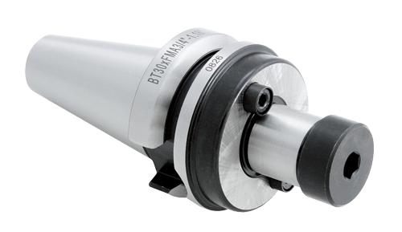

Tool Holders, Bits, and More
============================

When trying to figure out the appropriate tool holder to use, it is important to understand the different types. 

Collet Chucks 
-------------

For flat end mills, ball end mills, chamfer tools, a tool holder called a collet chuck is used. 

These collet chucks come in three different pieces and require assembling, as seen below.

.. figure:: ../_static/images/ColletChuckFull.jpg
   :figwidth: 700px 
   :target: ../_static/images/ColletChuckFull.jpg

The middle piece comes in many different sizes and need to be changed depending on your tool size. For example, a 1/2" Flat End Mill will not fit into the same collet as a 1/4" Flat End Mill.

In the machine shop, we have metric collets so, for example, one collet is size 8-7 meaning an end mill with a 7-8mm diameter shank will fit. 

Drill Chucks
------------

For drills, centre drills, and reamers, the tool holder called a drill chuck. 

The jaws on the drill chuck can be adjusted to fit different size drill bits by tightening it. 

NOTE: The collet chuck and the drill chuck can be tightened or losened at the back of the CNC on the tightening fixture. 

Face Mill Holders
-----------------

Face mills have their own type of holder. Because we only have one face mill that is normally used with the CNC machine, you will not be required to know how to change it. 

As a quick overview, you take the middle piece of the holder off using a hex key, slide the face mill on and then put the black piece back on and tighten it with the hex key.
The picture below is what the holder looks like without a face mill attached. 

