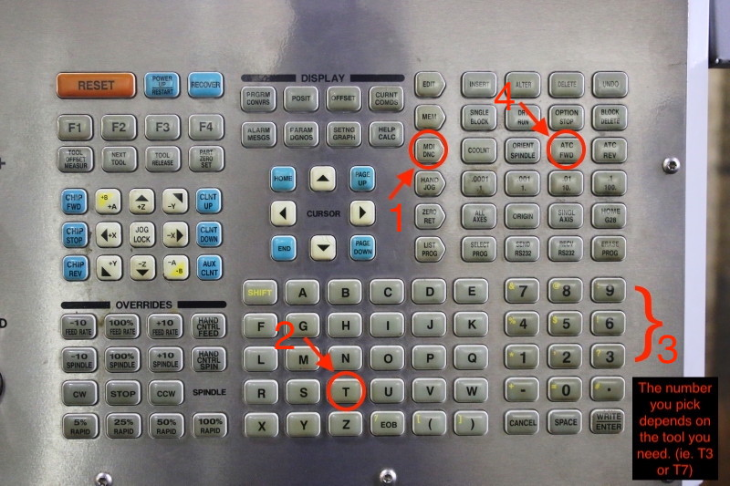

Tool Offsets
============

In order for the machine to determine where the "top" of the stock is, we must perform tool offsets for every tool we plan to use. 
This step is one of the most important steps in preparation to run the program and is done after we have changed all our tools to the ones we need. To begin tool offset:

1. Bring the first tool on your setup sheet to the spindle by pressing
   MDI > T1 > ATC fwd, as shown below.

**NOTE:** The correct tools must be in place before doing the offset. To
change any tools, see :ref:`Tool Changes`

2. Place the offset gauge on your stock. *ADD PIC*

3. Using hand jog, line the x and y axis up with the offset gauge. To do
   this, press hand jog > .01 > Y or X axis and then, rotate the hand
   jog in the positive or negative direction until the tool is above the
   round center piece on the tool gauge.

4. Next, press hand jog > 0.01 > Z axis and SLOWLY begin to bring the
   tool down.

5. When you’re about an inch away from the top of the gauge, press 0.001
   and again, slowly bring the tool down until it touches the top and
   the gauge begins to move.

6. Continue to slowly move the tool down until the gauge reads
   approximately 0.

7. Next, press 0.0001 and lean in close to the guage. Move the gauge
   until it reads exactly 0.

\*pic of gauge reading 0

8. Next, head to the control panel and make sure you can see the ‘Tool
   Offset’ screen. From there hit the right arrow in the cursor until
   you are under the ‘Geometry’ tab. Then, press tool offset measure and
   a value will show up under the tab you are on.

9. **IMPORTANT:** Press -50.8 and click enter. A new value should
   appear.

**NOTE:** Repeat step 8 and 9 twice to ensure the value is correct and no typos were made. This -50.8 value is crucial as this is the guage offset. It HAS to be entered every time.

10. To begin lifting the tool off the gauge, press hand job > z axis >
    0.001 and SLOWLY move the hand jog upwards. Make sure the z is
    moving away from the z-axis so the gauge doesn’t break.

11. Once the z-axis is moved far enough away, remove the gauge.

12. Repeat steps 1 through 11 until **ALL** tools have been correctly
    offsetted.

DO NOT mess up the -50.8 value. This value is the offset of the gauge so
if you skip this, the tool offset relative to to the stock will not be
correct and will cause the tool to crash into the stock/table.

--------------
