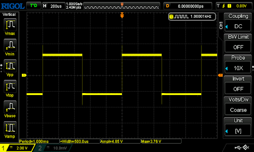
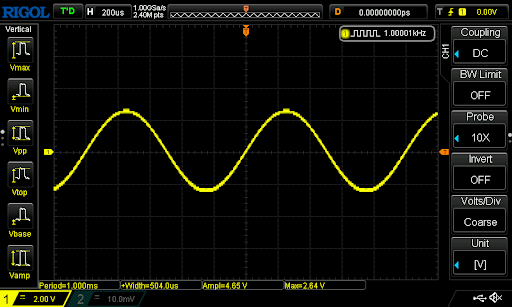

Types of Waveforms
==================

Square Wave

Sin/Cos wave or AC(Alternating Current) wave

Triangle Wave

    .. figure:: ../_static/images/Oscilloscope_Tutorial/osctut31.png
    :figwidth: 500px
    :target: ../_static/images/Oscilloscope_Tutorial/osctut31.png

DC Voltage

    .. figure:: ../_static/images/Oscilloscope_Tutorial/osctut32.png
    :figwidth: 500px
    :target: ../_static/images/Oscilloscope_Tutorial/osctut32.png

Fourier Series Wave
Note: Fourier Series waveforms have many different appearences. This is one of many. You can find more about this `here <https://www.allaboutcircuits.com/technical-articles/fourier-series-circuit-analysis-an-introduction-to-fourier-series-representation/>`_

    .. figure:: ../_static/images/Oscilloscope_Tutorial/osctut33.png
    :figwidth: 500px
    :target: ../_static/images/Oscilloscope_Tutorial/osctut33.png

Noise

    .. figure:: ../_static/images/Oscilloscope_Tutorial/osctut34.png
    :figwidth: 500px
    :target: ../_static/images/Oscilloscope_Tutorial/osctut34.png