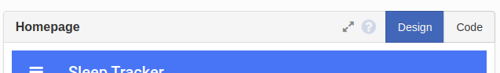
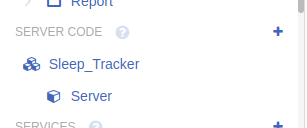
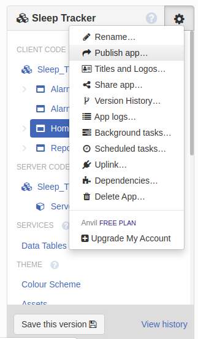
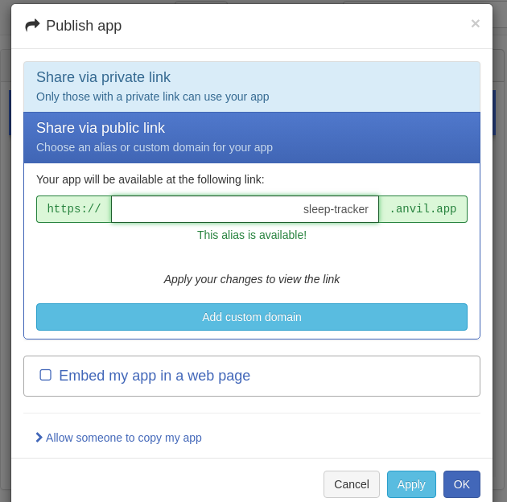
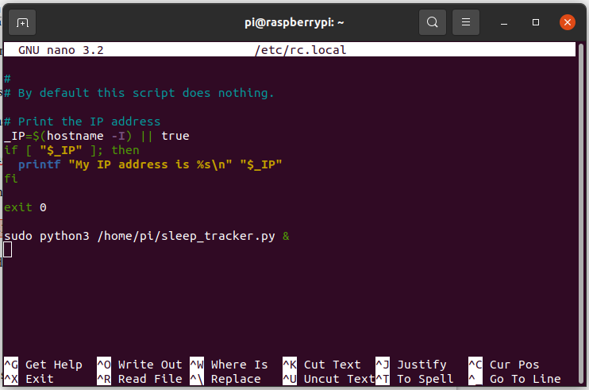
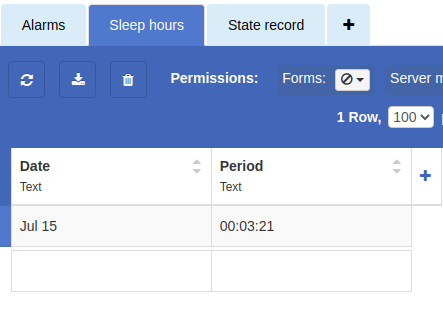
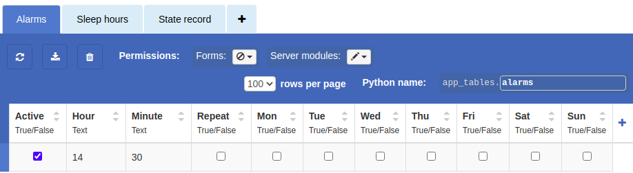
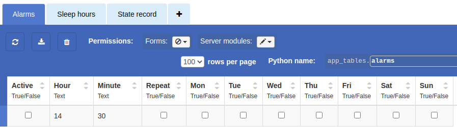
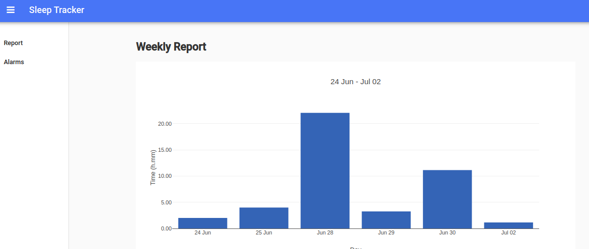

Uploading and Testing
=====================

Make sure you download the full project code from :download:`here <../_static/sleep_tracker_full_code.zip>`.

Anvil
-----

When :ref:`building the web app forms <Anvil Interface>`, Anvil automatically generates the client code file for each form. This file is accessed from the “Code” tab on the top bar of a form.

Also, by default, a server code file exists when an app is first created so that the user is ready to type their code.

Copy the server script to server code file, and the client script for each form to the code file of the corresponding form on Anvil.

.. _Uplink Key:

After pasting the scripts, publish your app by going to the app editor window and clicking Publish app in the top right corner of the App Browser panel.

You are given the option to generate a private or a public link for your app. For this project, a public link is selected and is set as sleep-tracker.anvil.app. The app can then be accessed from any browser using this link.

Raspberry Pi
------------

After the web app is published, the Raspberry Pi needs to link to the Anvil server through the Anvil uplink key. This key can be found in the web app settings menu under “Uplink”.

.. |front| figure:: ../_static/images/public.png
  :align: center

.. |back| figure:: ../_static/images/public.png
  :align: center

|front| |back|

Copy the key to the Raspberry Pi script at line 17 which defines the uplink key variable.

.. code-block:: python

  ANVIL_UPLINK_KEY = "YOUR_KEY_HERE"

To upload the script to the Raspberry Pi, save the code first to a text file. When the Raspberry Pi powers on and connects to the WiFi network (as described :ref:`before <Configure Pi>`), use the following command to copy the code to the Raspberry Pi micro SD card using SSH:

.. code-block:: none

  scp path/to/sleepTracker.py pi@raspberrypi.local:sleepTracker.py

where :python:`path/to/sleepTracker.py` is the path to where the script is stored on the PC.

To set the script to run automatically when the Raspberry Pi turns on, it needs to be added to the Raspberry Pi’s *rc.local* file. *rc.local* is a file that allow a user to specify objects or processes to run after the initial boot services are started.

After a successful SSH connection, use the following terminal command to open the *rc.local* file.

.. code-block:: none

  sudo nano /etc/rc.local

Add this terminal command at the end of the file to run the script:

.. code-block:: none

  sudo python3 /home/pi/sleep_tracker.py &

The ampersand sign indicates that the script is run in the background to not obstruct the boot process.

The final step is to place the Raspberry Pi and the circuit components in an enclosure box with openings for the display and ultrasonic sensor. We printed a box on our Prusa 3D printer. The enclosure’s STL file can be found :download:`here <../_static/sleep_tracker_enclosure_3d.zip>`. We recommend that you check your `3D printing tutorial <https://munsdh.readthedocs.io/en/latest/3D%20Printing%20in%20the%20Student%20Design%20Hub.html>`_ before you use a 3D printer.

.. figure:: ../_static/images/inside.png
  :align: center

.. figure:: ../_static/images/box.png
  :align: center

Testing
-------

To test the device, fix it above a bed, then lay on bed for a few minutes and get out. When opening the Anvil sleep hours data table, you will notice a new record showing the total number of minutes you slept for.

Try to set an alarm through the web app. The Raspberry Pi will fire alarms at the correct time, and pressing the dismiss button indeed deactivates that alarm. The screenshot below shows the alarms table before and after dismissing a test 2:30 PM alarm. Notice that the "Active" field is unchecked in the bottom photo.

Repeat the same test every day for a period of seven days. You will find that the data for each day is recorded in the sleep hours data table. The screenshot below shows a complete plot of the total hours of sleep per day on the Report form. The days are listed on the x-axis, and the sleep period is on the y-axis recorded in hours and minutes separated by a dot (H.MM). The test indicates that data is correctly stored and retrieved by the web app.

|

**Final words...**

Congratulations on completing your first IoT project! Now that you know how to build a web app on Anvil and connect a Raspberry Pi to the server, you can use the same methodology to create your own project. Look around, think about your everyday tasks or problems you face, and see which ones can be solved or improved by automation. Remember that one of the main points of IoT is to make life easier.
Also, please share your projects on open-source communities like Github and Instructables so that others learn too!
