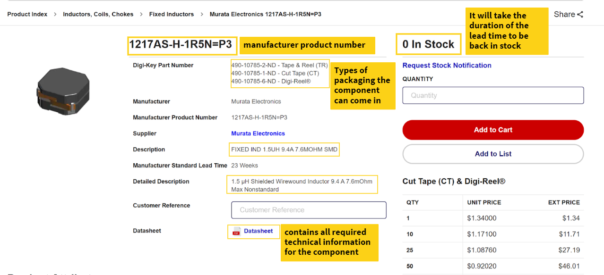
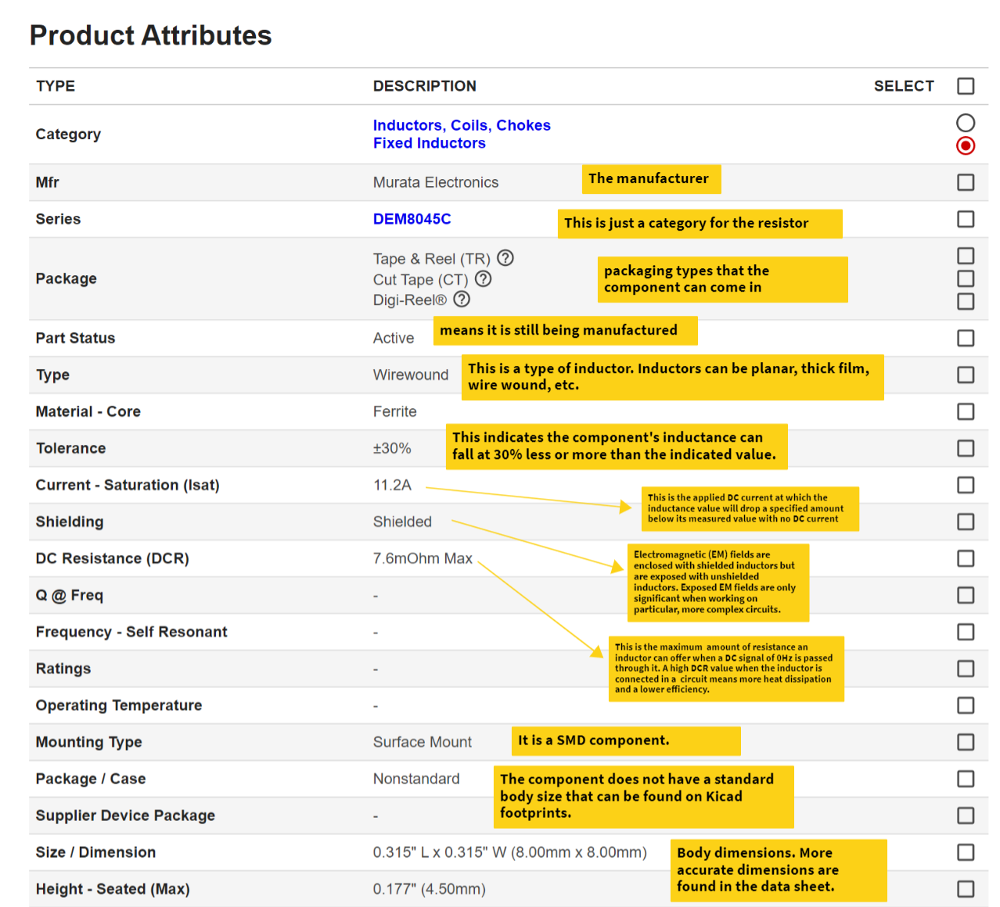
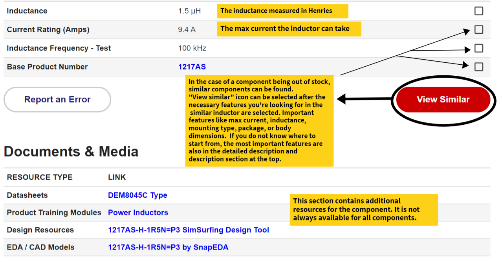
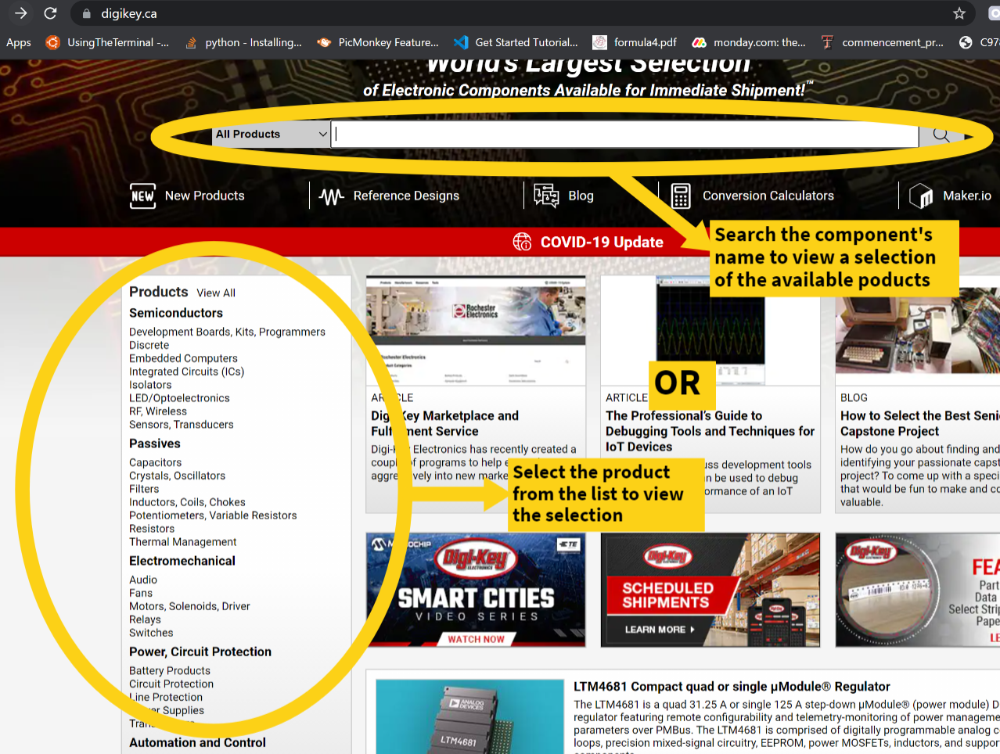
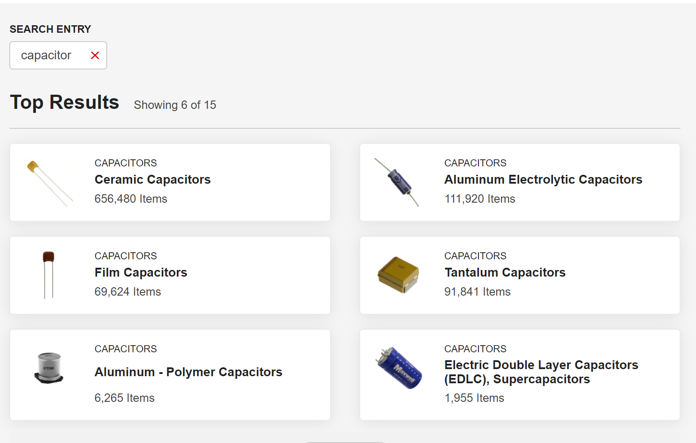
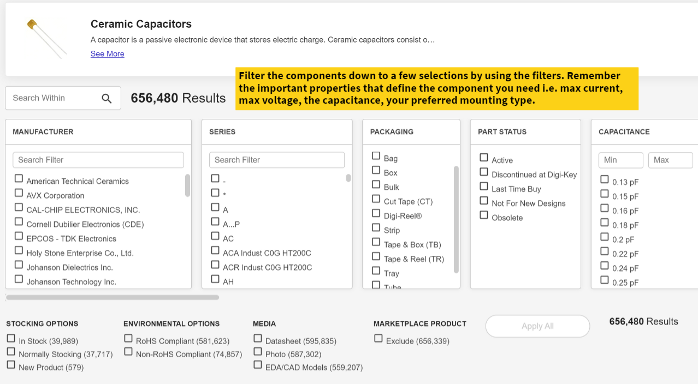
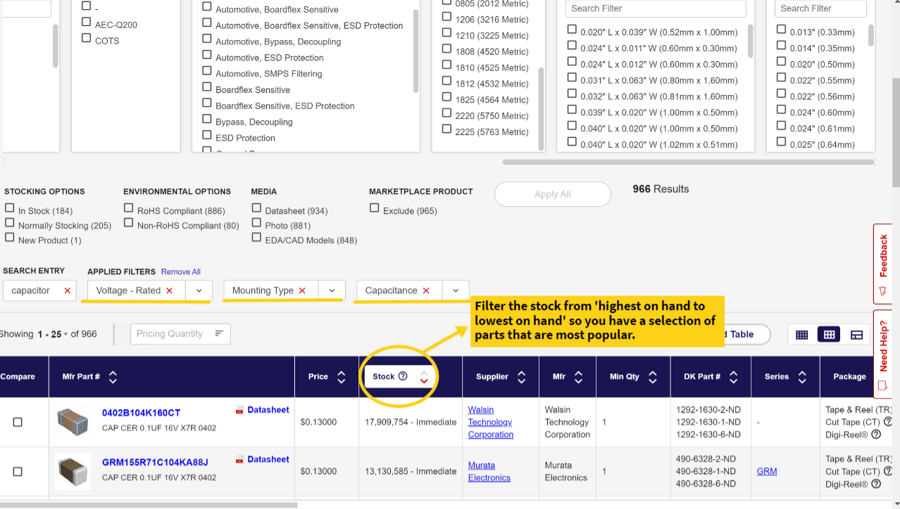

Using Digikey
=============

Digikey has the most variety of all distributors. As such, the inductor below from digikey will be used as an example: 

* The bolded part number at the top is the manufacturer's product number i.e. the component is always known by this part number on all supplier sites. While the Digikey part number is local for within the Digikey database only.
* The description and the detailed description sections highlight the most important attributes for selecting a component. It varies from component to component.

With understanding electrical components, the more you work with and read about them, the better you will understand them. An easy google search about a section you do not understand will provide you with a brief overview and a starting point to understanding the component. You can then look into the datasheet for a more technical perspective.

    

    

	
Searching Digikey’s Inventory
-----------------------------
On your first visit to the digikey site, you arrive at a homepage where you can search its inventory. As seen below, the component name can either be searched or selected.

Searching for a capacitor yields the below information. Ceramic capacitors are the most common with over 600,000 items so we select that.

It is difficult to go over 656,480 capacitors. Thus, we filter the selections using the important properties in the product description learnt in the previous section above, :ref:`Digikey`.

 
