Using Inkscape
==============

Setting Up Your File
--------------------

This part of the tutorial assumes you have a photo already in mind to use and will not be using inkscape as a way to design your cut. If you plan to use InkScape to make a design, refer to other tutorials on the web then skip to :ref:`Printer Settings`

It’s important to start by saying that Inkscape is the longest and most challenging part of laser cutting but, with some practice and experimenting it becomes a lot easier. InkScape uses image files to generate your cuts and the easier your image is for the computer to understand, the smoother your experience laser cutting will be. Most likely you already have in mind the image you want to laser cut but there are some things to keep in mind that will make your life easier:

* Have a clear background:
	* Having a solid color background or a very distinct background to foreground image will improve the quality of the laser cut

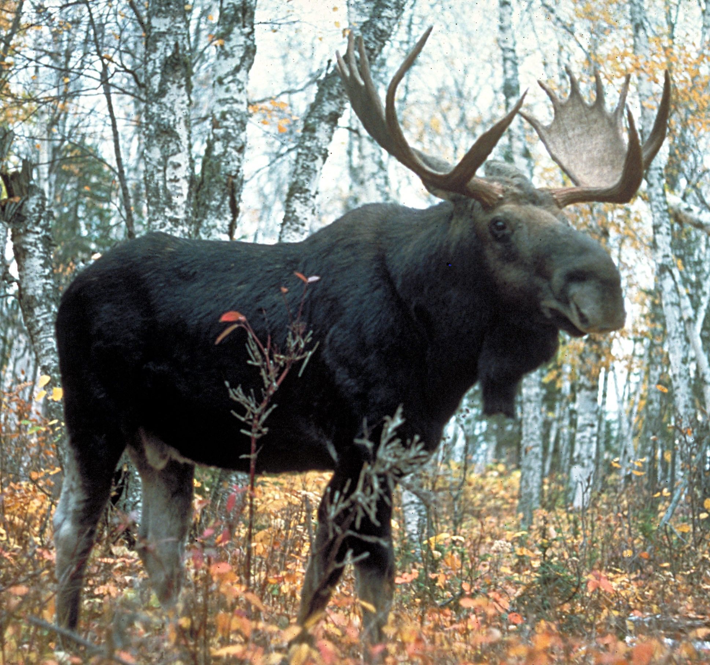
*BAD*

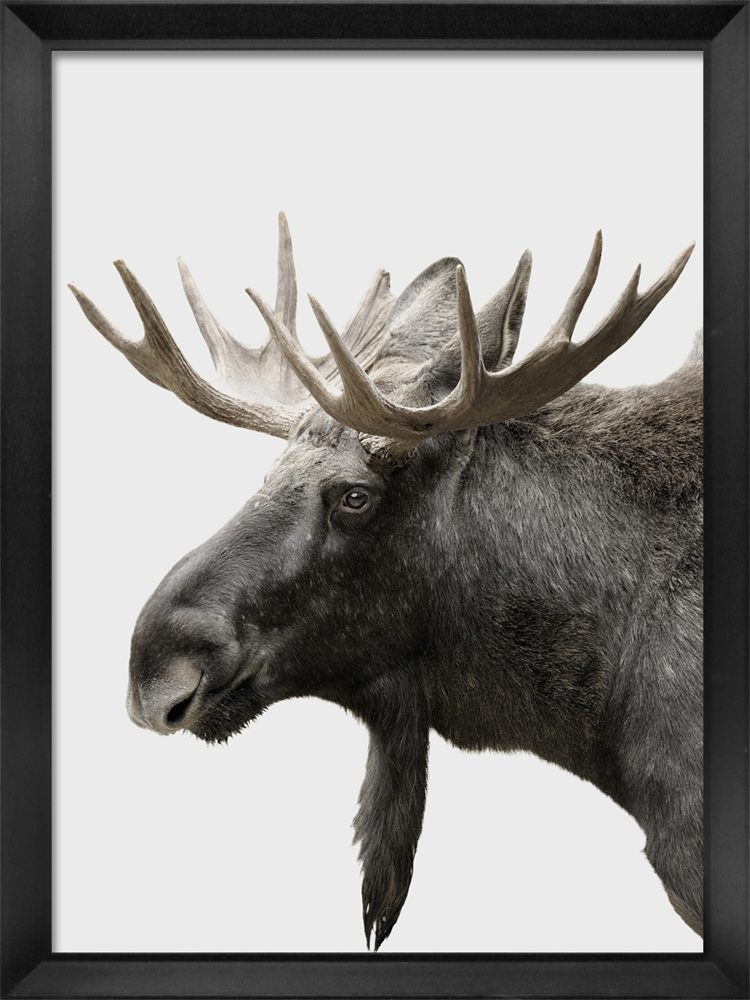
*GOOD*

* The less colors the better:
	* Laser cutters can only cut or etch at different intensities. More colors means a longer and tedious editing process.

*BAD*

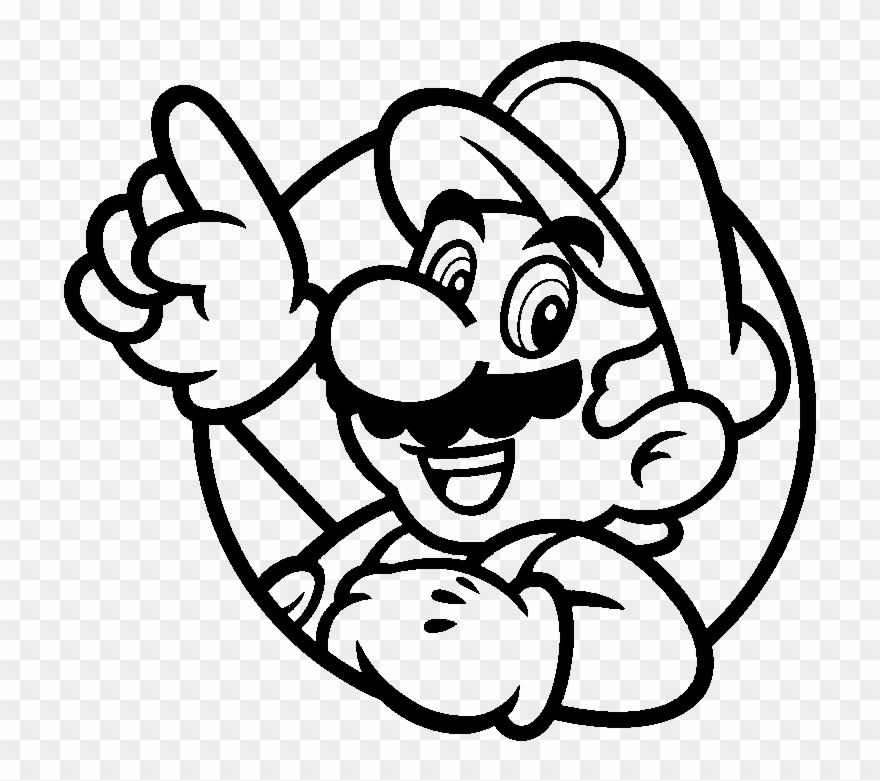

* Choose a well defined stencil if possible:
	* This tip works best for logos, names and common designs

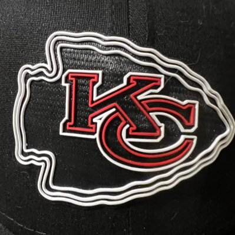
*BAD*

*GOOD*

* Ensure all your prominent features are in the foreground and at the same depth:
	* Items in the very front of your image will be laser cut the best. Be sure all important features are at the front.

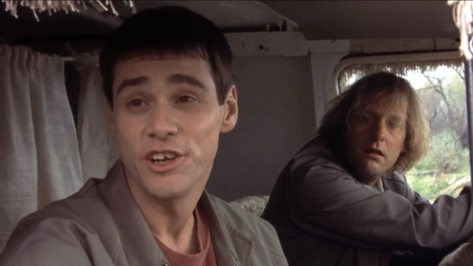
*BAD*

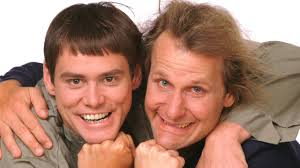
*GOOD*

* Inkscape only accepts the following file types:
	* jpg
	* jpeg
	* png
	* bmp
	* tif

If you realized the image you want to laser cut is quite difficult and cannot be changed, do not fret. All images can be laser cut to some extent but the methods you may need to take to get a quality result may be outside the scope of this tutorial. 

Once the image you want to laser cut has been decided upon, save it to a usb and go to the Trotec laser cutter located in EN1017. Unfortunately, this equipment is only available for use during regular operational hours. All required software is already installed on the computer, so you’ll only need to bring the file you would be using and the material you’ll be cutting.

Before we start, we need to turn on the laser cutter. There’s a switch on the back left of the machine, as shown below:

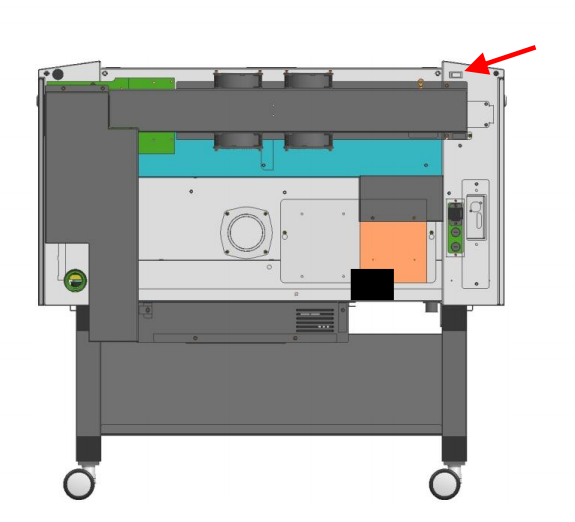

Next, login to the computer with:
username: \trotec and 
password: Passw0rd 
Open up the inkscape software in the top right corner of the monitor. 

.. figure:: ../_static/images/lasercut/ink.png

Inkscape will open a default template but you need to change the template to the size you want to cut. If you don't have specific dimensions in mind, just use a measuring tape to get the width and height of your material. The max size that will fit in the laser cutter is 74cm wide and 44cm tall.

Tip: Refer to the :ref:`Material Cut Paramters` section before choosing a template size. If the material you are working with does not have preset settings consider doing a small test print first to make sure the settings are correct. More on this in :ref:`Printer Settings`.

In order to open a template to a specific size go to file > new from template > generic canvas

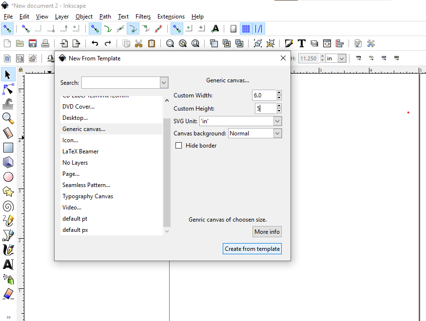

Next import the image from your usb drive onto the template. Do this by going file > import > click on your image > open. The image we will use in this tutorial is shown below.

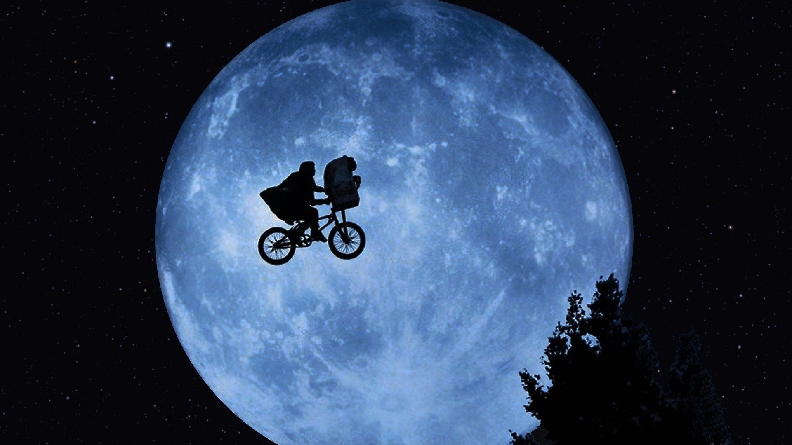

The very first thing to do is to lock the dimensions to avoid stretching the image.

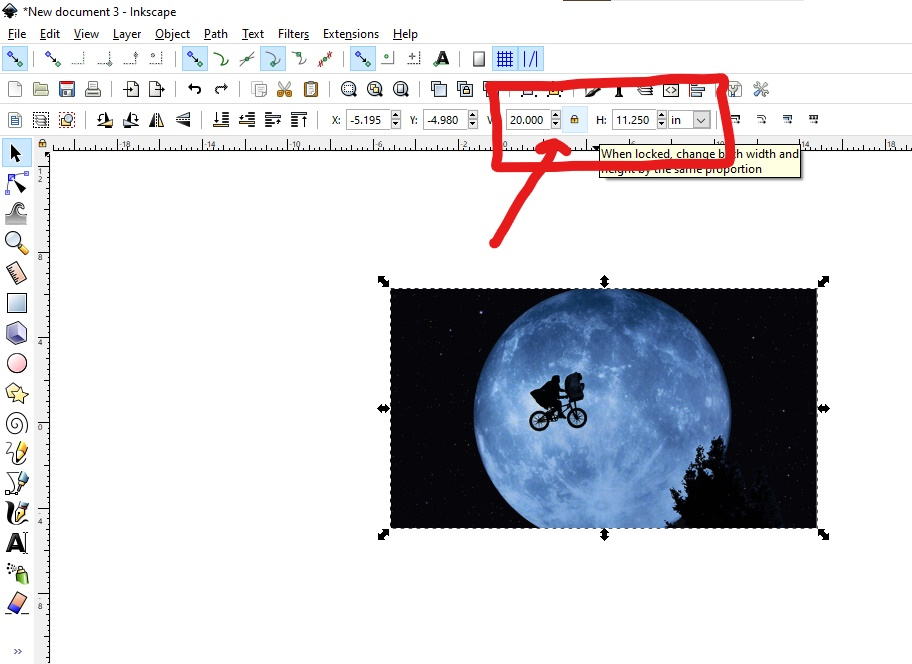

Then, you can set the dimensions of the image with the width (W) and height (H) scales located on either side of the lock button we just pressed.

Trace Bitmap
------------

Once the image is properly dimensioned, click on the image. You can tell you are clicked on an image if arrows surround its border. Next, left click and hit trace bitmap.

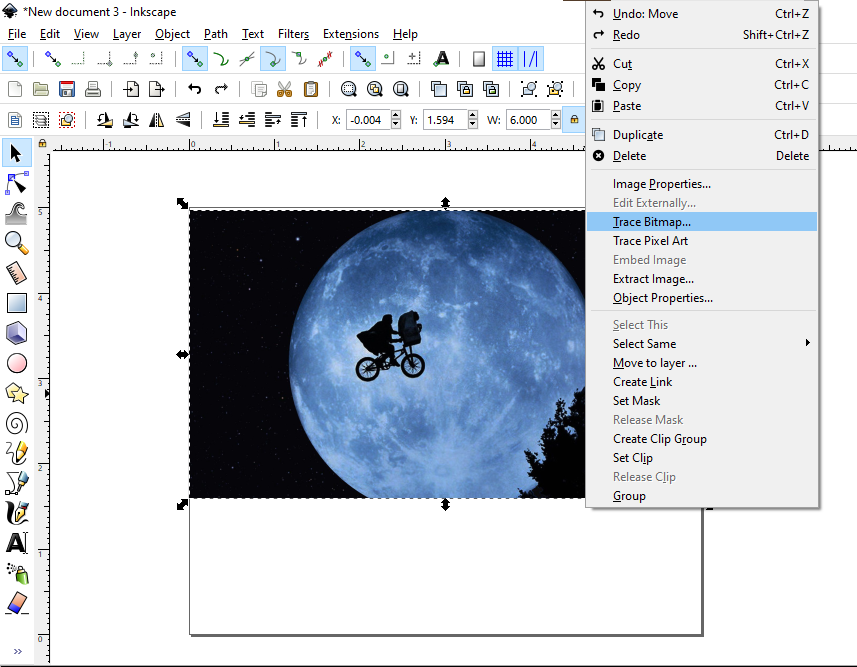

The first thing you want to click in the trace bitmap window is “Live Preview”. 

Once Live Preview is selected, a preview of a newly generated image will appear on the right of the window. 

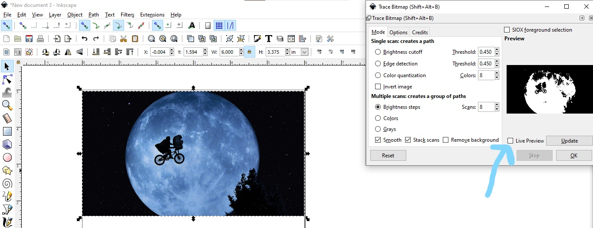

Trace bitmap is the way Inkscape can convert your image so that the laser cutter can understand what to etch and cut. It is an automated system that uses different methods to transform your image that is made of pixels to an image in something called vector form.

These different methods in which your image is converted to vector form are listed on the left-hand side of the window and are as follows:
* Brightness Cutoff 
* Edge Detection
* Color Quantization
* Brightness Steps
* Colors
* Grays

For the scope of this tutorial and the processing power of the computer we will stick to the first four methods. When using Trace Bitmap it’s important to know that there is no right or wrong setting when creating your new vectored image. It's encouraged to experiment with each setting and see how each one looks in the Preview window.

Tip: If you ever get overwhelmed with a lot of small dots on the screen in this part of the tutorial you are probably on the wrong pointer. Look to the left side of the screen and change it back as seen below:

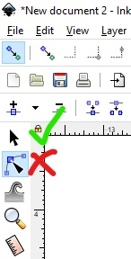

* Brightness cutoff: The most popular method. Uses the brightness of each pixel to trace the image
	* The threshold setting can be turned up or down to adjust the brightness threshold for each pixel.
	* Threshold 0.45

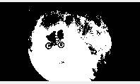

	* Threshold 0.15

* Edge Detection: Detects the edges of the image to trace
	* Rarely used but is the perfect match for some designs

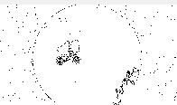

* Color Quantization: Traces along the borders of different colors
	* 2 colors:

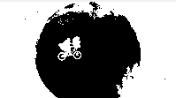

	* 4 colors:

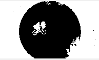

* Brightness steps: Similar to brightness cutoff but makes a number of scans all at once. In order to sort through which scan is of best quality you must confirm the trace bitmap by pressing ok. Then, click and drag the new image that is directly stacked on top of the original pixel image into a new space.

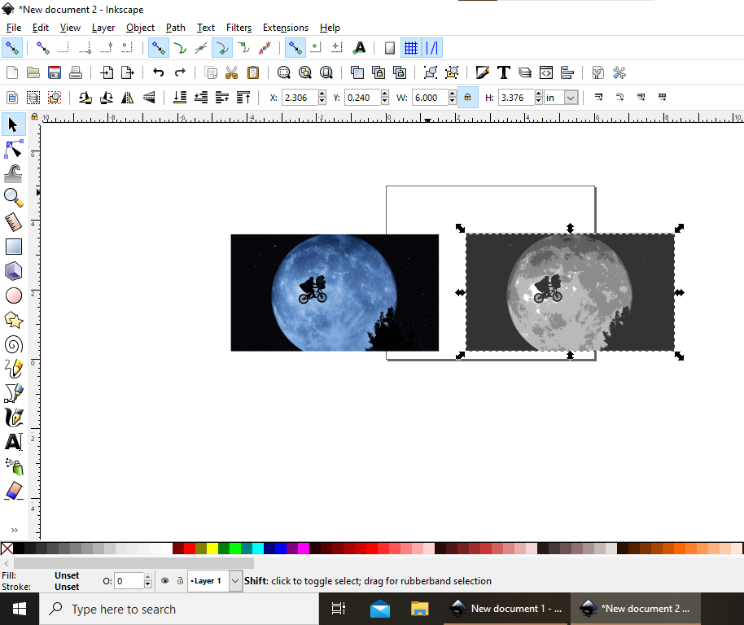

	* Next, click and drag all layers of the image away from the stacked scans to see how each turned out.

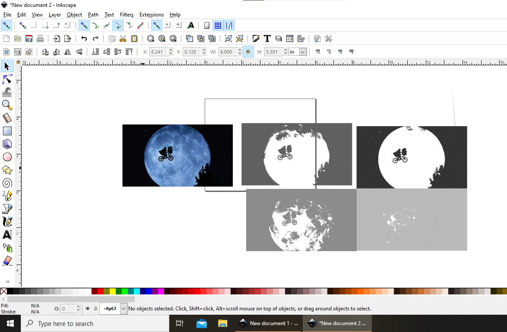

For the example above I went with a brightness cutoff with a threshold of 0.150 as it best captured the details important in the image. Once the vectored image has been selected the last thing to keep in mind before confirming the trace is the “invert colors” option. Your remaining design will be two colors, most likely black (or some other color) and white. Depending on what parts of the design you want etched, you might find that inverting the colors will give your design a better “pop”.

**Remember: anything in black will be etched!**

Finally, click ok to trace the bitmap, arrange it properly on the template and delete the original pixel design.

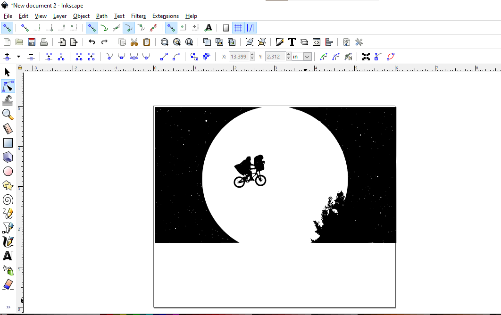

The last thing to do in Inkscape is to adjust the color of your image. In laser cutter knowledge, anything that is:

.. raw:: html

    Red = Cut 

.. raw:: html

    Black = Etch

All color changing can be done by clicking the vectored image, then left clicking and selecting fill and stroke.

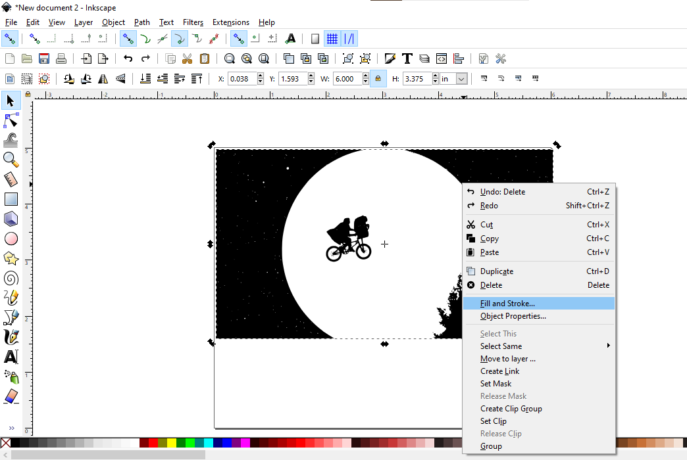

In this setting you can experiment with the colors to ensure your fill is black and to define where you will cut the piece.**It's important to note that adjusting the opacity of the black fill will adjust the etching intensity.** 

If you wish to cut directly along the edges of the design, click Stroke Paint > Flat color and change the color to red. If the edge of the stroke takes up the entire page or, you can't see it at all, don’t panic. You can adjust the stroke width by clicking “Stroke Style” and using the Width scale

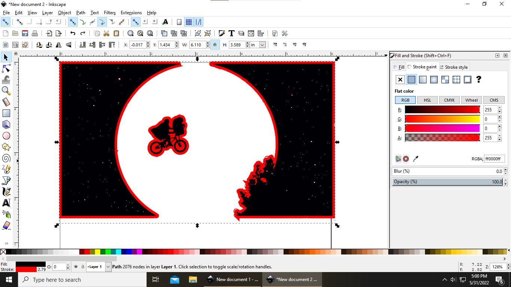

Note: The stroke width does not influence the width of the actual cut as the trotec will cut directly in the middle of the stroke.

If you wanted to simply cut around the perimeter of your design, as we will do with this example, click the square, circle or draw tool on the left vertical column of the screen. What tool you choose will depend on the shape of your perimeter. Next, draw your shape where you plan to cut the edges.

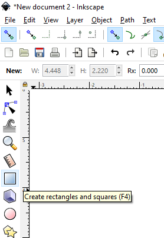

Then, left click on your newly created shape and hit fill and stroke. Make sure that the fill is set as “no fill” and that the stroke color is red to represent cut.

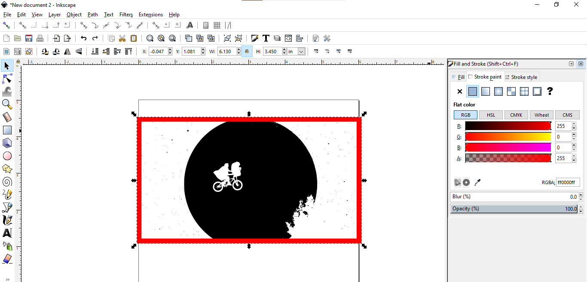

Now you are done with InkScape!

Tip: If you ever have overlapping etchs or colors, adjusting the opacity may be the solution

High Precision Processing
-------------------------

What if I want to cut a dimensionally accurate shape?

Let’s do something simple. We’re going to cut a rectangular border for a 5x7” picture frame to fit a 4x6” photo. Start by setting up your workpiece like you would have in the :ref:`first part of the tutorial <Setting Up Your File>`. Rather than import an image, you can now select the drawing tools on the left side of the screen.

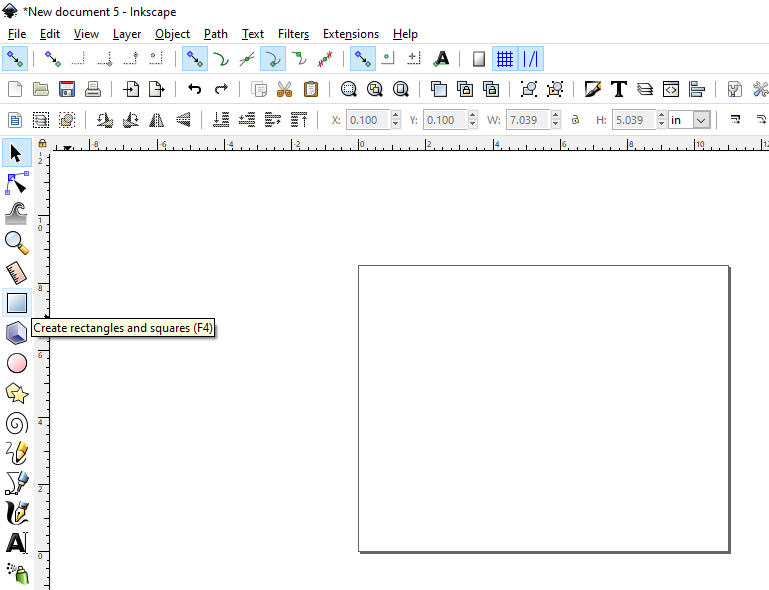

Select the rectangle tool. Draw a rectangle. Select the pointer tool again and click the image. This will open the dimensions bar at the top of your screen. Set the dimensions to inches, the width to 5”, and the height to 7”.

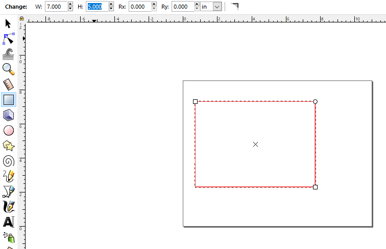

You now have a 5x7” rectangle! You’re halfway there! To keep things easy to see, click the rectangle and open the fill and stroke manager as you did in the :ref:`first section <Etch and Cut>`. Set the fill of the rectangle to white and the outside edge to red. Now your rectangle should look like the image above.

**NOTE:** Do not forget to lock the proportions of the rectangles!

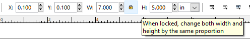

Next, we need to cut the center of the rectangle to fit a 4x6” picture. To make sure the photo is easy to mount to the board later, we’ll make the rectangle 3.8” x 5.8”. Draw another rectangle and set the dimensions using the dimension bar.

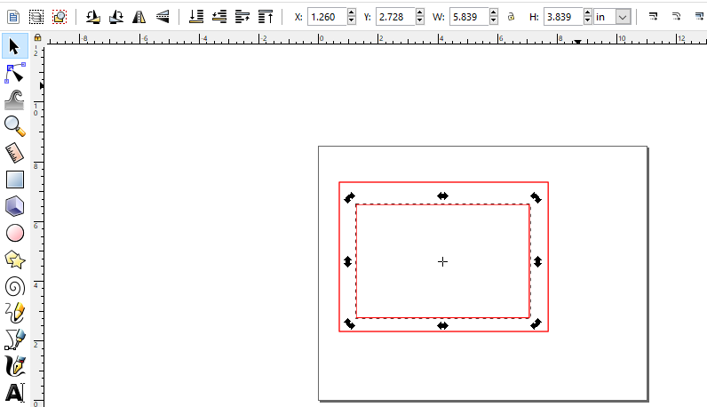

Now, we complete the familiar operation of changing the fill and perimeter colors of the interior rectangle. Change the fill to white and the border to red.

Next, we need to align the rectangles so that the 5.8x3.8 rectangle is in the middle of the 5x7 rectangle. Start by selecting the larger rectangle and adjusting its position. This can be done with the X & Y boxes at the top of the screen. Set X to 0.1 and Y to 0.1. This aligns the rectangle to the position 0.1 x 0.1 in the bottom corner of the sheet.

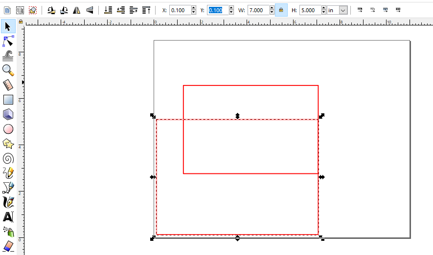

Next, we need to align the middle rectangle so that it is spaced equally from the top and sidewalls of the larger rectangle. The larger rectangle is 7 inches wide, and the smaller rectangle is 5.8 inches wide.

delta = 7 - 5.8 = 1.2 inches

Half the delta on either side of the smaller rectangle would center it horizontally. So, the smaller rectangle needs to be 0.6 inches from the sidewalls of the larger rectangle on either side.

Remember: The larger rectangle is coordinate position 0.1 x 0.1. To center the rectangle, add the current X coordinate to delta/2.

X = 0.1 + delta/2 = 0.7

The X Coordinate for the small rectangle is 0.7 Inch.

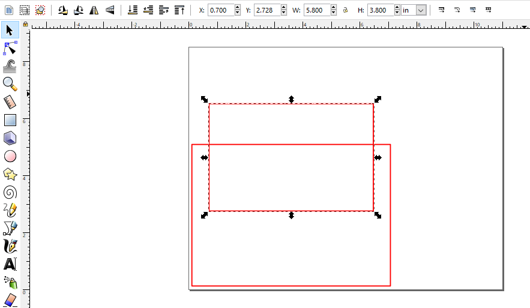

Now repeat this process for the Y position of the center rectangle.

The position should be: Y = 0.7

Before you cut, don’t forget to Group the two images! Select both images together, then right-click on them and click Group.

Now we’re ready to cut!

