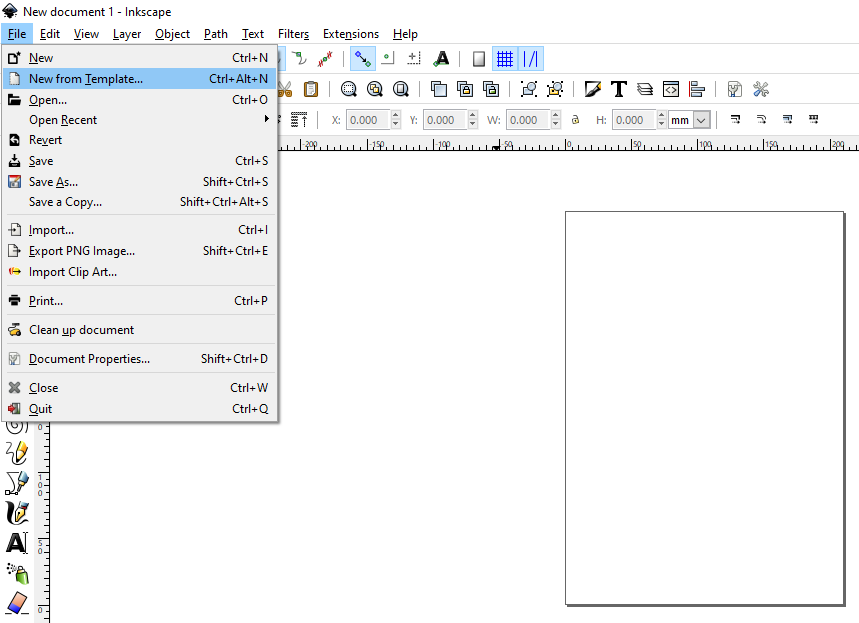
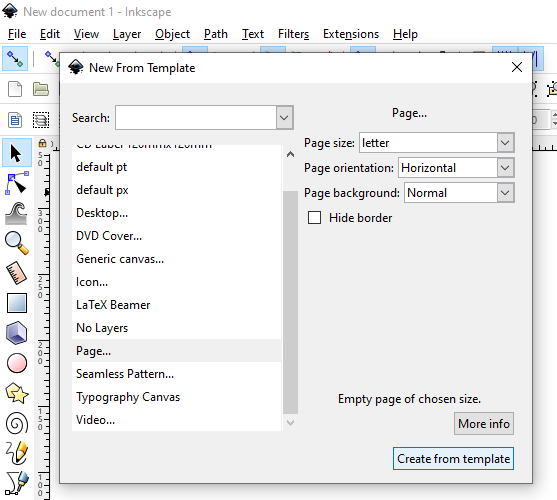

Using Inkscape
==============

Setting Up Your File
--------------------

It’s important to start by saying that Inkscape uses image files to generate your cuts. If you have a very specific and dimensionally accurate image, you’ll need to provide it in a format that Inkscape can interpret. Inkscape requires a non-rastered format to make changes by default, so it’s best to convert your image into an SVG file. Inkscape is NOT able to interpret PNGs and JPEGs natively.

Log in to the computer and boot up Inkscape. Inkscape will default a template size, however, you can define how big your workpiece is by going to File → New from Template.

In this menu, there are several options to default the workpiece size. For simplicity, select Letter (i.e. 8.5” x 11”. You can also orient it horizontally or vertically).

Next, you can import your image or create a new one using the options located on the left of the screen. If you need to cut a simple geometry, you can make it in Inkscape, however, it’s much more likely you have something specific you want to cut. For this tutorial, we’re going to use the MUN logo. When you import the file, your screen should look like this. You can import an image by going to File → Import → then select the file from your computer or thumb drive.

We need to define the size of this image. Right now, all we know is that it’s sitting on an 8.5”x11” surface. If you look at the perimeter of the image, you’ll notice that there’s a scale. You can use this scale to gauge relative position on the page and size.

Another way you can determine the size of your image is by clicking on it. This opens the sizing menu near the top of your screen. Start by clicking the lock to “lock” the proportions of your image.

You can now set the image boundary. By locking the proportion, you won’t stretch your image. Set the size of the bounding box of your image to match the size that you would like to cut. The images below show two examples on the 8.5” x 11” template.

.. |big| figure:: ../_static/images/inkscape_logo_big.png
    :align: center

.. |small| figure:: ../_static/images/inkscape_logo_small.png
    :align: center

|big||small|

Now that you have your image imported in Inkscape, we need to transform the image such that it is detectable by the laser. The laser is set up to interpret only two colors, and it can only interpret RGB color pallets.

.. raw:: html

    Red = Cut 

.. raw:: html

    Black = Etch

Keep these colors in mind!

Processing Your Image
---------------------

Before we start tweaking colors, we need to break the file into process-able parts so that we can define which parts to etch and which ones to cut. Right-click the image and select “ungroup.” You’ll see that Inscape has identified different parts of your image and broken them into separate selectable items. In this example, the first ungrouping separated the word “University” and the flag. Pressing ungroup again separated “Memorial” from the flag. This operation can also be done with hotkey Control+U, just click the image you’d like to ungroup.

.. |group| figure:: ../_static/images/inkscape_logo_group.png
    :align: center

.. |ungroup| figure:: ../_static/images/inkscape_logo_ungroup.png
    :align: center

|group| **→** |ungroup|

Repeat this process until the image has no more groups that can be separated.

Now, each group can be selected and manipulated separately, which allows you to select each group individually to edit the color. This can be done in the fill and stroke menu by adjusting the sliders.

To access the cut and stroke menu, click your image group, then click the bottom of the screen where the stroke is listed “None.” Alternatively, you can press Shift+Control+F.

.. _Etch and Cut:

There are three menus available here: Fill, Stroke paint, and Stroke style.

If you’d like to etch anything within the image, you’ll need to adjust the RGB color to black. (i.e. R=0, G=0, B=0), then adjust the opacity to control etching intensity (for now, let’s do 100%). In the image below, the Y has a black infill, which will cause it to be etched by the laser.

Next, to cut the outline of the part, go to Stroke paint. Change the Color to Red (i.e. R=255, G=0, B=0). Then adjust the opacity to 100%. In the example below, the Y has a red border, which would cause it to be cut out by the laser.

Move to the Stroke style menu. The Trotec program will pick up any red line, no matter how thin, so as long as the line has a width above 0.0, the program will locate the cut. A good default is a width of 0.01. In the screenshot below, you can see the difference between a width of 0.01 on the T and a 0.005 on the Y.

Now, you can start altering your image for the laser cutter. An example of how you might like to do the Memorial logo is as follows:

This would etch the flag and the word “University” while doing nothing to the word “Memorial.” The Red box would be cut around the image so it can be removed from the stock.

But why is the flag Gray?

Trotec’s job control has a tough time distinguishing colors when they are on top of a black background. Cutting this logo while setting the flag to be completely black would result in the area around the word “Memorial,” which is white, to not be etched, as shown below (screenshot is a print preview from Trotec Job Control):

To work around this, we can adjust the opacity of the black flag (here, we did 50%). This allows for the cut to preview correctly.

Now, your image is ready to go to the printer!

Before we cut out the MUN Logo, there are a few other things to consider:

  - What if I want to cut an image with multiple colors, like a picture?
  - What if I have a simple shape I need to cut?

If you’re ready to cut, skip ahead to :ref:`Printer Settings`.

**What if I have a photo, or image with various shades?**

Let’s try it!

Import test image “dr_evil_laser.jpeg” (or any image you want). When we introduced Inkscape, we made a note that it’s unable to handle non-rastered formats. Through this tutorial, we will be processing the image to work around that issue. Your imported image will look like this:

We’re going to use the trace function to create a vectored version of this image. Click on the image and select Path → Trace Bitmap.

There are several options we can use here. The two we’ll focus on are:
  - Brightness Cut Off: this option transforms the image to make any intensity under a threshold turn white and any over the threshold turn black.
  - Multiple Scans: breaks the image into vectors based on color. If you use this option, set layers to 20.

To get the best result, we’ll use Multiple Scans. Brightness Cut Off is a perfectly viable option. You can use this if you would rather.

Now, your image is vectored. The next step (if you used Multiple Scans) is to ungroup the image parts. Select the image, then click Ungroup from the Object menu. You may have to ungroup the image a few times, so you can use the hotkey Control+U.

This will generate 20 layers based on the image, each corresponding to a different color. You can separate each layer and find the one that is the best representation of your image. Delete all the other layers.

Select the layer you want you keep, then click Path → Simplify.

Now, you can follow the process listed :ref:`above <Etch and Cut>` to adjust the etch and cut parameters for your image.

**What if I want to cut a dimensionally accurate simple shape?**

Let’s do something simple. We’re going to cut a rectangular border for a 5x7” picture frame to fit a 4x6” photo. Start by setting up your workpiece like you would have in the :ref:`first part of the tutorial <Setting Up Your File>`. Rather than import an image, you can now select the drawing tools on the left side of the screen.

Select the rectangle tool. Draw a rectangle. Select the pointer tool again and click the image. This will open the dimensions bar at the top of your screen. Set the dimensions to inches, the width to 5”, and the height to 7”.

.. figure:: ../_static/images/inkscape_rectangle_big.png
  :align: center

You now have a 5x7” rectangle! You’re halfway there! To keep things easy to see, click the rectangle and open the fill and stroke manager as you did in the :ref:`first section <Etch and Cut>`. Set the fill of the rectangle to white and the outside edge to red. Now your rectangle should look like the image above.

**NOTE:** Do not forget to lock the proportions of the rectangles!

Next, we need to cut the center of the rectangle to fit a 4x6” picture. To make sure the photo is easy to mount to the board later, we’ll make the rectangle 3.8” x 5.8”. Draw another rectangle and set the dimensions using the dimension bar.

.. figure:: ../_static/images/inkscape_rectangle_small.png
  :align: center

Now, we complete the familiar operation of changing the fill and perimeter colors of the interior rectangle. Change the fill to white and the border to red.

Next, we need to align the rectangles so that the 5.8x3.8 rectangle is in the middle of the 5x7 rectangle. Start by selecting the larger rectangle and adjusting its position. This can be done with the X & Y boxes at the top of the screen. Set X to 0.1 and Y to 0.1. This aligns the rectangle to the position 0.1 x 0.1 in the bottom corner of the sheet.

.. figure:: ../_static/images/inkscape_rectangle_big_align.png
  :align: center

Next, we need to align the middle rectangle so that it is spaced equally from the top and sidewalls of the larger rectangle. The larger rectangle is 7 inches wide, and the smaller rectangle is 5.8 inches wide.

delta = 7 - 5.8 = 1.2 inches

Half the delta on either side of the smaller rectangle would center it horizontally. So, the smaller rectangle needs to be 0.6 inches from the sidewalls of the larger rectangle on either side.

Remember: The larger rectangle is coordinate position 0.1 x 0.1. To center the rectangle, add the current X coordinate to delta/2.

X = 0.1 + delta/2 = 0.7

The X Coordinate for the small rectangle is 0.7 Inch.

Now repeat this process for the Y position of the center rectangle.

The position should be: Y = 0.7

Before you cut, don’t forget to Group the two images! Select both images together, then right-click on them and click Group.

Now we’re ready to cut!
