Profilometer / 3D Scanning
=================================

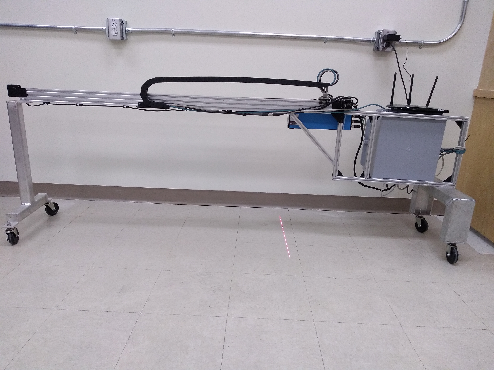

The Student Design Hub lab has a device called a "profilometer". It develops a 3D image by running a laser across an object and recording the height of the laser beam at each increment. The profilometer uses a Trispector 1060 sensor to record data and an Arduino Uno to control the motor on the apparatus. These are both connected to a router, allowing any computer that is connected to that router to communicate with the sensor and the Arduino wirelessly. A program was created to make it easier for a computer to control the motor on the apparatus without having to be plugged into the Arduino. The steps for downloading and using this program are detailed below. The software required to communicate with the sensor is called SOPAS Engineering Tool, which can be installed from `here. <https://www.sick.com/ca/en/sopas-engineering-tool/p/p367244>`_

Installing and Configuring SOPAS
--------------------------------
After clicking the "Download" button in the SOPAS website, you will receive a zipped file. Extracting it will reveal the installer application. Run this application and work through the setup wizard to install the application. Once it is finished, run SOPAS. A message will pop up saying, "There are no SDD files installed. Do you want to install SDD files?" Click "Yes". 

When asked where to install from, select "From SICK driver repository" and go to the next section by clicking the right arrow.

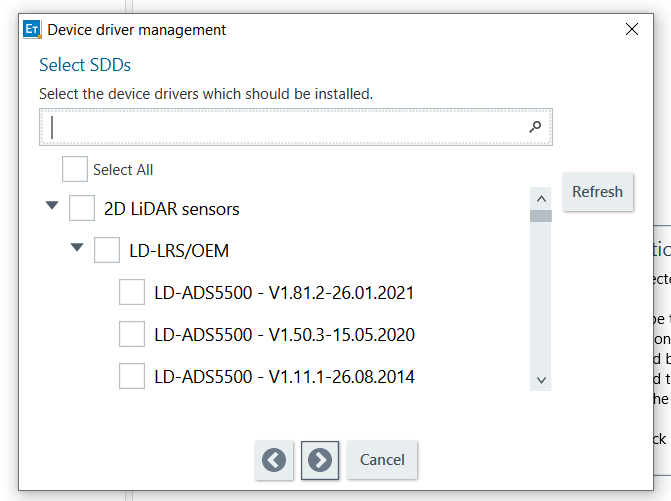

When this prompt appears (shown above), input "1060" into the search bar and click the "Select All" checkbox. Your the pop up should look like this before you go to the next page:

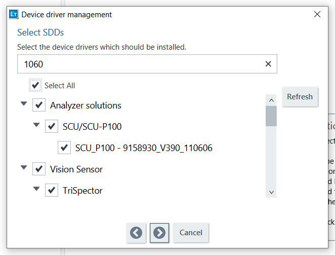
   
Click the arrow again and wait for the installations to complete. Once they are done, go to the next page and click "Finish". The software is now ready to use with the profilometer.

Installing the Program for Controlling the Motor
------------------------------------------------
The ZIP file containing the program executable for controlling the profilometer can be downloaded from this link: 

:download:`Download ZIP File <Profilometer Controller.zip>`

After downloading and extracting the ZIP file, open the folders until you see this:

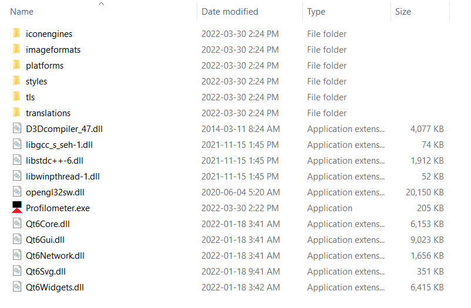
   
This file contains an executable file called "Profilometer.exe". This is the program. **Do not move the executable outside of this folder**. If you wish to make this file quickly accessible, you will have to create a shortcut for it.

**Note:** This program was made for Windows computers, so some (or all) the features may not work on other operating systems.

Adjusting the Scan Settings in SOPAS
------------------------------------
The Live 3D window gives a live view of your profile. The green area shows the entire area that is visible to the sensor, while the blue area is the area you have selected to scan. The blue area must reside within the green area, otherwise the scan will not work properly. **It is important to make sure that this blue area is as small as possible to keep the rendering time down.**

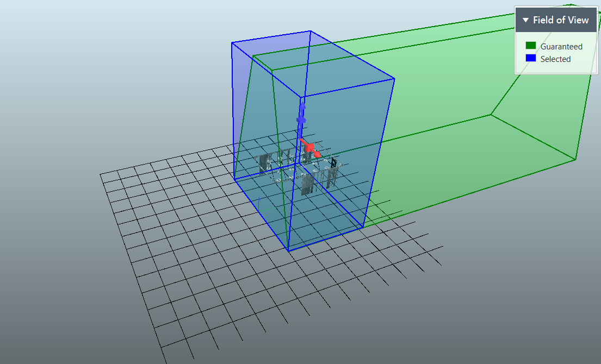
   
To change the size and position of the blue region, left click on it and click-and-drag on the white boxes that appear on each of the blue region's sides. Each side is divided into nine regions:

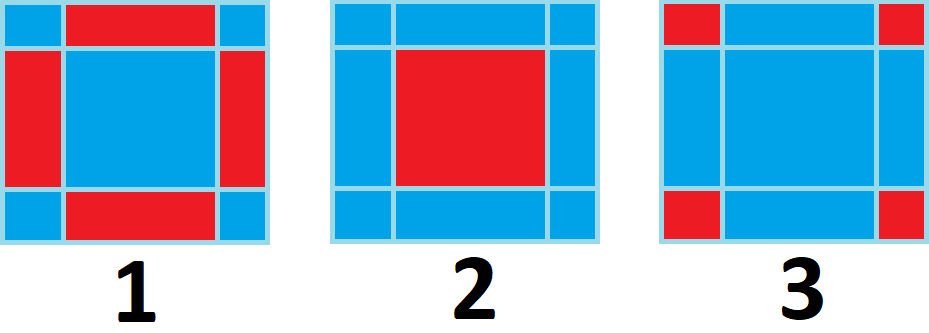

Clicking and dragging any of the rectangles highlighted in diagram 1 will scale the blue region in that direction. For example, clicking and dragging the top rectangle will scale the blue region vertically. Dragging the rectangle highlighted in diagram 2 will move the blue region along the plane defined by that side. Dragging the corners (as highlighted in diagram 3) will scale the blue region in both directions at once.

The size that you should adjust the blue region will depend on the size of your model. It is important to make sure that the sensor will be able to see your entire model at all times. To ensure that this is the case, move the model under the laser, as shown below. If the model's width varies, move the laser to be at the widest part.

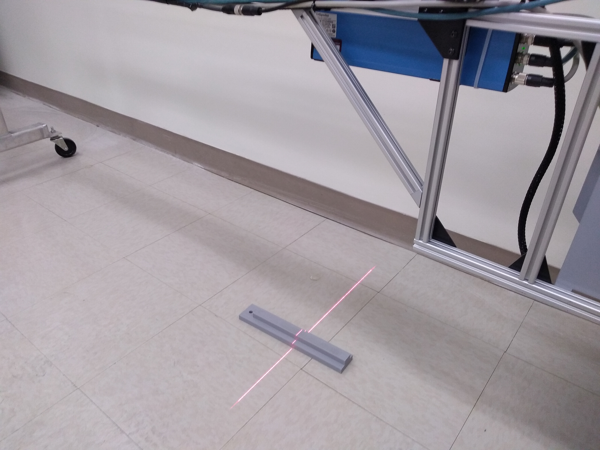

In SOPAS, click on the button labelled "Sensor" next to the "Live 3D" and "Force Trigger" buttons. The view will change to show you what the sensor sees.

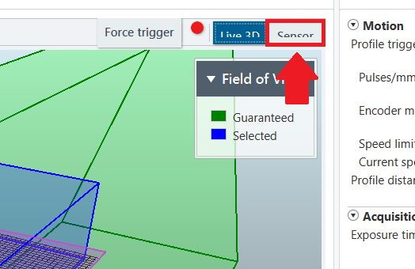
   
Somewhere in that view, you should see the basic shape of your object. You will also see lines next to the object from the floor. Ideally, you want the lines from the object to be the brightest, while everything else is completely black. 

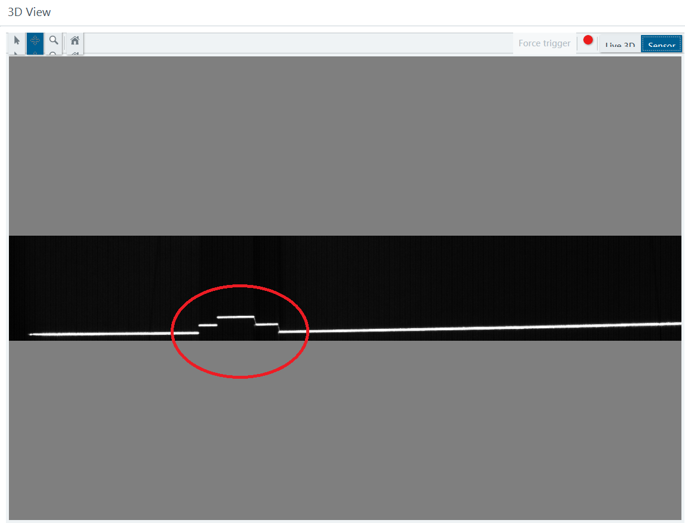
   
Changing the blue region's position and dimensions will change the sensor's field of view. Sometimes reflections from the floor interfere with the sensor, resulting in inaccurate profiles (see below). To fix this, try decreasing the Exposure Time and the Gain settings. If this still does not work, place a black mat underneath your object. This decreases the amount of light that the sensor picks up from the ground.

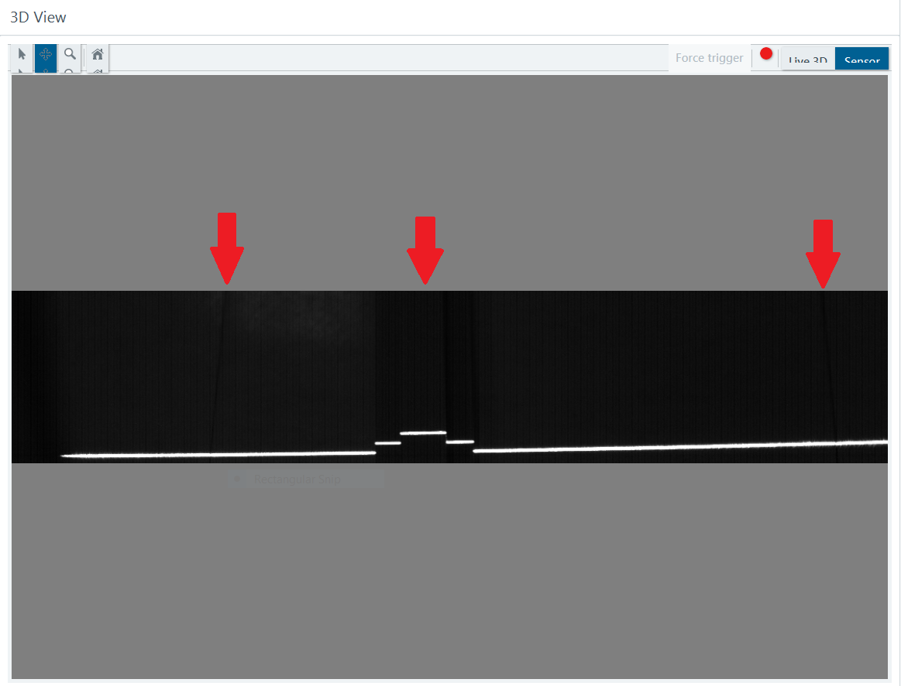
   
In the photo above, the red arrows are pointing to positions where the floor tile lines and the object are visible. Trying to scan with these settings would result in a poor profile. Besides the white lines from the laser, everything should be completely black.

The "Laser threshold" setting controls how intense the reflected light has to be for it to show up in the profile. If it is too low, all reflected light will show up in the profile. If it is too high, there will be no profile. Adjust the settings after each scan to find the best value.

Getting a Profile
-----------------
The first step to producing a scan is to place an object under the scanner. To ensure the most detailed scan possible, place the item such that there is minimal overhang. The sensor can only see features of the object from above, so overhangs will not be included in the profile.

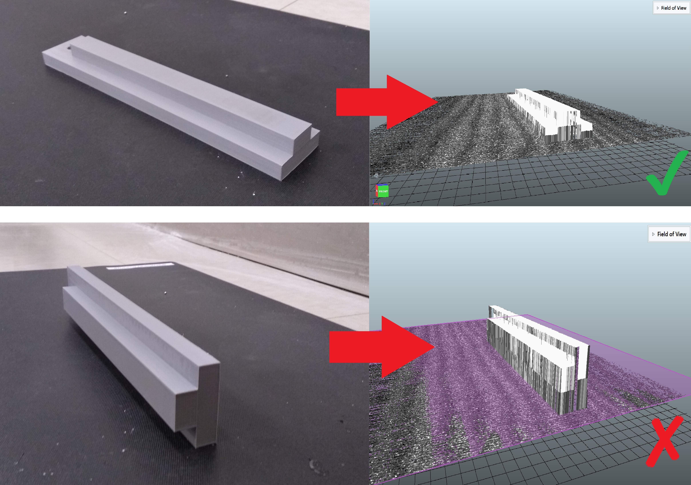
   
It is recommended that you place the object ~1 ft ahead of the laser line so that you have time to trigger the sensor. You will be able to perform a scan as soon as you have SOPAS configured and the profilometer controller program downloaded onto your computer.

First, make sure that the profilometer and the router on top of it are plugged into an outlet. Connect your computer to the router's Wi-Fi. You may have to press the button on the back of the router to connect. Once connected, you should be able to control the motor on the apparatus using the Profilometer Controller app. Try pressing the left and right arrow buttons (highlighted in the image below). **Note: Do not spin the motor the wrong way while the profilometer is at the end of the rail, as this may damage the motor or the contact sensors.**

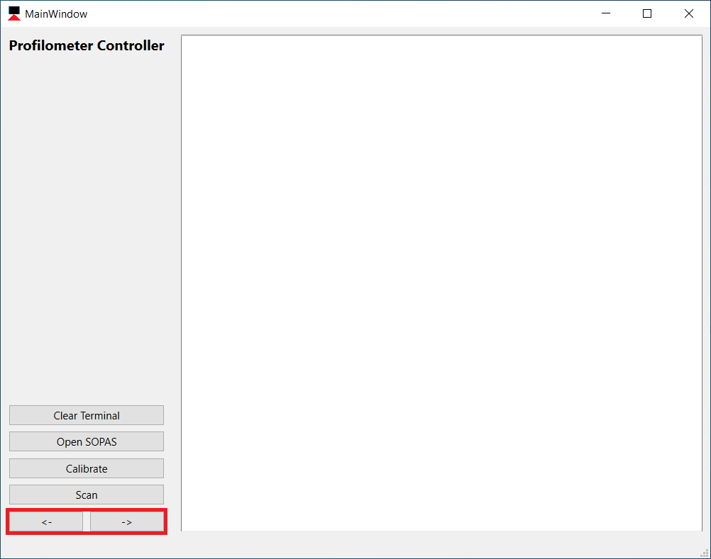
   
Now, either press the "Open SOPAS" button in the profilometer controller app or open SOPAS directly from where it is located on your computer. Once it is open, you should see the sensor pop up in the left area of the screen. If the sensor is already online, double click it and wait for a new window to appear. If it says it is offline, press the button that says "Offline" to switch it online again. When the following pop-up appears (below), select "Read parameters". Then just double click on the sensor in the left side of the screen and wait for a new window to pop-up:

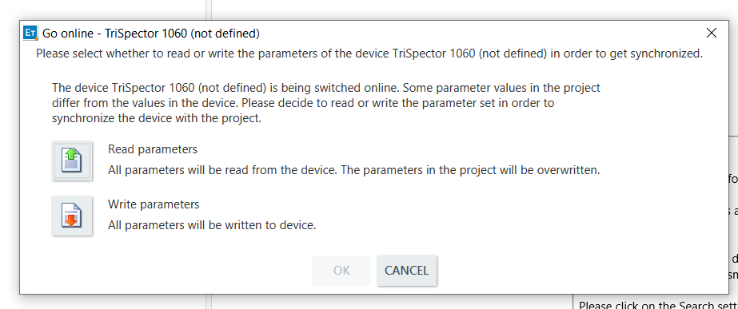
   
The sensor has settings burned into its memory which should produce a decent image. The settings under "Motion" should not be touched, as they are configured specifically for the incremental encoder used by the profilometer apparatus. However, the settings for every section below that can be changed to make the profile as detailed and accurate as possible. In case the settings have been permanently changed since the time this was written, an image has been provided showing all the default settings. More details on adjusting the settings in SOPAS are described :ref:`in the previous section. <Adjusting the Scan Settings in SOPAS>`

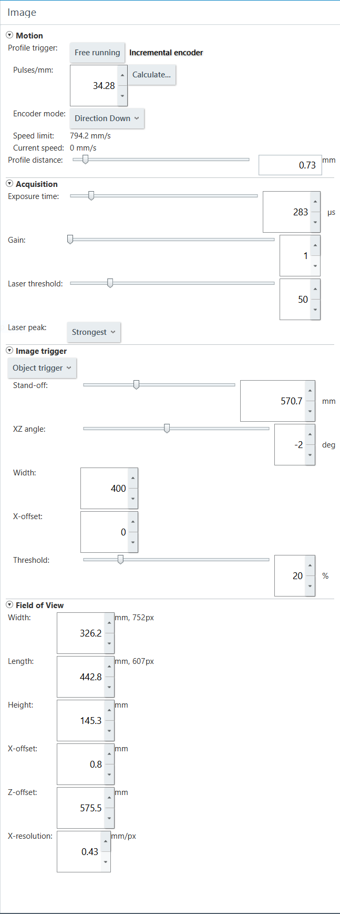

To get a scan, make sure the sensor is in the "home" position by pressing the "calibrate" button in the profilometer controller app. When you are ready to start the scan, press the "scan" button and wait for the laser to get within an inch or so of the object you are trying to scan. When it gets to this point, click the "Force Trigger" button in SOPAS (highlighted in the image below). After a few moments, you should see the object appear in the "Live 3D" view in SOPAS. If you do not, you may have to :ref:`adjust some of the scan settings<Adjusting the Scan Settings in SOPAS>`.

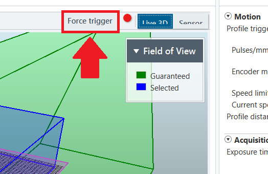

Analyzing a Profile
-------------------
After you have obtained a successful scan, you may want to measure parts of the profile. You can do this using SOPAS. As an example, we will find the height of this box:

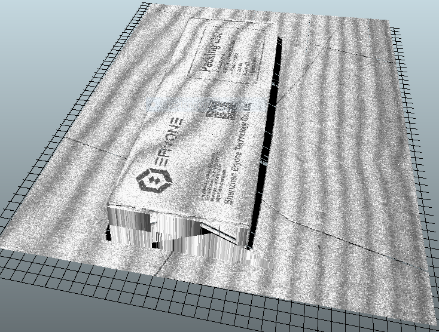

First click the TASK button at the top of the screen:

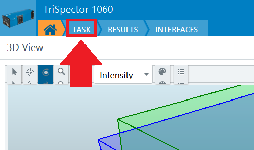
   
From there, click "Save Job Image":

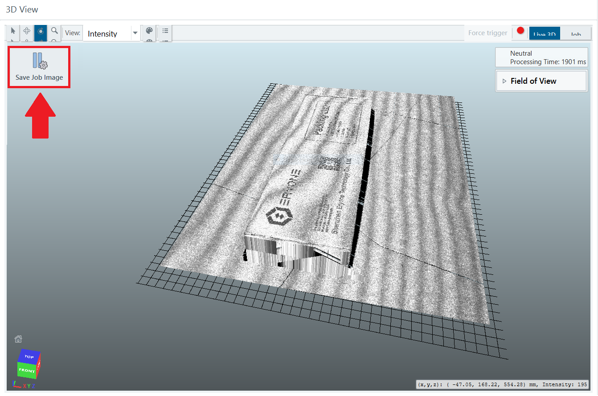
   
You will now have access to all the tools needed to take measurements of this profile. We need to use the "find" section to establish characteristics of our profile before we can measure anything. In this case, we want to find the normal distance between two planes: the ground plane and the top surface of the box's lid.

We must first add Find > Plane to find the ground plane. This will add a yellow box to the view, which you can resize the same way you would resize the blue box while preparing to scan. The plane that you want SOPAS to find must be inside this box. The purpose of resizing it is to make sure other planes that may exist in the profile are not detected instead. Once SOPAS has found the ground plane, you will see a blue grid appear that is coplanar with the ground plane, as shown below. In this case, resizing the yellow box was not necessary:

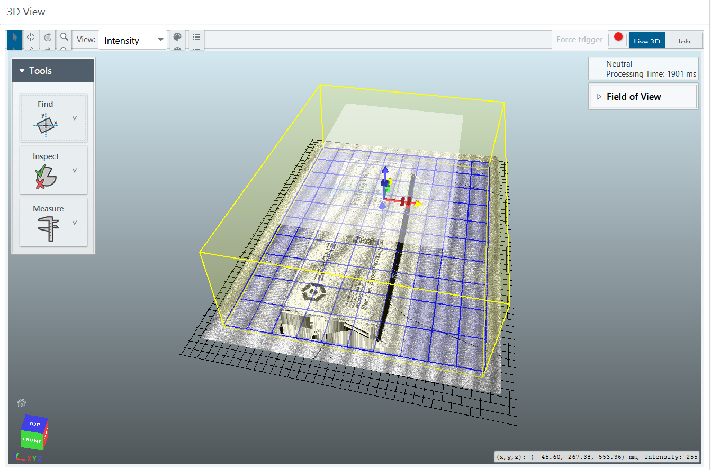

Now we will add another plane for the lid of the box. The yellow box for this plane had to be resized so that it only enclosed the box lid plane, and not the ground plane again:

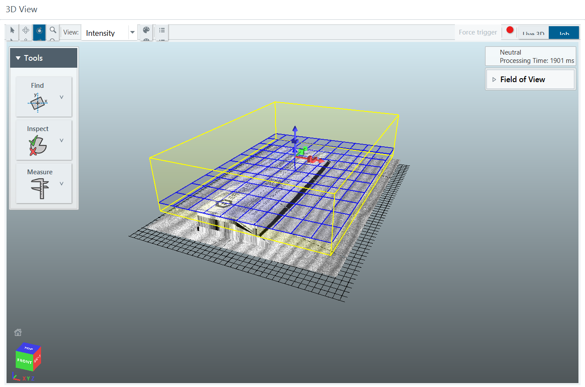

Lastly, select Measure > Distance and set Feature A to the ground plane (Plane 0) and Feature B to the lid plane (Plane 1) as shown below.

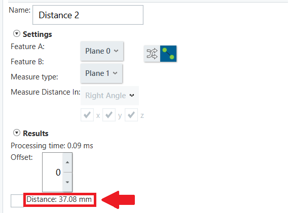
   
The result is also displayed in this image at the bottom, highlighted in red. The distance between these two planes is 37.08 mm.

Converting Profiles to STL
--------------------------
In this section, we are going to use height mapping to convert our profile to a 3D model. We are going to use two scans, with the second scan being from the object facing the opposite direction. This will give us a way to fill in extra details when we edit our height-map images later. This process will also be much easier if you make sure that the straight edges of the object are parallel to the laser line while scanning. The object we are going to use for this example is shown below:

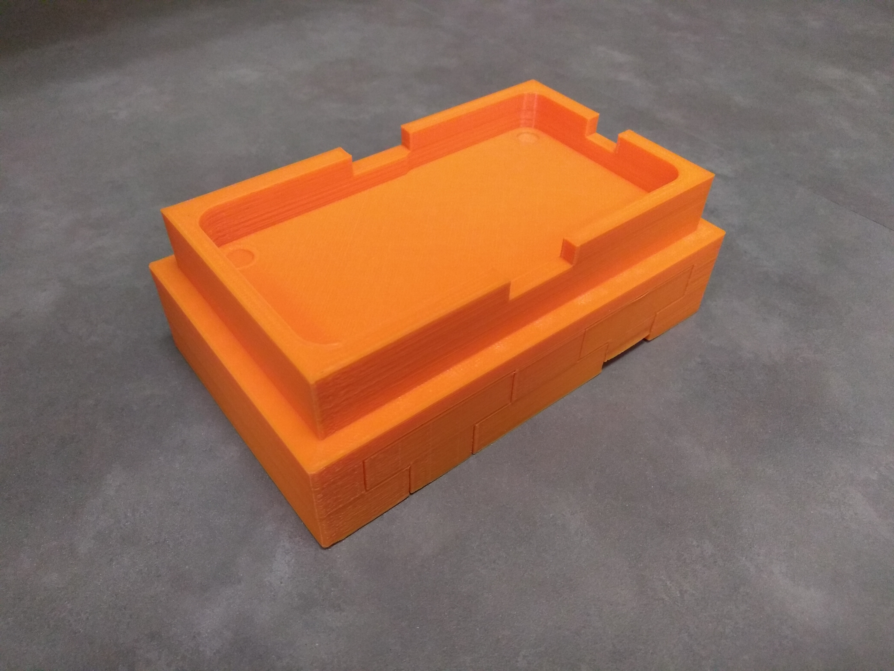
   
The first thing we need to do is scan the object. Read through :ref:`this section<Getting a Profile>` if you need a reminder on how to do this. Here is our scan:

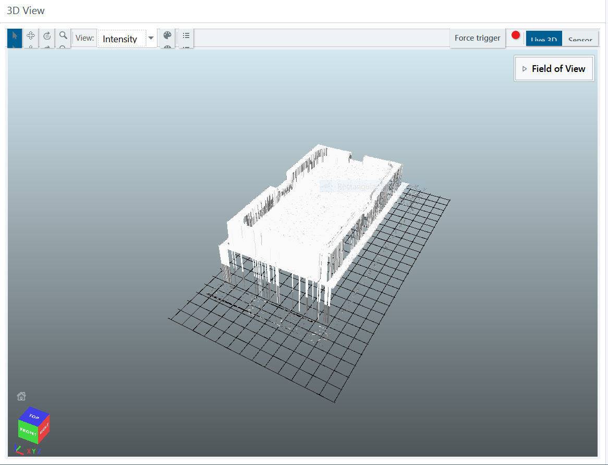
   
Once we have our scan, click the dropdown at the top of the 3D View window and select "Z", as shown below.

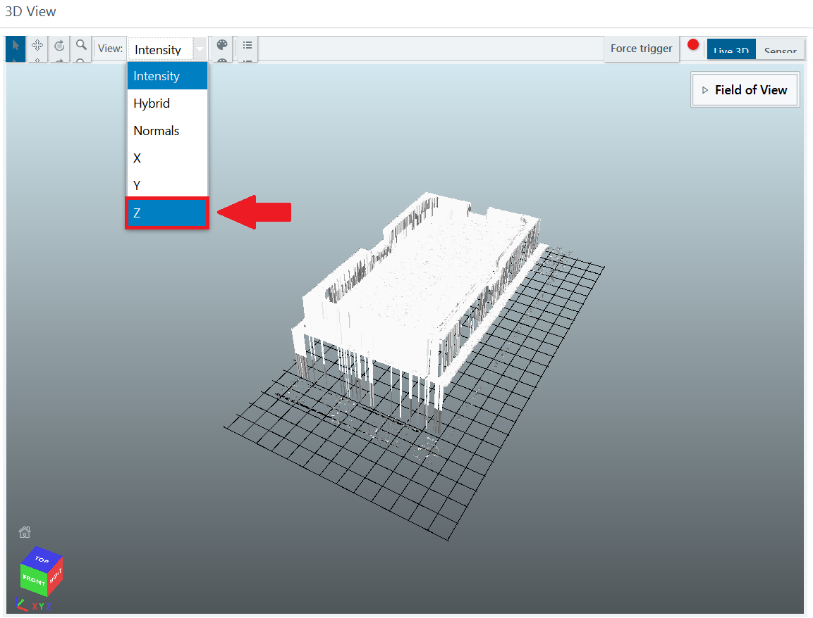

This sets the color of each point on the profile to be proportional to its Z-position (i.e. its height). You will have to set the color palette to be black and white by clicking the button shown below as well, to ensure that the height map uses shades rather than colors:

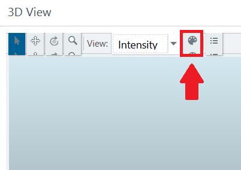
   
This will make the height map images easier to edit later. Now click the button right next to the color palette and set the color range such that the highest part of your profile is completely white, and the **ground plane** (the lowest layer of your profile) is completely black. This will ensure that anything above the ground plane is registered by the height-map converter to be at the right height above the ground. The dropdown for accessing the color range selector is shown below.

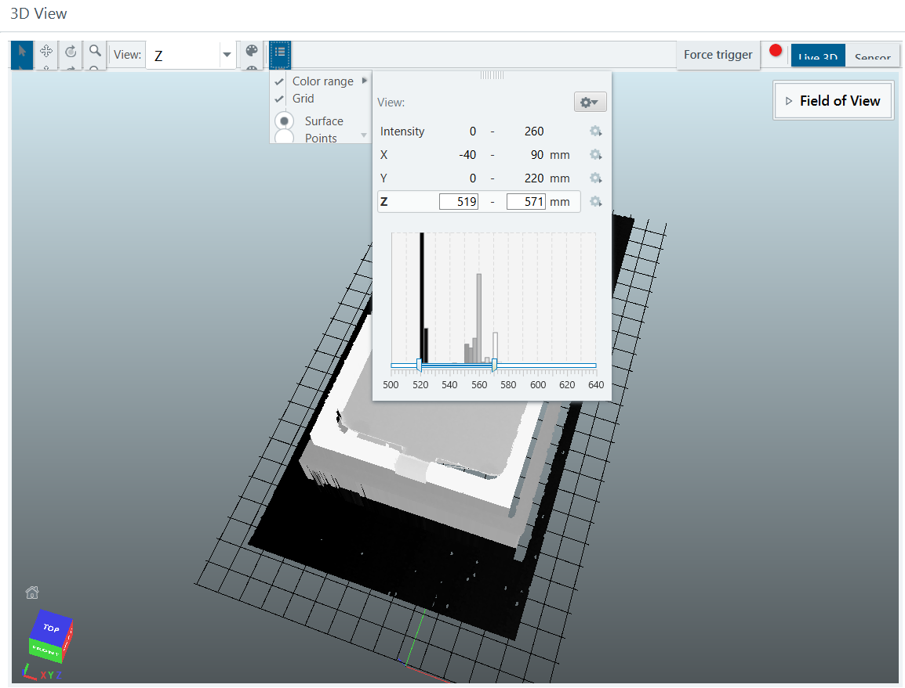

Once the right color range has been set, click the "Top" side of the cube in the bottom left corner of the 3D View window. You will have to click the center square on the top side of the cube twice so that the edges of grid below the profile align with the edges of the window. 

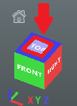
   
Take a screenshot of the profile and crop it so that it fills the entire image. You may notice that this profile had several holes in it. That is fine, as we will be fixing this later.

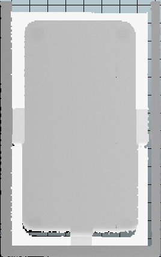

Repeat the process again after rotating the object 180 degrees and completing another scan. This second profile looks like this:

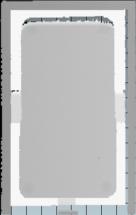
   
Now create a new file in whatever image editor you are most comfortable with (MS Paint was used here) and fill in the holes by coloring over them with the surrounding colors. You can also use the second profile image to fill in parts of the height map that are too detailed to be colored in by hand. The final height map image looks like this:

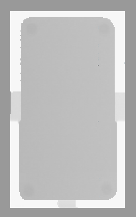
   
To convert this image to an STL file, search for an "image to STL" converter online. (`Here is a good one <https://imagetostl.com/>`_). Upload the height map image and start configuring the settings.

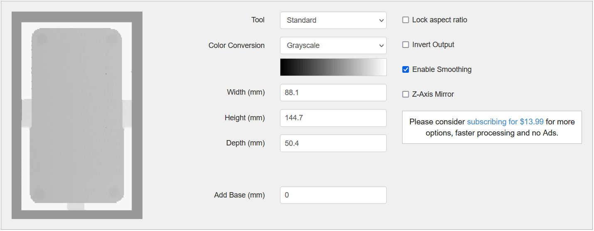
   
The Width, Height, and Depth properties are very important. To get an accurate model, each dimension must correspond to the actual dimension of the object you scanned. The height corresponds to the height of the image, **not** the z-axis of the profile, which is the depth here. 

Once all the settings are configured, click the "Convert" button and wait for the conversion to complete. Once finished, you should be able to download the STL file and view it.

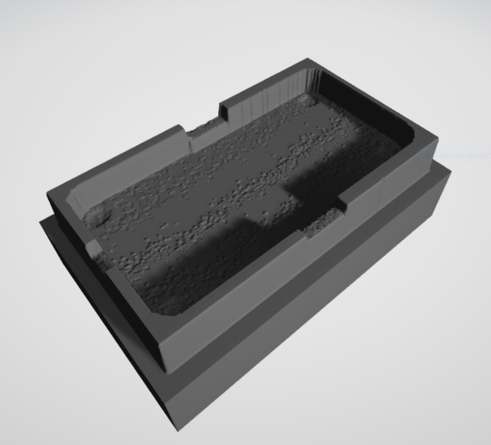

Troubleshooting Profilometer Controller
---------------------------------------
Here is a list of common issues you may encounter while trying to use the **profilometer controller**, along with some suggestions for fixing them:

**"Error: not connected to profilometer. Are you connected to the correct WiFi?"** -> The connection to the profilometer is timing out.

 - Make sure you are connected to the profilometer router's WiFi.
 - Make sure the profilometer and the router are plugged in.
 - Make sure the blue and white ethernet cables are connected to the back of the router.

**The profilometer never responds to the buttons, but no error appears in the terminal.** -> The profilometer is receiving the signal, but the motor is not moving.

 - Make sure the blue ethernet cable is connected to the back of the router.
 - Make sure the pin plug is plugged into the motor (shown below).

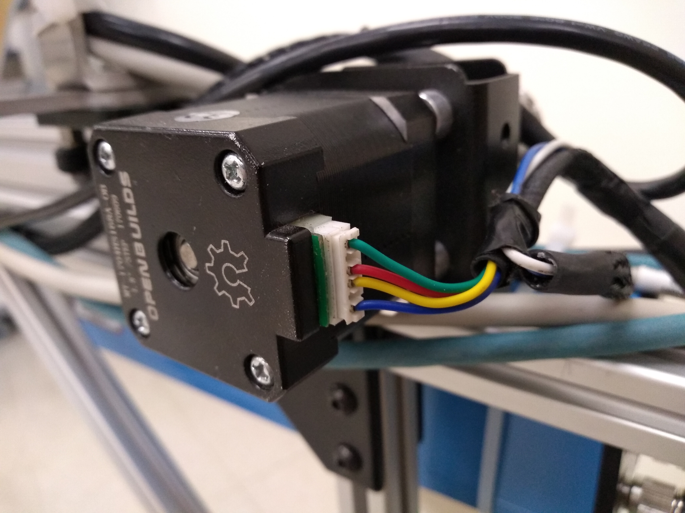
   
 - Check all connections. Nothing should be unplugged.

**The program keeps crashing/not responding.** -> The program is in the middle of fulfilling a request.

 - This is expected when scanning (or calibrating while the sensor is far away from the homing position). The program should start responding again as soon as the program is complete. If it never completes, force the program to close and open it again. Test the connection by click the left or right arrow.

**"This computer does not have SOPAS downloaded, or it does not exist in the following directory: C:/Program Files (x86)/SOPAS ET/SopasET.exe"** -> The program cannot find the SOPAS executable.

 - Make sure that your computer has SOPAS downloaded. If not, you can download it from this link:
 
 `Download SOPAS here. <https://www.sick.com/ca/en/sopas-engineering-tool/p/p367244>`_
 
 - Make sure the SOPAS software exists in the directory shown in the error message. This is where the program looks to run it.
 - If your computer does not use the Windows operating system, this button will not work for you.
