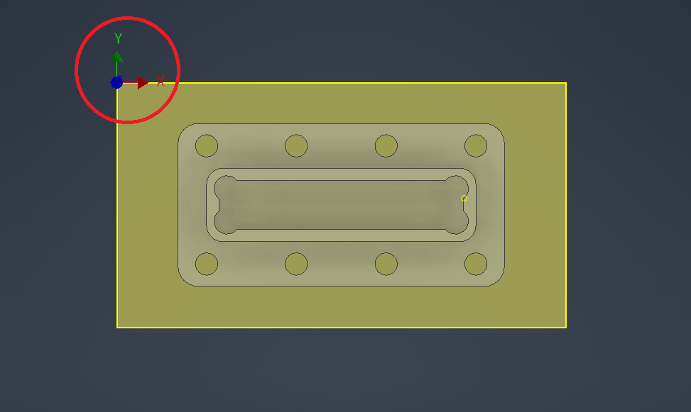
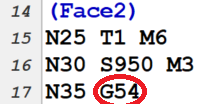
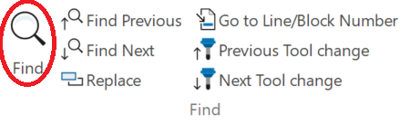
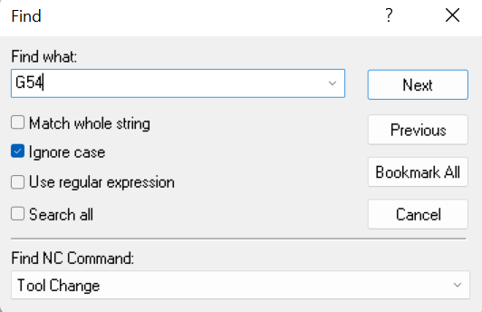
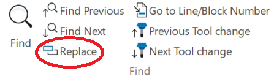
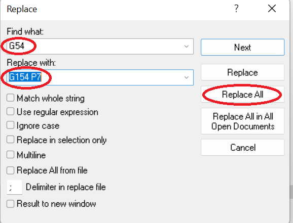
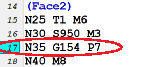

Work Offsets
============

When you create your part in CAD and continue on the the CAM portion, everything may go smoothly and your simulation may run without a hitch. But when you go to machine your part, the machine has no idea where the part begins. 

This is where work offsets come into play. When we set our work offsets, we are telling the machine where the 'zero' is. The machine has a coordinate system where there are ______. The G-Code commands that you can manually set, tell the machine to use the ___ as the 'zero' instead. 

If you're using the vise, you can line the corner of your part up with the top left corner of the vise. 

.. figure:: ../_static/images/vise1.jpg
   :figwidth: 700px
   :target: ../_static/images/vise1.jpg

The work offset for the top left corner of the vise is set as G54. This is already set so, if using this setup, you do not need to change any work offsets.

So, what if we want to use a different setup (ie. take out the vise)?

In this case, you will need to create a new offset. 

1. Begin by pressing the 'Offsets' button until the 'work zero offset' section on the screen turns white. 

2. Navigate to a new G-Code (using the cursor) to select as the new offset code (ie. G154 P7). Remember G54 is for the top left corner of the vise so make sure to pick a different one. 

3. Using the hand jog, navigate to the point that you want your orgin to be. 

4. Using cursor, naviagte to x-axis and press 'Part Zero Set'. Move to y-axis and repeat. 

Note: Since the tool offsets will be taken from the top of the work piece, the z-axis offset should always be 0.

5. The new G-code that you have selected now has to be replaced on your program for **every** operation. To do this:

a. When you click post process, your NC File will load onto your screen. 

b. Under every operation, the following G-Code is listed on the third line. We want to change this. 

c. Begin by pressing 'Find' and typing in 'G54' and pressing 'Bookmark All'. This will highlight G54 everywhere in the code.

d. Next, press 'Replace' and then make sure 'G54' is under 'Find What' and your new G-Code (ie. G154 P7) is under 'Replace With'.

e. This should replace G54 with your new G-Code everywhere in the program. Double check by going through the program and looking under each operation.

f. Make sure to save the new program NC File.

To learn more about setting work offsets using edge finder, follow the follwoing link: https://youtu.be/AyMsFtwzrmI
